# IT 220 — Unit 1: Database Concepts & Architecture
### Full Lecturer-Ready + Student-Revision Material (S1–S4)

**Program:** BIM, 4th Semester · **Credits:** 3 · **Unit weight:** 4 lecture hours
**Sessions:** S1–S4 (50 min each) · **Local context:** Nepal / South Asia

> **How to read this file.** It serves **two readers at once:**
> - **The lecturer** — minute markers `[~X min]`, delivery cues in `> 🎙️` blocks, a timed activity, and `[SLIDE]` markers.
> - **The student (revising later)** — every concept has a **📖 In Depth** prose section, a **🌍 Real life** story from a system you actually use, a **🎯 Model exam answer**, an **🧠 Analogy & memory hook**, a **🔑 Key terms** box, and a custom **diagram image**.
>
> Pace tags: `[THEORY] [EXAMPLE] [ACTIVITY] [QUIZ]`. Per session: **5 + 35 + 5 + 3 + 2 = 50 min.**
> Images live in `images/` (regenerate with `build_unit1_images.py`).

---

## Unit 1 — Learning Outcomes
By the end of this unit, students will be able to:
1. Define *database*, *DBMS*, and the roles around them, and explain why a DBMS beats flat files.
2. Distinguish *data models*, *schemas*, and *instances*.
3. Explain the *three-schema architecture* and the two kinds of *data independence*.
4. Identify database languages/interfaces and the components of the DBMS environment.
5. Compare *centralized* vs *client/server* architectures and classify DBMSs.

---
---

# S1 — What is a Database & DBMS? Users, DBA, and Advantages
**Lecture hour 1 of 4 · 50 minutes**

### 🎯 OPENING — Hook `[~5 min]`

[SLIDE] **"Where does your data actually live?"**

> **Deliver (≈2 min):** Put three everyday facts on screen: your **eSewa balance** survives when
> your phone dies; your **college exam results** are still there after the holidays; your
> **Facebook feed** reloads exactly where you left it. Land it: "None of that is stored *in the app*
> on your phone — the app is just a window. The data lives somewhere else, in a **database.**"
>
> **Show of hands (≈3 min):** "Who checked eSewa or a bank balance this week?" That number came out
> of a database in **under a second**, while thousands of others read theirs at the same moment, and
> nobody got the wrong balance.

> 🎙️ Speaker note: Don't define "database" formally yet — build curiosity. If quiet, cold-call:
> "Reinstall an app — why are you still logged in and your data is still there?" Agenda on board:
> data vs database → DBMS → users → DBA → why databases beat files.

**Agenda preview:** (1) data vs database, (2) what a DBMS is, (3) who uses it, (4) the DBA, (5) why databases beat files.

---

### 📚 CONTENT `[~35 min]`

#### Concept 1 — Data vs Information vs Database `[THEORY]` `[~7 min]`

[SLIDE] **Three words people blur together**

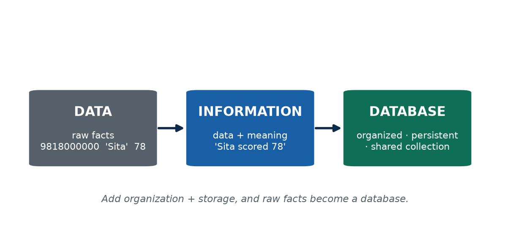

> 🎙️ **Deliver:** Write **DATA · INFORMATION · DATABASE** on the board. Ask "Is `78` a mark, an age,
> a temperature, or a house number?" — you can't tell, *that's* what makes it raw data. Add context
> → information. Organize + store many related facts → a database. Then give the three-property test.

**📖 In Depth — read this for revision**

These three words sound interchangeable in daily speech, but a database professional must keep them sharp, because the whole subject is built on the difference.

- **Data** is *raw, unprocessed facts* with no context attached. The values `9818000000`, `"Sita"`, and `78` are data. On their own they are almost meaningless — `78` could be a mark, an age, a temperature, or part of a phone number. Data is the rough material; it has not yet been given a job.
- **Information** is *data placed in a context so that it answers a question and carries meaning*. The sentence *"Sita scored 78 in DBMS"* turns that bare `78` into information: now it tells you something useful. The transformation from data to information is simply the act of organizing and interpreting.
- **A database** is an *organized, related collection of data, stored so that it can be easily accessed, managed, and updated*. The key words are **organized** and **related** — a database is not a random heap of facts; it is a structured, connected collection where, for example, a student record links to that student's marks, which link to a subject.

Not every pile of stored data deserves to be called a database. Three properties must hold:

1. **Persistent** — the data survives after the program that created it has shut down. You close the app, switch off the computer, and tomorrow the data is still there. (Contrast this with a value held only in a running program's memory, which vanishes the moment the program stops.)
2. **Shared** — many users and many different applications can use the *same* data at the same time. Your college's exam database is read by the result portal, by exam staff, and by the printing system — all from one shared source of truth.
3. **Structured** — the data is organized into a clear form (rows, columns, and relationships between them), not scattered across loose, inconsistent files.

**Worked illustration — a kirana shop notebook.** Imagine a shopkeeper who records stock in a paper notebook: item names down one column, quantities beside them, updated daily. *Is this a database?* Yes — it is organized, persistent data, and it satisfies the spirit of the definition. But it is a *fragile and painful* one. Only one person can read it at a time (no real sharing). It can be destroyed by a fire or a spilled cup of tea (weak persistence). And answering a simple question like "which items have fewer than 5 units left?" means scanning every single page by hand (no efficient querying). Hold that notebook in mind: nearly every advantage of a computerized database is really a fix for one of the notebook's weaknesses.

**Real Nepal-context example.** A university's exam system (e.g. Tribhuvan University or Pokhara University) stores roll numbers, names, programs, and marks. It is *persistent* across semesters, *shared* by exam staff and the public result portal, and *tightly structured* so that a roll number reliably links to the right student and the right marks. That is a database in the full sense.

> **🌍 Real life — your eSewa transaction list.** Open eSewa and look at one line: *"Rs 500 to
> Hari · 2081-02-15 · success."* Those bare fields — an amount, a name, a date, a status — are
> **data**. Shown together so you understand *"you paid Hari Rs 500 and it worked,"* that's
> **information**. Now multiply that by millions of such records, all organized, linked to the
> right accounts, and stored so any user's full history loads in one tap — that's the **database**.
> The contrast that proves the point: if eSewa kept each day's payments in a separate, disconnected
> text file, you could never get your yearly statement in one tap — the *organization* is what
> makes it a database, not just the facts.

> **🎯 Model exam answer.** *"Differentiate data, information, and database with examples."*
> **Data** are raw facts with no context (e.g. `500`, `'Hari'`). **Information** is data given
> meaning by context (e.g. *"You sent Rs 500 to Hari"*). A **database** is an organized, persistent,
> shared collection of related data (e.g. eSewa's store of all transactions). Data becomes
> information through context; many related pieces stored systematically become a database.

> **🧠 Analogy & memory hook.** Ingredients (data) → a cooked dish (information) → a stocked,
> organized kitchen you can cook anything from (database). **Hook: "Facts → meaning → organized store."**

> **🔮 Hypothetical scenario — test yourself.** Someone hands you a USB stick holding a file with
> just: `84, 91, 77, 88`. Is that *data, information,* or a *database*? (Raw **data** — you can't act
> on it; `84` could be anything.) Now you're told it's *"the DBMS midterm marks of seats 1–4, in
> roll order"* — it just became **information**. Store it in a structured, shared, persistent system
> that links each mark to a student and a subject, and you have a **database**. The same four numbers
> climbed all three levels purely by gaining *context* and *structure*.

> **🔑 Key terms:** *data* (raw facts) · *information* (data + context) · *database* (organized, related, stored collection) · *persistent · shared · structured* (the three defining properties).

---

#### Concept 2 — DBMS: Database Management System `[THEORY]` `[~7 min]`

[SLIDE] **The database vs the software that manages it**

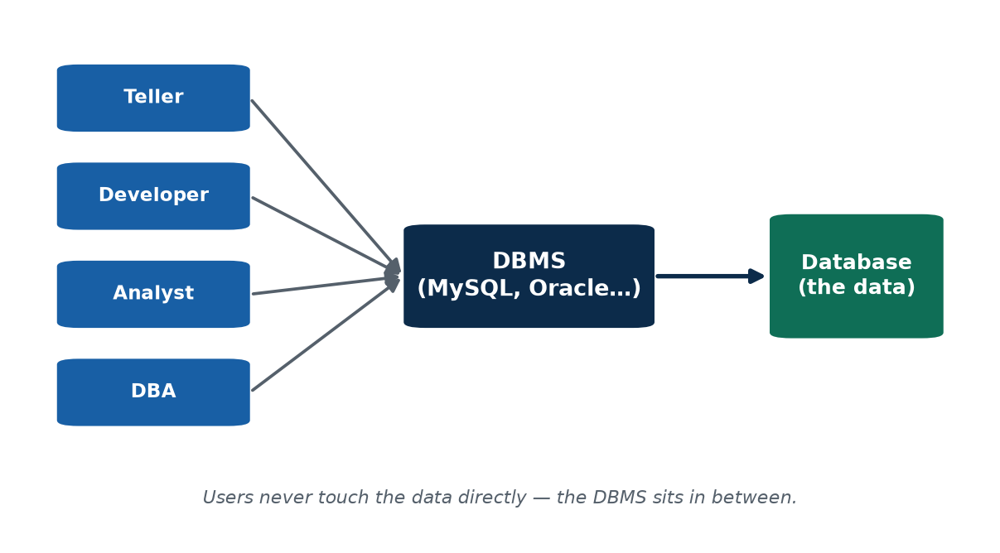

> 🎙️ **Deliver:** Separate the two ideas students confuse all semester. "MySQL is the **DBMS** — the
> engine. The `college` database is the **data** it manages." Repeat it twice. Deliver the librarian
> analogy: the librarian doesn't *own* the books, they *manage* them.

**📖 In Depth — read this for revision**

A **DBMS (Database Management System)** is the *software* that lets people and applications **define, create, query, update, and administer** databases. This is the single most important distinction in the whole course, and it is worth stating precisely:

- The **database** is the *data itself* — the actual student records, account balances, or product listings.
- The **DBMS** is the *program that manages that data*. It enforces the structure, lets many users work at once without corrupting each other's changes, controls who is allowed to see or change what, and answers queries efficiently.
- Put the two together and you have a **database system** (database + DBMS + the applications and users around them).

Make it concrete with names. **MySQL, MariaDB, PostgreSQL, Oracle, and Microsoft SQL Server** are all *DBMSs* — they are engines. When you install MySQL on a server, MySQL is the DBMS; the `college` database you then create inside it is the *data*. One DBMS engine can manage many separate databases at once, just as one librarian can run several reading rooms.

**Why the distinction matters.** Students who blur "database" and "DBMS" get confused later when we talk about, say, "backing up the database" (copying the data) versus "upgrading the DBMS" (installing a newer version of the engine). They are different objects doing different jobs.

**The librarian analogy (worth remembering).** A DBMS is like a **librarian**, and the data is like the **books**. Without a librarian you still *have* all the books — but they are in a pile on the floor. Good luck finding a specific one, stopping two people from grabbing the same copy at once, or keeping the catalogue accurate as books come and go. The librarian does not *own* the books; they *manage* access to them, keep them in order, and enforce the rules. That is exactly the relationship between a DBMS and the data it manages.

**Common misconception — "Excel is a database."** A spreadsheet *stores* data, so it feels database-like, but it is **not** a DBMS. It lacks real **concurrency control** (two people safely editing the same data at once), enforced **data integrity** (rules that stop bad data getting in), a real **query language** for searching millions of rows, and proper **security**. Excel is perfectly fine for 200 rows on your own laptop — but it breaks down at exactly the scale and multi-user demands where a DBMS begins. Knowing *where* that line is, is part of thinking like a database professional.

> **🌍 Real life — MySQL behind your college result portal.** When you check results, the portal
> page doesn't *contain* your marks — it asks a **DBMS** (very often MySQL) running on a server,
> and the DBMS manages the actual marks database. On results night, when thousands of students log
> in within minutes, the DBMS is what serves everyone the *right* marks at once without records
> clashing. Imagine the college instead kept marks in a shared Excel file: two clerks saving at the
> same moment would overwrite each other's work. Preventing exactly that is a core job of a DBMS.

> **🎯 Model exam answer.** *"What is a DBMS, and how does it differ from a database?"*
> A **DBMS** is software used to define, create, query, update, and administer databases (e.g.
> MySQL, Oracle, PostgreSQL). The **database** is the actual stored data; the **DBMS** is the
> program that manages it — providing concurrency control, integrity, querying, and security.
> Together (database + DBMS + applications) they form a **database system**.

> **🧠 Analogy & memory hook.** The data is the **books**; the DBMS is the **librarian** who
> shelves, finds, and lends them and stops two people taking the same copy. **Hook: "Data is the
> books; the DBMS is the librarian."**

> **🔮 Hypothetical scenario — test yourself.** Suppose your college scrapped its DBMS and told every
> department to keep its own copy of student data in Excel instead. Predict **three** things that go
> wrong within a month. (Likely: the same student's name spelled differently in three departments;
> two clerks saving at once and silently overwriting each other; nothing stopping a junior staffer
> from opening the salary sheet.) Every failure you predict is a job the DBMS was quietly doing all
> along — which is the best way to *feel* why a DBMS exists.

> **🔑 Key terms:** *DBMS* (software that manages databases) · *database system* (data + DBMS + apps/users) · *concurrency control · data integrity · query language · security* (four things a DBMS provides that a spreadsheet does not).

---

#### Concept 3 & 4 — Database Users and the DBA `[THEORY]` `[EXAMPLE]` `[~7 min]`

[SLIDE] **Who actually touches the database?**

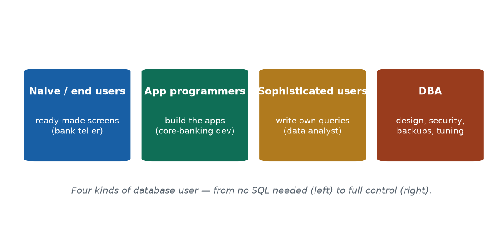

> 🎙️ **Deliver:** Use ONE Nepali bank to populate all four roles. Stress that the **DBA** is the
> person accountable when the data layer misbehaves — make the role feel real and high-stakes.

**📖 In Depth — read this for revision**

Different people interact with a database at very different levels of technical depth. Recognising the four main categories helps you understand who needs which tools — and who carries which responsibilities.

1. **Naive / end users.** These are people who use the database through ready-made screens and never write a query themselves. A **bank teller** entering a deposit is a naive user — they fill in a form, press a button, and the system does the rest. The vast majority of a system's users are in this group, so their screens must be simple and safe.
2. **Application programmers.** These are the developers who *build* the applications that talk to the database. The team writing a bank's mobile-banking app are application programmers — they embed database commands inside the software so that when a teller presses "deposit," the right data changes.
3. **Sophisticated users.** These are people who write their *own* complex queries and analyses directly, without a pre-built screen. A **data or MIS analyst** pulling a custom report ("how many loans over Rs 10 lakh were approved in Bagmati last quarter?") is a sophisticated user.
4. **Database Administrator (DBA).** The DBA is the specialist who administers the whole database. Their responsibilities include **designing and maintaining the schema** (the structure of the data), **controlling security and permissions** (deciding who may see or change what), managing **backup and recovery**, and **monitoring and tuning performance** so queries stay fast.

**Why the DBA matters most for this course.** Of the four roles, the DBA is the one whose job is *purely* about the database itself, and it is a position of serious trust and accountability. Picture this scenario: it is the night before exam results are published, and the result server has slowed to a crawl under the load of thousands of refreshes. **Who gets the call? The DBA.** They are the person who diagnoses the slow queries, adds an index to speed them up, or scales the server. When the data layer misbehaves — it is slow, it is corrupted, it has been breached — the DBA is accountable. Much of what you learn in this course (normalization, indexing, transactions, recovery) is, in effect, the DBA's toolkit.

**Real Nepal-context example.** At a commercial bank, the front-desk teller is a *naive user* working through a guided screen; the team building the bank's app are *application programmers*; the risk and MIS team running ad-hoc reports are *sophisticated users*; and one or a few *DBAs* keep the entire database healthy, secure, and fast behind the scenes.

> **🌍 Real life — a single day inside a Nepali bank.** The **teller** at the counter enters your
> deposit through a guided form — a *naive/end user*. The team that built that banking screen are
> *application programmers*. The MIS officer who pulls a custom report — *"how many loans above Rs
> 10 lakh defaulted in Bagmati last quarter?"* — is a *sophisticated user* writing their own
> queries. And behind all of them, the **DBA** keeps the core-banking database backed up, secured,
> and fast. When the system crawls during the month-end salary rush, it's the DBA who gets paged —
> nobody else can fix the data layer.

> **🎯 Model exam answer.** *"List the types of database users and state the role of a DBA."*
> Users: **naive/end users** (use ready-made screens), **application programmers** (build the
> apps), and **sophisticated users** (write their own queries). The **DBA (Database Administrator)**
> administers the database itself: designing/maintaining the schema, controlling security and
> permissions, performing backup & recovery, and tuning performance — the person accountable for
> the database.

> **🧠 Analogy & memory hook.** An airport: passengers (end users), the booking-app developers,
> the analysts studying traffic, and **air-traffic control** keeping everything safe = the DBA.
> **Hook: "The DBA is air-traffic control for data."**

> **🔮 Hypothetical scenario — test yourself.** Imagine a small startup with **no DBA**. The lead
> developer also "does backups when they remember," and everyone logs in with one shared admin
> account. One afternoon a careless query deletes the entire `Orders` table. Ask yourself: who
> *notices*? Who can *restore* it (and from when)? And who *should* have set permissions so an
> ordinary account couldn't drop a table at all? Every unanswered question in this scenario is
> exactly the gap a DBA is hired to close.

> **🔑 Key terms:** *naive/end user · application programmer · sophisticated user · DBA* · the DBA's four duties: *schema design, security/permissions, backup & recovery, performance tuning.*

---

#### Concept 5 — Why a Database beats a File System `[THEORY]` `[~6 min]`

[SLIDE] **The problems a DBMS was invented to solve**

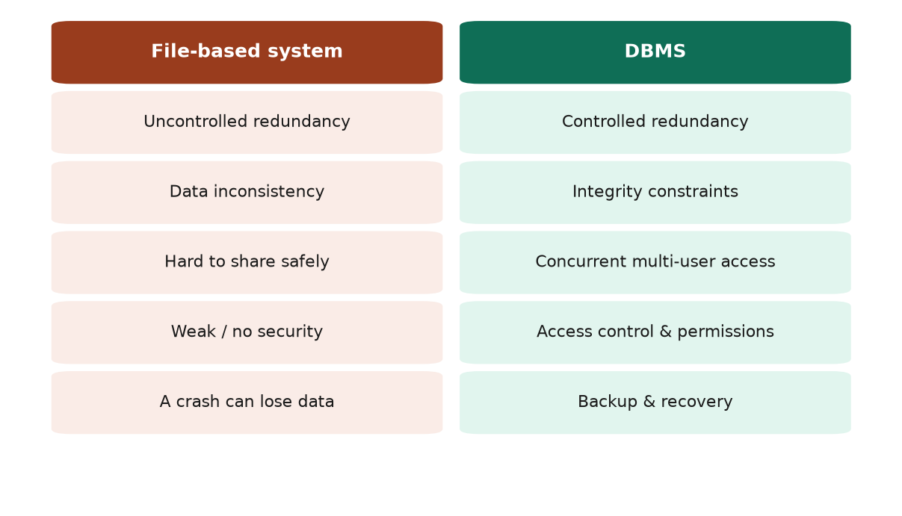

> 🎙️ **Deliver:** Walk the address-in-5-files example: store an address in 5 files, update 4, forget
> 1 — now the data is inconsistent and you can't tell which is right. This one example motivates
> "controlled redundancy."

**📖 In Depth — read this for revision**

Before databases, organizations kept data in separate **files**, each owned by a different program or department. This "file-based" approach has deep, recurring problems — and a DBMS exists precisely to solve each of them. Learning the problems is the best way to remember the benefits.

| Problem in a file-based system | How a DBMS solves it |
|---|---|
| The same fact is copied into many files → versions drift apart (**uncontrolled redundancy**) | **Controlled redundancy** — store each fact once, as a single source of truth |
| Copies fall out of sync → contradictory data (**inconsistency**) | **Integrity constraints** — rules that keep data valid and consistent |
| Files are hard to share safely between users/programs | **Concurrent multi-user access** — many users at once, safely |
| Anyone who can open the file can read or change it | **Security & access control** — permissions decide who sees/changes what |
| A crash or deletion can lose data permanently | **Backup & recovery** — the system can restore to a safe state |

**The worked example that makes it click — "the address in five files."** Suppose a student's home address is stored in five different department files (admissions, library, hostel, exams, accounts). The student moves house. A clerk dutifully updates four of the five files — but forgets the fifth. Now the data is **inconsistent**: four files say one thing, one says another, and *nobody can tell which is correct without investigating*. This is the curse of **uncontrolled redundancy**. A DBMS fixes it by storing the address **once** and letting every department refer to that single copy — update it in one place and everyone instantly sees the correct value.

**Common misconception — "more copies = safer."** It feels intuitive that keeping several copies protects you. But *uncontrolled* duplication is dangerous: every extra copy is another thing that can drift out of date and create contradictions. A DBMS does keep backups — but that is **controlled** redundancy, managed deliberately, not the same as scattering unmanaged copies across loose files.

**Why this matters in practice.** Every benefit in the right-hand column above is a feature you will study in depth later: integrity constraints (Units 2 and 5), concurrency (Unit 6), security (Unit 7), backup and recovery (Unit 6). Unit 1 is where you learn *why* they exist.

> **🌍 Real life — government records going digital.** For years, Nepali government offices kept
> citizen details in paper registers and separate files. The same person's address sat in several
> registers, so one office had the old address and another the new — **uncontrolled redundancy**
> producing **inconsistency**, with no way to know which was right. Moving such records into one
> central database (the direction of national-ID and Nagarik App–style systems) means a detail
> updated **once** is correct everywhere, access is controlled by role, and a single fire can no
> longer destroy the only copy. Every file-system pain maps to a DBMS fix.

> **🎯 Model exam answer.** *"State four advantages of a DBMS over a file-based system."*
> (1) **Controlled redundancy** — each fact stored once, avoiding contradictory copies.
> (2) **Consistency & integrity** — rules keep data valid. (3) **Concurrent multi-user access** —
> many users safely at once. (4) **Security/access control** — permissions decide who sees what.
> (Also acceptable: **backup & recovery**.) Each directly fixes a file-system weakness.

> **🧠 Analogy & memory hook.** Many people keeping their own diaries that slowly disagree, versus
> one shared, always-current source of truth. **Hook: "One source of truth beats many drifting copies."**

> **🔮 Hypothetical scenario — test yourself.** Suppose a hospital keeps each patient's blood group
> in three separate files — one in the lab, one in the ward, one in the pharmacy. A patient's blood
> group is corrected, but only the *lab* file gets updated. A week later the *pharmacy* file is used
> to prepare a transfusion. What is the danger here, and which single DBMS feature would have made it
> impossible? (Answer: this is **uncontrolled redundancy** causing a potentially fatal
> **inconsistency**; storing the blood group **once** as a single source of truth removes the risk.)

> **🔑 Key terms:** *file-based system* · *redundancy* (controlled vs uncontrolled) · *inconsistency* · *integrity constraints* · *concurrent access* · *access control* · *backup & recovery*.

---

#### 🛠 ACTIVITY — "File or DBMS?" `[ACTIVITY]` `[~6 min]`

[SLIDE] **Think–Pair–Share**

- In pairs (2 min), decide **file/spreadsheet or DBMS** for each: a wedding guest list; a bank's accounts; a one-person diary; Daraz's orders.
- For each, name **which property decides it** — concurrency, integrity, scale, or security.
- Share aloud (4 min) and build the file-vs-DBMS table from the class's answers.

> 🎙️ Speaker note: The bank accounts and Daraz orders clearly need a DBMS (many users, strict
> integrity, huge scale); the diary and short guest list don't. That contrast *is* the lesson —
> a DBMS is justified by concurrency, integrity, scale, and security needs.

---

### 🧠 CHECK FOR UNDERSTANDING `[QUIZ]` `[~5 min]`

**MCQ 1.** Which is **NOT** a function of a DBMS?
a) define data  b) ✅ **print formatted documents**  c) query data  d) control access

**MCQ 2.** Who is responsible for granting and revoking user permissions?
a) naive user  b) app programmer  c) ✅ **DBA**  d) end user

**Discussion:** *Name a phone app you use and guess what its database stores about you.*

---

### 💡 REAL-LIFE APPLICATION `[~3 min]`
Every fintech and e-commerce employer in Nepal — **eSewa, Khalti, Daraz, IME Pay** — runs on a DBMS. "Understands databases" is a baseline requirement on almost every software, data, or QA job advertisement. This unit is the foundation for all of them, and the vocabulary you just learned (DBMS, schema, DBA) is exactly what a first-round interviewer will expect you to use correctly.

### 📝 SUMMARY & TAKEAWAYS `[~2 min]`
1. A **database** is organized, persistent, shared data; a **DBMS** is the software that manages it.
2. Four user types interact at different depths; the **DBA** is accountable for the data layer.
3. A DBMS beats files through **controlled redundancy, integrity, sharing, security, and recovery.**

**Next session (S2):** how we *describe* data — data models, schemas, instances, and data independence.

---
---

# S2 — Data Models, Schemas & Instances · Three-Schema Architecture & Data Independence
**Lecture hour 2 of 4 · 50 minutes**

### 🎯 OPENING — Hook `[~5 min]`

[SLIDE] **"Why didn't you notice when the college changed how marks are stored?"**

> **Deliver:** Last year results were stored one way; this year IT moved everything to a faster
> server with a different internal layout. You — checking marks online — noticed **nothing.** That
> invisibility has a name: **data independence.** Ask "why didn't the change break the portal?" and
> hold the question until Concept 4.

---

### 📚 CONTENT `[~35 min]`

#### Concept 1 — Data Models `[THEORY]` `[~7 min]`

[SLIDE] **Describing data at three levels of abstraction**

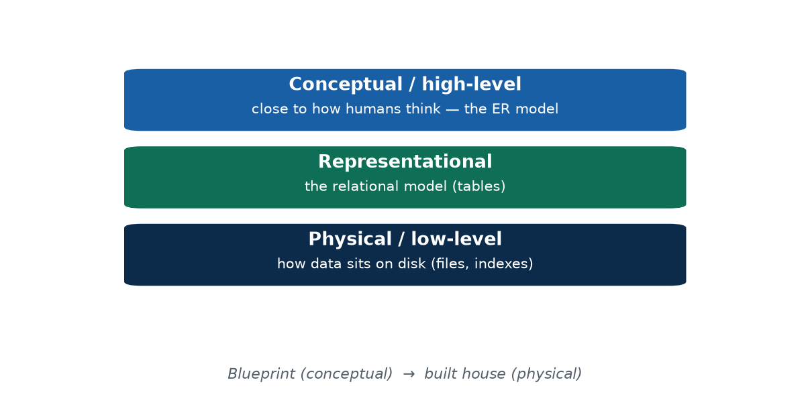

> 🎙️ **Deliver:** Keep it light — models are previewed here, detailed in Unit 2. The takeaway is the
> *idea* of describing data at different abstraction levels; that sets up the three-schema architecture.

**📖 In Depth — read this for revision**

A **data model** is a set of concepts used to describe the **structure** of a database — together with the **constraints** (rules the data must obey) and the **operations** (what you can do to the data). In plain terms, a data model is the "language" you use to describe what your data looks like and how it behaves.

Data models exist at different **levels of abstraction**, from close-to-humans down to close-to-the-machine:

- **High-level / conceptual data models** describe data the way *people* think about it — in terms of real-world things and the relationships between them. The **Entity-Relationship (ER) model** (the whole of Unit 2) is the classic example. It says nothing about files or disks; it talks about students, courses, and the fact that students *enrol in* courses.
- **Representational / implementation models** sit in the middle. The **relational model** — data organized into **tables** of rows and columns — is the dominant one, and it is what almost every business DBMS uses. It is concrete enough to implement, but still hides the physical storage details.
- **Low-level / physical data models** describe *how* the data is actually stored on disk — the files, the page layout, the indexes. This is the level the DBMS and the DBA care about for performance, and that ordinary users never see.

**The analogy to remember.** A conceptual model is like an **architect's blueprint** — it shows the rooms and how they connect, without specifying which bricks or wires to use. The physical model is the **actual built house** — real materials, real plumbing. The same building exists at both levels of description; they are just different amounts of detail for different audiences. This "same thing, described at several levels" idea is exactly what the three-schema architecture (Concept 3) formalises.

> **🌍 Real life — designing Daraz before a line of code.** Before Daraz was built, someone sketched
> the idea in human terms: *"a Customer places Orders; each Order contains Products."* That sketch is
> a **conceptual (ER) model** — no tables, no disks, just real-world things and relationships.
> Engineers then turned it into **relational tables** (the representational model), and the
> operations team decided how to store and index those tables on disk (the physical model). Same
> shop, described at three levels. Startups that skip the conceptual model often end up with a
> tangled database nobody can safely change later.

> **🎯 Model exam answer.** *"What is a data model? Name its categories."*
> A **data model** is a set of concepts describing the **structure, constraints, and operations**
> of a database. Categories by abstraction: **high-level/conceptual** (e.g. the ER model),
> **representational/implementation** (e.g. the relational/table model), and **low-level/physical**
> (storage details). They range from human-oriented to machine-oriented.

> **🧠 Analogy & memory hook.** An architect's **blueprint** → the **floor plan** → the **built
> house**. **Hook: "Idea → tables → disk."**

> **🔮 Hypothetical scenario — test yourself.** Imagine three teams describe the *same* library
> system. Team A draws boxes and lines: *"a Member borrows a Book."* Team B writes `CREATE TABLE
> Member(...)` statements. Team C lists the disk files and the indexes. None of them is "wrong" —
> they are the same system at the **conceptual**, **representational**, and **physical** levels.
> Quick question: which team's description would you put in front of a non-technical principal, and
> which would you hand to a storage engineer tuning performance?

> **🔑 Key terms:** *data model* · *conceptual (high-level) model* · *representational/relational model* · *physical (low-level) model* · *structure, constraints, operations*.

---

#### Concept 2 — Schema vs Instance `[THEORY]` `[~8 min]`

[SLIDE] **The design vs the data inside it**

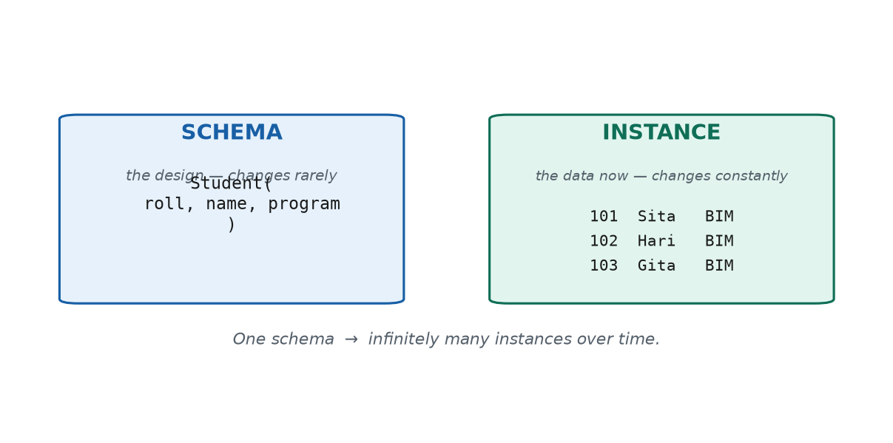

> 🎙️ **Deliver:** Hammer the mould/poured-in metaphor. Write `Student(roll, name, program)` on the
> board, then list 3 fake rows beside it — "same schema, infinitely many instances over time."

**📖 In Depth — read this for revision**

This is a distinction students mix up constantly, so fix it firmly now.

- A **schema** is the **design or structure** of the database — the definition of what tables exist, what columns they have, and what rules apply. The schema is decided when the database is designed and **changes only rarely** (you don't redesign the structure every day). For example, the schema `Student(roll, name, program)` says: "there is a table called Student, and every row has a roll number, a name, and a program."
- An **instance** (also called the **database state**) is the **actual data stored at a particular moment in time**. It is the set of real rows currently in the table. The instance **changes constantly** — every time a student enrols, drops out, or corrects their name, the instance changes, even though the schema stays exactly the same.

**The mould metaphor (worth remembering).** The schema is a **mould**; the instance is **what is poured into it** at any moment. The mould barely changes over the life of the database; the contents change all the time. Today's instance of `Student` might be 60 rows; tomorrow a student drops out and it's 59 — same schema, new instance. Over the life of the database there is **one schema but an endless succession of instances.**

**Worked illustration.** Write the schema on one side:
```
Student( roll, name, program )
```
and a snapshot instance on the other:
```
101  Sita   BIM
102  Hari   BIM
103  Gita   BIM
```
The left side is the design (the mould); the right side is one moment's data (one pouring). Change the data — add a row, fix a name — and you have a new instance under the *same* schema. Change the design itself — add a `phone` column — and you have changed the *schema*, which is a much rarer and bigger event.

**Why it matters.** When we say a query "returns the current instance," or that "the schema is stable but the instance is volatile," you now know exactly what is meant. The schema/instance split also underpins the next idea: because the structure is described separately from the data, we can reorganise one without disturbing the other — which is **data independence.**

> **🌍 Real life — your class WhatsApp group.** The group's *structure* — it has a name, members,
> and admins — is the **schema**, and it barely changes. The *actual messages and current member
> list right now* are the **instance**, and they change every minute. Two members leave tomorrow:
> it's the same group (same schema) with a different membership (new instance). A college's
> `Student(roll, name, program)` table works identically — the design is fixed, while the 60 rows
> sitting in it today are just one instance of many the table will hold over the years.

> **🎯 Model exam answer.** *"Differentiate schema and instance with an example."*
> A **schema** is the design/structure of a database — the table definitions and constraints; it is
> stable and changes rarely. An **instance** (database state) is the actual data stored at a given
> moment; it changes constantly. One schema has many instances over time. *Example:* schema
> `Student(roll, name, program)`; an instance = today's actual rows of students.

> **🧠 Analogy & memory hook.** An empty **ice tray** (schema) versus the water/ice sitting in it
> right now (instance). **Hook: "Schema = the mould; instance = what's in it now."**

> **🔮 Hypothetical scenario — test yourself.** Suppose you photograph your class attendance register
> every day for a month. The printed columns — *date, roll, present/absent* — never change; that's
> the **schema**. Each day's photo, with different ticks, is a different **instance**. Now on day 15
> a new student joins and you draw in an extra column for them. Here's the test: did you change the
> **schema** or the **instance**? (The **schema** — and notice how *rare* and deliberate that change
> is, compared with the daily change of instances.)

> **🔑 Key terms:** *schema* (structure/design, stable) · *instance / database state* (current data, volatile) · the relationship: *one schema → many instances over time*.

---

#### Concept 3 — The Three-Schema Architecture `[THEORY]` `[~9 min]`

[SLIDE] **One database, described at three levels**

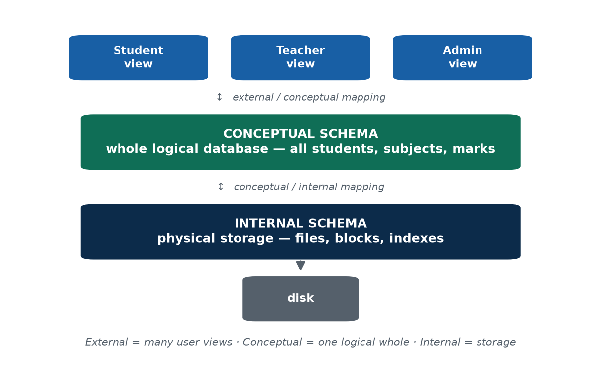

> 🎙️ **Deliver:** This is the centrepiece. Walk the college exam DB through all three levels;
> the *mappings* between levels are what give data independence (next concept).

**📖 In Depth — read this for revision**

The **three-schema architecture** is a foundational idea proposed to separate *what users see* from *how data is logically organised* from *how it is physically stored*. It describes the same database at three distinct levels:

1. **External level (views).** This is the **per-user** level. Each user or application sees only the slice of the database relevant to them, formatted for their needs — this slice is called a **view** or **external schema**. A single database can have many external views. For example, a student logging into the result portal sees only *their own* marks; they have no idea the database also holds every other student's data.
2. **Conceptual level.** This is the **whole logical structure** of the entire database — all the entities, all the relationships, all the constraints — described *without* reference to how it is physically stored. There is exactly **one** conceptual schema. For the college, the conceptual schema is the complete exam database: every student, every subject, every mark, and how they relate.
3. **Internal level.** This is the **physical storage** level — how the data is actually laid out on disk, which files and pages are used, and which indexes exist to speed up access. There is one internal schema, and it is the concern of the DBMS and the DBA.

**Mappings.** Between the levels sit **mappings** that translate between them: an *external/conceptual mapping* connects each user view to the overall logical schema, and a *conceptual/internal mapping* connects the logical schema to the physical storage. These mappings are the machinery that lets each level **hide its details from the level above** — and, crucially, they are what make data independence possible.

**Worked illustration — the college exam database at all three levels.**
- *External:* a student sees a page with only their own subjects and marks (one view); a teacher sees their class's marks (another view); an admin sees everything (a third view).
- *Conceptual:* underneath all those views is one complete logical database — all students, all subjects, all marks, and the relationships linking them.
- *Internal:* that logical database is physically stored as files and indexes on a particular server's disk, arranged for fast lookup.

The power of this arrangement is **separation of concerns**: students don't need to know the storage layout, and the storage team don't need to know each user's view. Each level can be reasoned about — and changed — on its own.

> **🌍 Real life — the college result system through three pairs of eyes.** A **student** logging in
> sees only their own marksheet — that's an **external view**. The **exam section's** system holds
> every student, subject, and mark, with all their relationships — that's the **conceptual** level.
> The **IT team** knows it's physically stored as indexed files on a particular server — that's the
> **internal** level. The student never needs to know how it's stored, and the storage team never
> need to know each student's personal view. That clean separation — each level shielded from the
> others — *is* the three-schema architecture, and it's why the system is maintainable.

> **🎯 Model exam answer.** *"Explain the three-schema architecture."*
> It separates a database into three levels: the **external level** (per-user views, e.g. a student
> sees only their own marks), the **conceptual level** (the whole logical database — all entities,
> relationships, constraints), and the **internal level** (physical storage — files and indexes).
> **Mappings** between the levels hide lower-level detail from higher levels and enable data
> independence.

> **🧠 Analogy & memory hook.** A restaurant: diners read the **menu** (external), the head chef
> knows the full **recipe book** (conceptual), and the **store-room** holds the raw stock
> (internal). **Hook: "View → whole → storage."**

> **🔮 Hypothetical scenario — test yourself.** Imagine a hospital database. A **patient** should see
> only their own reports; a **doctor** sees only their own patients; the **billing system** sees
> amounts but *not* diagnoses; and the **DBA** sees the raw storage files on disk. Sort each of these
> onto the right level of the three-schema architecture. (The first three are different **external
> views**; together they sit on **one conceptual schema**; the DBA's file view is the **internal
> schema**.) If you can place all four, you understand the architecture.

> **🔑 Key terms:** *external schema / view* · *conceptual schema* · *internal schema* · *external/conceptual* and *conceptual/internal* **mappings** · *separation of concerns*.

---

#### Concept 4 — Data Independence `[THEORY]` `[~6 min]`

[SLIDE] **The payoff of three levels**

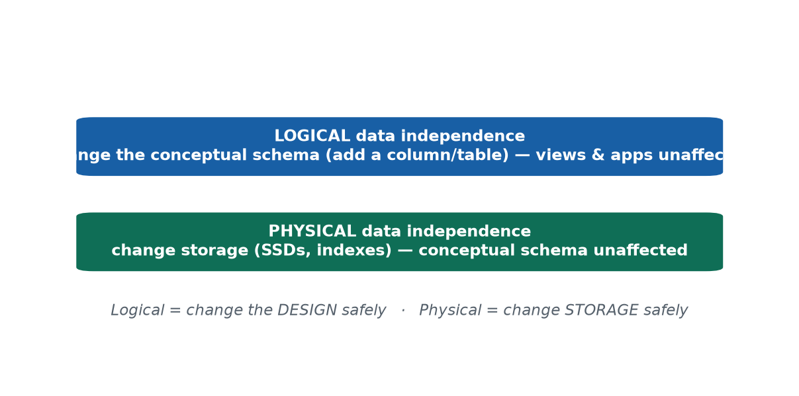

> 🎙️ **Deliver:** Resolve the hook. Mini case: the admin moves the DB to SSDs + adds an index
> overnight; next morning every app works unchanged = physical independence. Logical is the harder one.

**📖 In Depth — read this for revision**

**Data independence** is the ability to change the database at one level *without* being forced to change the levels above it. It is the practical payoff of having three separate schemas, and it comes in two kinds:

- **Logical data independence** is the ability to change the **conceptual schema** without changing the **external views** (or the applications that use them). For instance, you can add a new column or a new table to the conceptual schema, and existing user views that don't need the new data keep working unchanged. Logical independence is *harder* to achieve, because user views are tied fairly closely to the logical structure.
- **Physical data independence** is the ability to change the **internal (physical) storage** without changing the **conceptual schema**. You can move the data to faster solid-state disks, reorganise the files, or add an index to speed up queries — and the logical structure, and therefore every application, is completely unaffected. Physical independence is the *easier* and more commonly achieved of the two.

**A memory hook.** *Logical independence = you can change the **design** safely. Physical independence = you can change the **storage** safely.*

**Worked mini-case (this answers the opening hook).** One night, the database administrator migrates the entire exam database onto faster SSD storage and adds a new index to speed up result lookups. The next morning, every application and every user works **exactly as before** — students still check marks the same way, no app code was rewritten, nobody noticed. That seamless, invisible change is **physical data independence** in action. It is *why* the college could move servers without breaking the student portal — the question we opened the session with.

**Why it matters in the real world.** Data independence is the reason large organisations — banks, **Ntc/Ncell**, government portals — can upgrade their storage and infrastructure over the years without rewriting every application from scratch. A system that *lacked* data independence (where changing the disk layout meant rewriting all the apps) would become impossibly expensive to maintain. Independence is what keeps long-lived systems affordable to evolve.

> **🌍 Real life — eSewa, across the years.** When you first used eSewa it was a basic page on a
> feature phone; today it's a slick app with QR and fonepay. Behind the scenes eSewa has swapped
> servers, moved to faster databases, and added new fields for QR payments and rewards — yet your
> account, balance, and full transaction history carried over, and every old feature kept working.
> You never had to "reinstall your money." That seamless continuity *is* **data independence**:
> they changed the **storage** (physical independence) and even added to the **design** (logical
> independence) underneath, while what *you* see — your external view — kept working untouched.
> Contrast a poorly built college system where adding one "middle name" field broke the entire
> results page: that system had **no** data independence.

> **🎯 Model exam answer.** *"Define logical and physical data independence."*
> **Logical data independence** is the ability to change the **conceptual schema** (e.g. add a
> column or table) without changing external views or the applications using them.
> **Physical data independence** is the ability to change the **physical storage** (e.g. add an
> index, move to SSDs) without changing the conceptual schema. The three-schema architecture, via
> its mappings, provides both; logical independence is the harder to achieve.

> **🧠 Analogy & memory hook.** Renovating a shop's back **store-room** without changing the
> **shopfront** customers see. **Hook: "Logical = change the design safely; physical = change the
> storage safely."**

> **🔮 Hypothetical scenario — test yourself.** Suppose the college must add a `biometric_id` column
> to every student next year. In a system **with logical data independence**, what happens to the
> existing result-portal screen that doesn't use biometrics at all? (Nothing — it keeps working
> untouched.) Now suppose instead they only move the data onto a faster SSD and add an index — which
> kind of independence is *that*? (**Physical.**) One scenario, both kinds of independence, told
> apart by *what* actually changed: the design, or the storage.

> **🔑 Key terms:** *data independence* · *logical data independence* (change the conceptual schema safely) · *physical data independence* (change storage safely).

---

#### 🛠 ACTIVITY — "Draw your college's three schemas" `[ACTIVITY]` `[~5 min]`

- In pairs (3 min): for the college result system, write what lives at **each level** — External (what does a student / teacher / admin see?), Conceptual (the whole database), Internal (how it's stored).
- Then name **one change at the internal level that students would NOT notice** — that's physical data independence.
- Share (2 min).

> 🎙️ Speaker note: The "change students wouldn't notice" prompt directly rehearses physical data
> independence — typical good answers: switching to SSDs, adding an index, compressing old data.

---

### 🧠 CHECK FOR UNDERSTANDING `[QUIZ]` `[~5 min]`

**MCQ 1.** Adding a column without breaking existing user views demonstrates:
a) ✅ **logical data independence**  b) physical data independence  c) redundancy  d) an instance change

**MCQ 2.** Which level is closest to physical storage?
a) external  b) conceptual  c) ✅ **internal**  d) view

**Discussion:** *Give an everyday example of "changing the inside without changing the outside."*

---

### 💡 REAL-LIFE APPLICATION `[~3 min]`
Data independence is *why* banks, telecoms (**Ntc/Ncell**), and government portals can upgrade storage and infrastructure without rewriting every application. Systems built without it become unmaintainable — a real and expensive business risk that good architecture avoids.

### 📝 SUMMARY & TAKEAWAYS `[~2 min]`
1. **Data models** describe data at three abstraction levels (conceptual → representational → physical).
2. **Schema** = structure (stable); **instance** = current data (always changing).
3. The **three-schema architecture** gives **logical** and **physical** data independence.

**Next session (S3):** the **languages** and **interfaces** we use to talk to a DBMS, and what's inside the DBMS box.

---
---

# S3 — Database Languages & Interfaces · The Database System Environment
**Lecture hour 3 of 4 · 50 minutes**

### 🎯 OPENING — Hook `[~5 min]`

[SLIDE] **"SQL is several languages wearing one name."**

> **Deliver:** There's one language to **build** a database, another to **use** it daily, another to
> **protect** it. You've heard of SQL — but SQL bundles several sub-languages. Ask "which SQL
> keywords have you already seen?" Agenda: languages → interfaces → components → data dictionary.

---

### 📚 CONTENT `[~35 min]`

#### Concept 1 — Database Languages (DDL / DML / DCL / TCL) `[THEORY]` `[~8 min]`

[SLIDE] **Four jobs, four sub-languages**

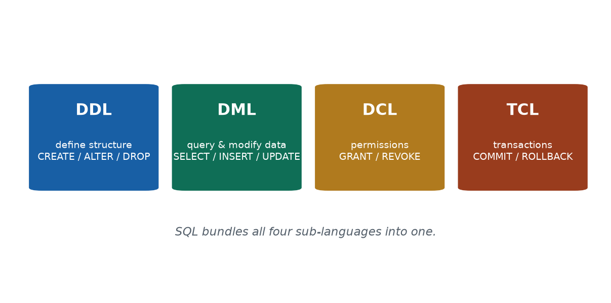

> 🎙️ **Deliver:** Full SQL syntax is Unit 5 — today just the four categories. One college example:
> register a course = DDL; enrol a student = DML; grant a TA access = DCL; commit = TCL.

**📖 In Depth — read this for revision**

When we "talk to" a database we use a database language. **SQL (Structured Query Language)** is the standard one — but SQL is really a *family* of sub-languages, each with a different job. (In this course we target **MySQL/MariaDB** when we reach the full SQL in Unit 5.) The four categories are:

- **DDL — Data Definition Language.** Used to **define and change the structure** of the database — creating, altering, and dropping tables and other objects. Example commands: `CREATE`, `ALTER`, `DROP`. *Defining a new `Course` table is DDL.*
- **DML — Data Manipulation Language.** Used to **query and modify the data** itself — retrieving rows and inserting, updating, or deleting them. Example commands: `SELECT`, `INSERT`, `UPDATE`, `DELETE`. *Enrolling a student or fetching their marks is DML.*
- **DCL — Data Control Language.** Used to control **permissions** — who is allowed to do what. Example commands: `GRANT`, `REVOKE`. *Giving a teaching assistant read-only access is DCL.*
- **TCL — Transaction Control Language.** Used to manage **transactions** — confirming or undoing a group of changes as a unit. Example commands: `COMMIT`, `ROLLBACK`. *Making a money transfer permanent (or undoing it if something fails) is TCL.*

**The misconception to correct.** Students often think "SQL is one single language." In fact **SQL bundles all four** sub-languages into one. `CREATE` is DDL, `SELECT` is DML, `GRANT` is DCL, `COMMIT` is TCL — all of them are "SQL," but they do very different jobs.

**Worked illustration — one college, four sub-languages.** Registering a brand-new course in the system creates a structure → **DDL**. Enrolling a student into that course changes the data → **DML**. Granting a teaching assistant permission to view the class roster sets a permission → **DCL**. Finally, committing the enrolment so it becomes permanent → **TCL**. A single real task often touches several sub-languages in sequence.

> **🌍 Real life — building the college result portal in SQL.** First the developer `CREATE`s the
> `Student` and `Marks` tables — that's **DDL**, defining structure. On result-entry day, staff
> `INSERT` and `UPDATE` marks — that's **DML**, handling data. The admin `GRANT`s the exam clerk
> permission to enter marks, then `REVOKE`s it once results are published — that's **DCL**. Each
> batch of entries is `COMMIT`ted so it's saved permanently, or `ROLLBACK`ed if a mistake is caught
> mid-way — that's **TCL**. One real workflow, all four sub-languages, all of them "SQL."

> **🎯 Model exam answer.** *"Name the SQL sub-languages with one command each."*
> **DDL** (`CREATE`/`ALTER`/`DROP`) defines structure; **DML** (`SELECT`/`INSERT`/`UPDATE`/`DELETE`)
> queries and modifies data; **DCL** (`GRANT`/`REVOKE`) controls permissions; **TCL**
> (`COMMIT`/`ROLLBACK`) controls transactions. SQL bundles all four into one language.

> **🧠 Analogy & memory hook.** Building a house: **DDL** builds the rooms, **DML** moves furniture
> in and out, **DCL** hands out the keys, **TCL** signs or cancels the deal. **Hook: "Define,
> Manipulate, Control, Transact."**

> **🔮 Hypothetical scenario — test yourself.** Imagine you're shown four SQL statements with the
> keywords blanked out: one *creates a table*, one *fetches matching rows*, one *gives a colleague
> read access*, one *makes a batch of changes permanent*. Label each as **DDL / DML / DCL / TCL**
> from the description alone. (Create → DDL; fetch → DML; give access → DCL; make permanent → TCL.)
> If you can classify by the *job* without seeing the exact verb, you've understood that SQL is four
> sub-languages in one.

> **🔑 Key terms:** *SQL* · *DDL* (define structure) · *DML* (query/modify data) · *DCL* (permissions) · *TCL* (transactions) · example verbs for each.

---

#### Concept 2 — Interfaces to a DBMS `[THEORY]` `[EXAMPLE]` `[~7 min]`

[SLIDE] **Many doors into the same data**

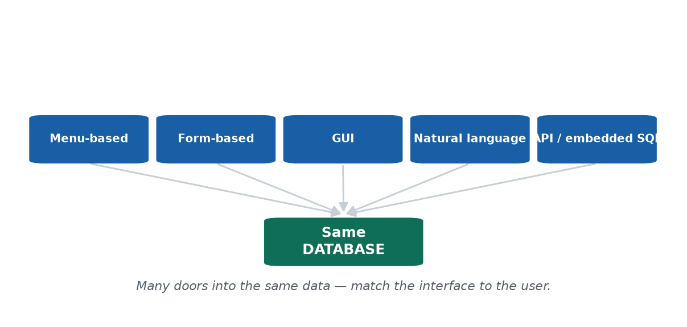

> 🎙️ **Deliver:** Same data, many doors. The teller and the developer touch the SAME database
> through different interfaces matched to their skill. Sets up the shopkeeper-interface discussion.

**📖 In Depth — read this for revision**

A DBMS can be reached through several kinds of **interface**, each suited to a different type of user. The same underlying data can be accessed many ways:

- **Menu-based interfaces** — the user picks from lists of options (common in older systems and kiosks).
- **Form-based interfaces** — the user fills in fields on a structured screen. Safe and guided; ideal for non-technical staff.
- **Graphical user interfaces (GUIs)** — point-and-click, often combining menus and forms visually.
- **Natural-language interfaces** — the user types a request in ordinary language and the system interprets it.
- **Application-program interfaces (APIs) / embedded SQL** — programs talk to the database directly in code, with SQL embedded inside a programming language.

**The principle to remember:** *match the interface to the user.* The same database is reached through whichever door fits the person using it.

**Worked example.** In a bank, a **teller** uses a **form-based screen** — guided fields, no SQL knowledge required, hard to make a dangerous mistake. A **developer** building that bank's systems talks to the *same* database directly through **SQL or an API**, with far more power and far more responsibility. Neither is "the right interface" in the abstract — each is right for its user. (This is exactly the question in today's discussion: what interface would you build for a non-technical shopkeeper? Almost certainly a simple form or GUI, never raw SQL.)

> **🌍 Real life — eSewa's many front doors.** Your grandmother uses eSewa through big tap-buttons
> (a **form/GUI** interface); a shopkeeper accepts payment by having customers scan a **QR**; and
> eSewa's own developers reach the very same database through **APIs and SQL**. One database,
> several doors, each matched to a user's skill. Force the grandmother to type SQL and she'd never
> pay a bill; force a developer to build features by tapping buttons and the app would never get
> built. Matching the interface to the user is the whole point.

> **🎯 Model exam answer.** *"List the types of interfaces a DBMS can provide."*
> **Menu-based**, **form-based**, **graphical (GUI)**, **natural-language**, and
> **application-program (API) / embedded-SQL** interfaces. Each suits a different kind of user; the
> guiding principle is to **match the interface to the user's skill and task** — the same database
> is reached through whichever door fits.

> **🧠 Analogy & memory hook.** A building with a **ramp, stairs, and a service lift** — different
> entrances for different people, one building. **Hook: "Same data, many doors."**

> **🔮 Hypothetical scenario — test yourself.** Suppose you must build **one** library system used by
> three very different people: (a) a 70-year-old member who has never used a computer, (b) a
> librarian doing 200 check-outs a day, and (c) a developer integrating the library with the college
> app. Propose a *different* interface for each and justify it. (Likely: a simple GUI/app for the
> member; a fast form with barcode scanning for the librarian; an API for the developer.) Same
> database — three doors, because *match the interface to the user*.

> **🔑 Key terms:** *interface* · *menu-based · form-based · GUI · natural-language · API / embedded SQL* · the principle: *match the interface to the user*.

---

#### Concept 3 — Inside the DBMS: The Database System Environment `[THEORY]` `[~8 min]`

[SLIDE] **What's inside the DBMS box?**

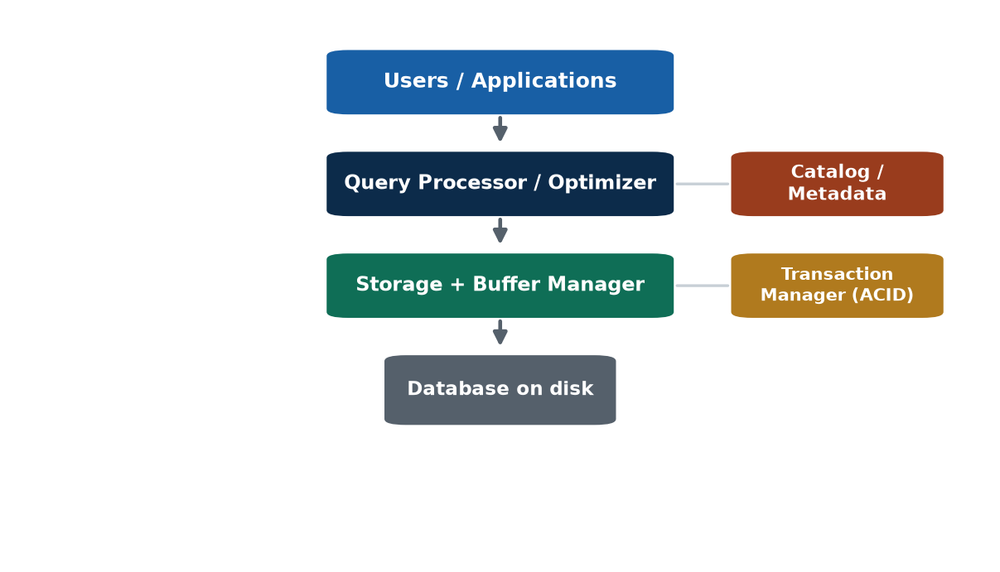

> 🎙️ **Deliver:** Use the restaurant analogy — waiter (query processor), kitchen (storage), manager
> (transaction manager ensures no half-done order), receipt book (catalog).

**📖 In Depth — read this for revision**

A DBMS is not one monolithic blob of code — it is several cooperating **components**, each with a clear job. Knowing them demystifies what happens between "I run a query" and "I get an answer":

- **Query processor / optimizer** — receives your query and works out the **cheapest, fastest way** to execute it. For any non-trivial query there are many possible execution plans; the optimizer chooses a good one. This is why two queries that return the same answer can run at wildly different speeds.
- **Storage manager** — handles the actual **reading and writing of data to disk**, managing files and storage space.
- **Buffer manager** — keeps **frequently used ("hot") data in memory** so it doesn't have to be re-read from slow disk every time, dramatically improving speed.
- **Transaction manager** — ensures transactions are processed **safely and reliably**, preserving the ACID properties you'll study in Unit 6 (so a half-finished money transfer can never leave the data in a broken state).
- **Catalog / metadata (data dictionary)** — stores information *about* the database itself (covered in the next concept).

**The restaurant analogy (worth remembering).** Think of a restaurant. The **waiter** takes your order and figures out how to fulfil it — that's the **query processor/optimizer**. The **kitchen** stores ingredients and prepares the food — that's the **storage manager**. The **manager** makes sure no order is left half-done and money isn't taken without food being served — that's the **transaction manager**. And the **receipt book / menu** records what exists and what was ordered — that's the **catalog**. Each role is distinct, and the meal only works because they cooperate.

> **🌍 Real life — what happens when you tap "View Result."** Your single tap becomes a query. The
> **query processor** works out the fastest way to fetch your marks; the **buffer manager** checks
> whether they're already in memory from a recent lookup; if not, the **storage manager** reads them
> from disk; the **transaction manager** guarantees you never see half-updated marks if a clerk is
> editing at that instant; and the **catalog** confirms the `Marks` table and its columns actually
> exist. Five components cooperate in well under a second to render one result page.

> **🎯 Model exam answer.** *"Name the main components of a DBMS and their roles."*
> **Query processor/optimizer** (plans the most efficient execution), **storage manager** (reads/
> writes data to disk), **buffer manager** (caches frequently used data in memory), **transaction
> manager** (ensures safe, reliable transactions — ACID), and the **catalog/data dictionary**
> (stores metadata). They cooperate to answer queries quickly and safely.

> **🧠 Analogy & memory hook.** A restaurant kitchen: the **waiter** (query processor), the
> **store-room** (storage), the **manager** (transaction manager), the **recipe book** (catalog).
> **Hook: "A DBMS is a kitchen of cooperating roles."**

> **🔮 Hypothetical scenario — test yourself.** Imagine a query that normally returns in 0.1 seconds
> suddenly takes 30 seconds. Walk through the components to localise the fault: is the
> **query processor/optimizer** choosing a bad execution plan? Is the **buffer manager** starved of
> memory so everything is re-read from disk? Is the **storage manager** sitting on a failing disk? Or
> is the **transaction manager** making it wait on locks held by someone else? The point of the
> scenario: knowing the components turns "it's slow" into a checklist you can actually diagnose.

> **🔑 Key terms:** *query processor/optimizer · storage manager · buffer manager · transaction manager · catalog/metadata* · the idea that a DBMS is *cooperating components*, not one block.

---

#### Concept 4 — Data Dictionary / Catalog `[THEORY]` `[~6 min]`

[SLIDE] **A database about the database**

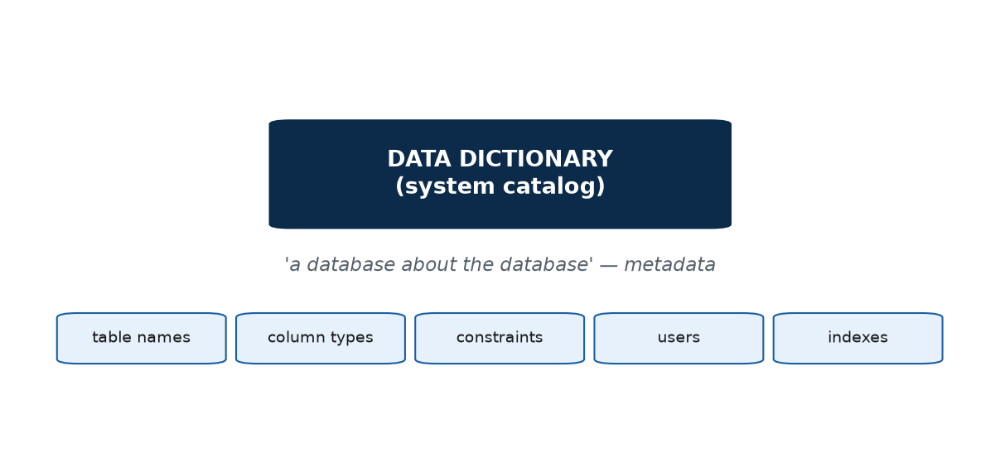

> 🎙️ **Deliver:** When you ask "what columns does Student have?", the answer comes FROM the catalog.
> Keep crisp, then run the activity.

**📖 In Depth — read this for revision**

The **data dictionary** (also called the **system catalog**) is the part of the DBMS that stores **metadata** — that is, **data about the data**. It is, quite literally, "a database about the database."

The catalog keeps track of things like: the names of all tables, the columns in each table and their data types, the constraints (rules) defined on them, the registered users and their permissions, and the indexes that exist. Whenever the DBMS needs to check "does a `Student` table exist, and what columns does it have?", it consults the catalog. When *you* run a command to list a table's structure, the answer is read straight out of the data dictionary.

**Understanding "metadata."** Metadata is simply *data that describes other data*. A useful everyday parallel: a printed phone book is **data** (names and numbers); the note on the cover that says "sorted alphabetically by surname" is **metadata** — it describes how the data is organised. The catalog is the DBMS's collection of all such describing information.

**Why it matters.** The catalog is what makes a DBMS *self-describing*: the system can answer questions about its own structure, tools can inspect a database automatically, and the DBMS can check that your queries make sense (e.g. that the column you asked for actually exists) before running them.

> **🌍 Real life — how a tool instantly "knows" your tables.** Open a database in MySQL Workbench
> or phpMyAdmin on the college database, and it immediately shows a list of every table and each
> table's columns. That list isn't magic — the tool reads it from the **system catalog**, the
> database's own **metadata**. Delete a column and the catalog updates; every tool then reflects the
> change automatically. The catalog is how the DBMS describes *itself*, which is what lets the system
> check that your query refers to columns that actually exist before it runs.

> **🎯 Model exam answer.** *"What is a data dictionary / system catalog?"*
> It is the part of the DBMS that stores **metadata** — *data about the database*: table names,
> column names and types, constraints, registered users and permissions, and indexes. The DBMS uses
> it to validate and process queries, making the database **self-describing**.

> **🧠 Analogy & memory hook.** The **index / contents page** of a book describes the book itself.
> **Hook: "Metadata = data about data."**

> **🔮 Hypothetical scenario — test yourself.** Suppose someone hands you an unfamiliar database with
> **no documentation at all** and asks "what's in it?" Without opening or reading any of the actual
> data, how could you discover every table it contains and the columns in each? (Query the **system
> catalog** — the database's own metadata.) The fact that this is even possible is the whole point:
> a DBMS is **self-describing**, because it stores data *about* its own structure.

> **🔑 Key terms:** *data dictionary / system catalog* · *metadata* (data about data) · what it stores: *table names, column types, constraints, users, indexes*.

---

#### 🛠 ACTIVITY — "Sort the command" `[ACTIVITY]` `[~6 min]`

- Rapid-fire (as a class or in pairs): for each command, call out **DDL / DML / DCL / TCL** —
  `CREATE TABLE` · `SELECT` · `GRANT` · `DROP` · `UPDATE` · `COMMIT` · `REVOKE` · `INSERT`.
- Then: "enrol a student in a brand-new course and make it permanent" — which sub-languages, in order?

> 🎙️ Speaker note: The last prompt chains DDL (create the course) → DML (enrol) → TCL (commit),
> reinforcing that one real task touches several sub-languages.

---

### 🧠 CHECK FOR UNDERSTANDING `[QUIZ]` `[~5 min]`

**MCQ 1.** `CREATE TABLE` belongs to which sub-language?
a) ✅ **DDL**  b) DML  c) DCL  d) TCL

**MCQ 2.** Which component decides the cheapest way to execute a query?
a) storage manager  b) buffer manager  c) ✅ **query processor / optimizer**  d) catalog

**Discussion:** *Which DBMS interface would you build for a non-technical shopkeeper, and why?*

---

### 💡 REAL-LIFE APPLICATION `[~3 min]`
Knowing **DDL / DML / DCL** is the literal day-one skill in any backend, data, or QA role. When a job advertisement says "SQL required," it is really asking for exactly these sub-languages — and being able to say which command does which job marks you as someone who understands databases, not just memorised syntax.

### 📝 SUMMARY & TAKEAWAYS `[~2 min]`
1. **DDL / DML / DCL / TCL** each have a distinct job; SQL bundles them.
2. A DBMS offers **many interface styles** for many kinds of users.
3. A DBMS is **several cooperating components** plus a **catalog** of metadata.

**Next session (S4):** *where* the database runs — centralized vs client/server — and how we classify DBMSs.

---
---

# S4 — Centralized vs Client/Server Architectures · Classification of DBMSs
**Lecture hour 4 of 4 · 50 minutes · CLOSES UNIT 1**

### 🎯 OPENING — Hook `[~5 min]`

[SLIDE] **"5,000 students hit refresh in the same minute."**

> **Deliver:** Results are out; thousands open the portal in the same 60 seconds. What stops the
> system collapsing? **Architecture** — *where* the database and apps actually run. Agenda:
> centralized → client/server (2-tier/3-tier) → classification → Unit 1 synthesis.

---

### 📚 CONTENT `[~35 min]`

#### Concept 1 — Centralized Architecture `[THEORY]` `[~7 min]`

[SLIDE] **Everything in one place**

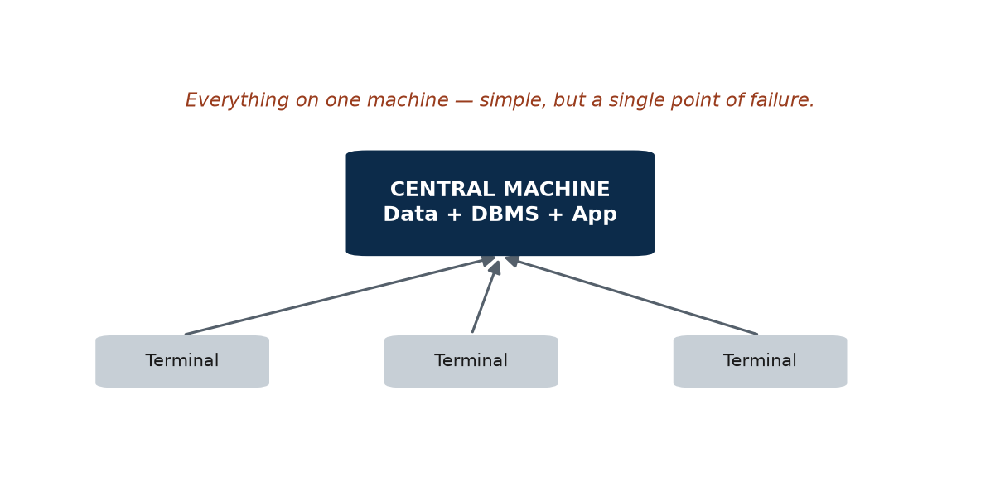

> 🎙️ **Deliver:** Emphasise the single point of failure — it's the weakness that motivates
> everything that follows.

**📖 In Depth — read this for revision**

In a **centralized architecture**, the **data, the DBMS, and the application all run on one central machine**, and users connect through simple terminals that mostly just *display* results. All the real work happens in one place.

This has a clear **advantage**: it is **simple** to set up, manage, and secure — there is only one machine to look after. But it has an equally clear **disadvantage**: that one machine is a **single point of failure.** If it goes down — hardware fault, power cut, overload — *everything* stops, because there is nowhere else for the work to happen. A purely centralized system also struggles to **scale** to large numbers of simultaneous users, since one machine can only do so much.

**Real example.** Picture an old standalone office system where a single PC in the corner holds the database, and everyone walks over to that one machine (or connects to it through dumb terminals) to do their work. Convenient when the office is small; catastrophic the day that PC dies with no backup.

This weakness — one fragile centre — is exactly what the client/server architecture was designed to overcome.

> **🌍 Real life — the one-PC office that froze.** A small Kathmandu trading firm ran its entire
> inventory and billing system on a single back-office PC; staff queried it from that one machine.
> Simple and cheap — until that PC's hard disk failed during the Dashain rush, with no backup, and
> the whole business stopped for two days. That is the defining weakness of a **centralized
> architecture**: everything sits on one machine, so that one machine is a **single point of
> failure**, and it can't scale when many users pile on at once.

> **🎯 Model exam answer.** *"What is centralized architecture and its main drawback?"*
> In a **centralized architecture**, the data, the DBMS, and the application all run on **one central
> machine**, with terminals only displaying results. It is **simple** to set up and manage, but its
> main drawback is being a **single point of failure** (if the central machine fails, everything
> stops) together with **poor scalability**.

> **🧠 Analogy & memory hook.** A town served by a **single water tank** — convenient, until it
> cracks and the whole town runs dry. **Hook: "One machine = one point of failure."**

> **🔮 Hypothetical scenario — test yourself.** Imagine your entire college runs on **one server in
> one room**, and during the busiest hour of result-publishing a transformer blast cuts power to
> that room. What is the "blast radius" — how many of the college's services keep running? (None —
> that's the meaning of a **single point of failure**.) Now picture the same college with three
> replicated servers in three different buildings: how does the answer change? The contrast is
> exactly why we move away from centralized designs.

> **🔑 Key terms:** *centralized architecture* · *single point of failure* · *scalability* · *terminal*.

---

#### Concept 2 — Client/Server Architecture `[THEORY]` `[EXAMPLE]` `[~9 min]`

[SLIDE] **Split the work across machines**

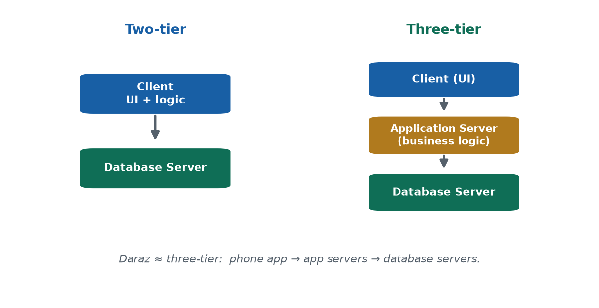

> 🎙️ **Deliver:** Three-tier is the modern web/mobile standard. The "why your phone doesn't hold the
> full ledger" case lands the server-side idea: security, consistency, access from any device.

**📖 In Depth — read this for revision**

In a **client/server architecture**, the work is **split across machines** that cooperate over a network. There are two common arrangements:

- **Two-tier:** a **client** (the user's machine, running the user interface and often the application logic) talks directly to a **database server** (which stores and manages the data). The two tiers are the client and the database server.
- **Three-tier:** a third layer is inserted in the middle. Now there is a **client** (just the user interface), an **application server** (which holds the *business logic* — the rules, the processing, the security checks), and a **database server** (the data). This is the dominant architecture for modern web and mobile applications, because each tier can be scaled, secured, and updated independently.

**Worked example — the Daraz app.** When you shop on Daraz, your phone runs the **client** (the app's screens). It talks to **application servers** that handle the logic — logging you in, managing your cart, processing the order. Those in turn talk to **database servers** that store the products, orders, and user accounts. Three tiers, each able to grow on its own: if traffic spikes during a Dashain sale, Daraz can add more application servers without touching the database design.

**The case that makes "server-side" click.** *Why doesn't a mobile-banking app store your full transaction ledger on your phone?* Because the real data lives **server-side**, for three reasons: **security** (your phone can be lost or stolen), **consistency** (the bank must hold one authoritative copy, not trust thousands of phones), and **access from any device** (you can log in from a new phone and your data is still there). The phone is just a **client** showing you a view of data that safely lives on the server. This is the everyday reality of client/server design.

> **🌍 Real life — why Daraz survives a Dashain sale.** During a big sale, millions open Daraz at
> once. Your phone (the **client**) just shows the screens. A fleet of **application servers** handle
> logins, carts, and offers. **Database servers** store the products and orders. When traffic
> spikes, Daraz simply adds more application servers — the three tiers scale **independently**. If
> Daraz ran centralized on one machine, the first big sale would crash it. Your banking app works the
> same way: the phone is only a client; your actual money lives **server-side**, which is why you can
> log in from a new phone and everything is still there.

> **🎯 Model exam answer.** *"Differentiate two-tier and three-tier architecture."*
> **Two-tier:** the client (user interface + application logic) communicates directly with a
> database server. **Three-tier:** an **application server** holding the business logic sits between
> the client (UI only) and the database server. Three-tier scales better, is easier to secure, and
> is the standard for modern web and mobile applications.

> **🧠 Analogy & memory hook.** A restaurant: **you** (client), the **waiter + kitchen manager**
> (application server), the **kitchen store** (database). **Hook: "Three tiers: face, logic, data."**

> **🔮 Hypothetical scenario — test yourself.** Suppose 50,000 students open the result portal within
> five minutes. In a **two-tier** design, every client hammers the database server directly. In a
> **three-tier** design, an application-server layer sits in front, absorbing logins, caching, and
> queuing before anything reaches the database. Predict which design buckles first and why — and in
> each design, *where* would you "add more machines" to cope? (Two-tier: nowhere good — the DB is the
> bottleneck. Three-tier: add application servers, leaving the DB protected.)

> **🔑 Key terms:** *client/server architecture* · *two-tier* (client ↔ database server) · *three-tier* (client ↔ application server ↔ database server) · *business logic* · *server-side*.

---

#### Concept 3 — Classification of DBMSs `[THEORY]` `[~7 min]`

[SLIDE] **Four ways to classify a DBMS**

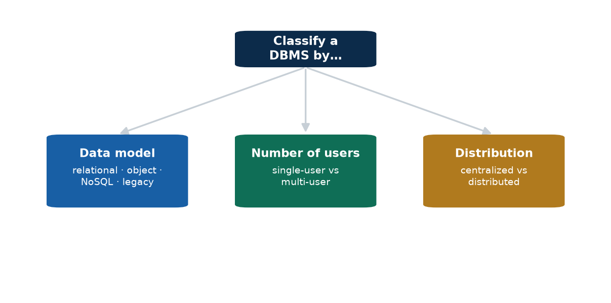

> 🎙️ **Deliver:** NoSQL and distributed are previews of Unit 7. Stress that relational still
> DOMINATES business systems; NoSQL is an additional tool for specific needs.

**📖 In Depth — read this for revision**

DBMSs come in many varieties, and we can **classify** any DBMS along several independent axes. Knowing the axes lets you describe any system precisely:

- **By data model:** **relational** (tables — by far the most common in business), **object-oriented**, **object-relational**, the older **hierarchical/network** models (legacy), and **NoSQL** systems (a fuller treatment comes in Unit 7).
- **By number of users:** **single-user** (one user at a time, e.g. a small desktop database) vs **multi-user** (many simultaneous users — almost all business systems).
- **By number of sites / distribution:** **centralized** (data at one site) vs **distributed** (data spread across multiple sites or servers; previewed in Unit 7).
- **By purpose:** **general-purpose** vs **special-purpose** systems built for one specific job.

**The misconception to correct.** Students often hear "NoSQL" and assume it means "no SQL" or "SQL is dead." It actually stands for **"not only SQL."** Relational, SQL-based databases still **dominate** business systems; NoSQL is an *additional* family of tools suited to specific needs such as enormous scale or very flexible, changing data structures. It complements relational databases rather than replacing them.

> **🌍 Real life — classifying the apps in your pocket.** Your **bank app's** DBMS is *relational,
> multi-user,* and (for a large bank) *distributed* across data centres. A small offline **note app**
> might be *relational* but *single-user* and *centralized*. A giant like **Facebook** mixes
> *relational and NoSQL*, is *massively multi-user*, and is *heavily distributed*. The very same
> three axes — data model, number of users, distribution — let you describe any system you touch,
> which is exactly what an exam question is testing.

> **🎯 Model exam answer.** *"On what bases are DBMSs classified?"*
> By **data model** (relational, object, object-relational, NoSQL, legacy hierarchical/network);
> by **number of users** (single-user vs multi-user); by **number of sites / distribution**
> (centralized vs distributed); and by **purpose** (general- vs special-purpose). *(Note: "NoSQL"
> means "not only SQL," not "no SQL.")*

> **🧠 Analogy & memory hook.** Classifying **vehicles** by fuel, number of seats, and range.
> **Hook: "Model · users · distribution."**

> **🔮 Hypothetical scenario — test yourself.** Imagine you're handed three unlabelled systems: a
> shop-billing app running on a single laptop, a nationwide bank core, and a global social network.
> Classify each on all three axes — **data model, number of users, distribution**. (Roughly:
> relational/single-user/centralized; relational/multi-user/distributed; relational+NoSQL/massively
> multi-user/heavily distributed.) This is almost word-for-word a typical exam question — so practise
> it on systems you already know.

> **🔑 Key terms:** *classification axes* — *data model · number of users · distribution · purpose* · *relational · NoSQL ("not only SQL") · single- vs multi-user · centralized vs distributed*.

---

#### Concept 4 — Unit 1 Synthesis `[THEORY]` `[~6 min]`

[SLIDE] **The whole unit in one picture**

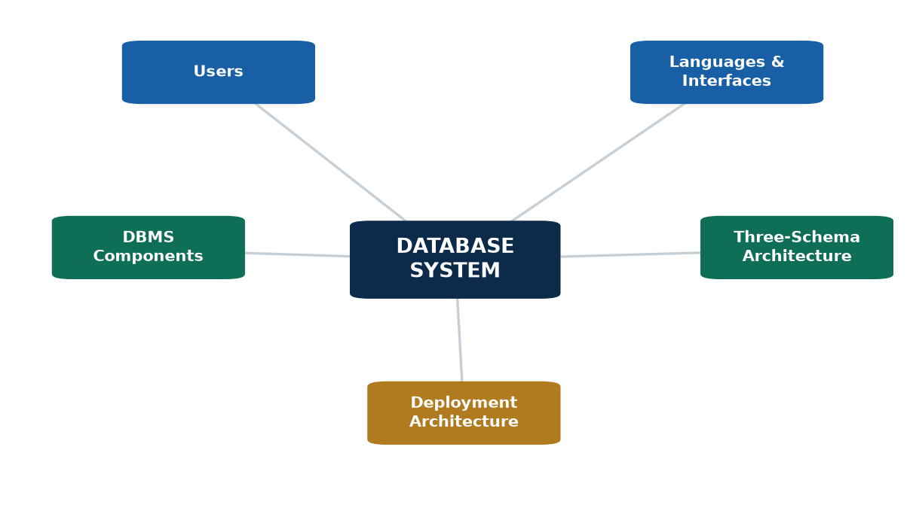

> 🎙️ **Deliver:** Walk the mind-map slowly; ask students which session each branch came from. This
> is the slide to photograph for revision.

**📖 In Depth — read this for revision**

It helps to see how the four sessions of this unit fit together into a single picture of a **database system**:

Different **users** (naive users, application programmers, sophisticated users, the DBA) interact, through **languages and interfaces** (DDL/DML/DCL/TCL; forms, GUIs, APIs), with a **DBMS** (made of cooperating components — query processor, storage and buffer managers, transaction manager, and the catalog). The DBMS manages a **database** whose structure is described by a **schema** at three levels — the **three-schema architecture** — which gives us **data independence**. And the whole system runs on some **deployment architecture** (centralized or, more usually today, client/server). Finally, we can **classify** any such system by its data model, its number of users, and its distribution.

Every branch of that picture is one of the sessions you just studied: users and the DBA (S1), schemas and architecture (S2), languages, interfaces and components (S3), deployment and classification (S4). If you can reconstruct this paragraph from the mind-map image, you have the whole unit.

> **🌍 Real life — one tap on eSewa touches the whole unit.** You (**a user**) tap a button (**an
> interface**) that sends a query (**DML**) to eSewa's **DBMS** (its **components** + **catalog**).
> It reads your balance from a **database** whose design is a **schema at three levels** — which is
> exactly why eSewa can upgrade its storage without breaking your app (**data independence**) — all
> running on a **three-tier client/server** architecture, on a DBMS that is **relational, multi-user,
> and distributed**. A single tap quietly exercises every concept in Unit 1.

> **🎯 Model exam answer.** *"How do the concepts of Unit 1 connect?"*
> Users reach a **DBMS** through **interfaces and languages**; the DBMS (built of cooperating
> **components** plus a **catalog**) manages a **database** described by a **schema at three levels**
> (giving **data independence**) and runs on a **centralized or client/server architecture**; any
> such system can be **classified** by its data model, number of users, and distribution.

> **🧠 Analogy & memory hook.** Follow one eSewa tap from your thumb down to the disk and back.
> **Hook: "User → interface → DBMS → schema → architecture."**

> **🔮 Hypothetical scenario — test yourself.** Imagine eSewa's **database servers** go offline for
> ten minutes, but its **application servers** stay up. Trace it through Unit 1: your app (client)
> still opens, the app server still responds to taps — but every action that needs *data* (your
> balance, your history, a new payment) fails. What does this tell you about how the tiers depend on
> each other, and which single layer is the true "source of truth"? Walking this failure through the
> stack rehearses every concept in the unit at once.

> **🔑 Key terms (unit-wide):** *database · DBMS · users · DBA · data model · schema · instance · three-schema architecture · data independence · DDL/DML/DCL/TCL · DBMS components · catalog · centralized vs client/server · DBMS classification*.

---

#### 🛠 ACTIVITY — "Classify a Nepali app" `[ACTIVITY]` `[~5 min]`

- In pairs (3 min): pick a Nepali app (**eSewa, Daraz, Nagarik App, a bank app**). Sketch whether it's **two-tier or three-tier** and label what lives in each tier. Then classify its likely DBMS on the **three axes** (data model, number of users, distribution) with a one-line reason each.
- Share (2 min).

> 🎙️ Speaker note: Most modern Nepali apps are three-tier, multi-user, and relational (sometimes
> with some NoSQL). Let pairs justify their guess — the reasoning matters more than being "right."

---

### 🧠 CHECK FOR UNDERSTANDING `[QUIZ]` `[~5 min]`

**MCQ 1.** The main weakness of a purely centralized architecture is:
a) too many servers  b) ✅ **single point of failure**  c) too secure  d) no data storage

**MCQ 2.** A three-tier architecture adds which layer between the client and the database?
a) a second client  b) a backup disk  c) ✅ **an application / business-logic server**  d) a second database

**Discussion:** *Pick a Nepali app and sketch whether it's two-tier or three-tier, and why.*

---

### 💡 REAL-LIFE APPLICATION `[~3 min]`
Every scalable product you use — e-commerce, fintech, the **Nagarik App**, government portals — is built client/server, usually three-tier. Understanding this frames the rest of the course: the next units zoom into how that database layer is *designed* (ER modelling, normalization) and *queried* (SQL). Architecture is the map; the rest of IT 220 fills in the territory.

### 📝 SUMMARY & TAKEAWAYS `[~2 min]`
1. **Centralized** = simple but fragile (single point of failure).
2. **Client/server** (especially **three-tier**) is the scalable modern standard.
3. DBMSs are **classified** by data model, number of users, and distribution.

**Next unit (Unit 2):** we start *designing* databases — modelling the real world with the **Entity-Relationship (ER) model** and converting it to tables.

---
---

# 📋 UNIT 1 — END-OF-UNIT QUIZ
*Use as a 15–20 min in-class quiz or a take-home review. Answer key at the end.*

### Section A — Multiple Choice (1 mark each)
1. A database is best described as:
   a) any collection of files  b) ✅ an organized, persistent, shared collection of related data  c) a single spreadsheet  d) a programming language
2. The software that manages a database is the:
   a) ✅ DBMS  b) OS  c) compiler  d) data dictionary
3. Which is a disadvantage of file-based systems that a DBMS solves?
   a) too much security  b) ✅ uncontrolled data redundancy/inconsistency  c) too fast access  d) too few users
4. Granting permissions is the responsibility of the:
   a) end user  b) ✅ DBA  c) app programmer  d) naive user
5. The actual data in a database at a given moment is the:
   a) schema  b) ✅ instance  c) model  d) catalog
6. Changing storage on disk without affecting the conceptual schema is:
   a) logical data independence  b) ✅ physical data independence  c) redundancy  d) normalization
7. The external level of the three-schema architecture refers to:
   a) physical storage  b) the whole database  c) ✅ per-user views  d) the catalog
8. `CREATE TABLE` is part of:
   a) ✅ DDL  b) DML  c) DCL  d) TCL
9. The DBMS component that finds the most efficient way to run a query is the:
   a) buffer manager  b) ✅ query processor/optimizer  c) catalog  d) storage manager
10. The main weakness of centralized architecture is:
    a) high cost  b) ✅ single point of failure  c) too many tiers  d) weak UI
11. The middle tier in a three-tier architecture is the:
    a) database server  b) client  c) ✅ application/business-logic server  d) backup server
12. "NoSQL" most accurately means:
    a) SQL is banned  b) ✅ not only SQL  c) no databases  d) new SQL

### Section B — Short Answer (2 marks each)
13. Define *schema* and *instance*, and give one example of each for a `Student` table.
14. List any **four** advantages of a DBMS over a file-based system.
15. Differentiate **logical** and **physical** data independence in one sentence each.
16. Name the four database sub-languages (DDL/DML/DCL/TCL) and give one example command of each.
17. What is metadata? Where is it stored in a DBMS?

### Section C — Applied / Diagramming (3 marks each)
18. Draw and label the **three-schema architecture**, and explain what each level hides from the level above it.
19. For the **Daraz** app, sketch a **three-tier** architecture and label what lives in each tier.
20. Classify a multi-user online banking system along **three** different classification axes (model, users, distribution), with a one-line justification each.

### Section D — Discussion (open-ended)
21. "A kirana shop's paper notebook is technically a database." Argue for and against, then state what upgrading it to a DBMS would gain.

---

### ✅ Answer Key (Section A)
1-b · 2-a · 3-b · 4-b · 5-b · 6-b · 7-c · 8-a · 9-b · 10-b · 11-c · 12-b

> Sections B–D: grade on key terms — e.g. Q14 should mention controlled redundancy, integrity,
> sharing/concurrency, security, backup/recovery (any four). Q18 must show External → Conceptual →
> Internal with mappings.

---

## ✅ Unit 1 complete (lecturer-ready + student-revision depth, with diagrams)
Every concept now has standalone written depth for revision, a custom diagram, lecturer delivery
cues, minute markers, and a timed activity. **This is the project-wide standard** — all other units
(IT 220 and IT 246) will be brought to this same level: real images on every important concept and
full written exploration a student can revise from. Say the word and I'll roll it out unit by unit;
the matching deck embeds these same images.
