# IT 220 — Unit 2: Data Modelling (ER Model & Relational Model)
### Full Lecturer-Ready + Student-Revision Material (S5–S8 of S5–S12)

**Program:** BIM, 4th Semester · **Credits:** 3 · **Unit weight:** 8 lecture hours
**Sessions:** S5–S8 (50 min each) · **Local context:** Nepal / South Asia · **Notation:** Chen

> **How to read this file.** It serves **two readers at once:**
> - **The lecturer** — minute markers `[~X min]`, delivery cues in `> 🎙️` blocks, a timed activity, and `[SLIDE]` markers.
> - **The student (revising later)** — every concept has a **📖 In Depth** prose section, a **🌍 Real life** story from a system you actually use, a **🔮 Hypothetical scenario** to apply the idea, a **🎯 Model exam answer**, an **🧠 Analogy & memory hook**, a **🔑 Key terms** box, and a custom **diagram image**.
>
> Pace tags: `[THEORY] [EXAMPLE] [ACTIVITY] [QUIZ]`. Per session: **5 + 35 + 5 + 3 + 2 = 50 min.**
> ER diagrams in this unit use **Chen notation** — **rectangles = entities, ovals = attributes, diamonds = relationships.** Images live in `images/`.

---

## Unit 2 — Learning Outcomes
By the end of this unit (S5–S12), students will be able to:
1. Explain the database design process and the role of a high-level conceptual (ER) model in it.
2. Identify entity types, entity sets, and classify attributes (simple, composite, derived, multivalued) and keys.
3. Model relationship types/sets with roles and structural constraints (cardinality ratio, participation).
4. Recognize and diagram weak entity types using identifying relationships and partial keys.
5. Draw clean, correctly-named ER diagrams and avoid common design pitfalls.
6. Handle relationships of degree higher than two (ternary and beyond).
7. Apply specialization/generalization with disjoint/overlap and total/partial constraints.
8. Convert (map) a complete ER diagram into relational tables using the standard algorithm.

*(This batch covers outcomes 1–4 across S5–S8.)*

---
---

# S5 — High-Level Conceptual Data Models & the Database Design Process
**Lecture hour 5 of 8 · 50 minutes**

### 🎯 OPENING — Hook `[~5 min]`

[SLIDE] **"Why draw before you build?"**

> **Deliver (≈2 min):** Put it on screen: *"Before Daraz wrote a single line of code, someone drew
> boxes and lines on a whiteboard — a box for **Product**, a box for **Customer**, a box for
> **Order**, and lines joining them."* Ask the class: "Why would engineers waste a whole day drawing
> pictures instead of just building the database?" Let two or three answer.
>
> **Land it (≈3 min):** You don't lay bricks before an architect draws the floor plan — you'd get a
> house with a toilet opening into the kitchen. Software is the same. That whiteboard drawing has a
> name: a **conceptual data model**, and the most popular way to draw it is the **Entity-Relationship
> (ER) model** — this whole unit. Today we learn *what* it is and *where* it fits in the bigger job
> of designing a database.

> 🎙️ Speaker note: Don't teach ER symbols yet — just plant the idea "describe *what*, before *how*."
> If quiet, cold-call: "You're asked to build a college result system tomorrow — what's the *first*
> thing you'd do?" Agenda on board: conceptual model → the design pipeline → data vs functional
> requirements.

**Agenda preview:** (1) what a conceptual data model is and why ER, (2) the four-stage database design process, (3) data requirements vs functional requirements.

---

### 📚 CONTENT `[~35 min]`

#### Concept 1 — What a Conceptual Data Model Is (and Why ER) `[THEORY]` `[~12 min]`

[SLIDE] **Describe *what* you store — not *how* you store it**

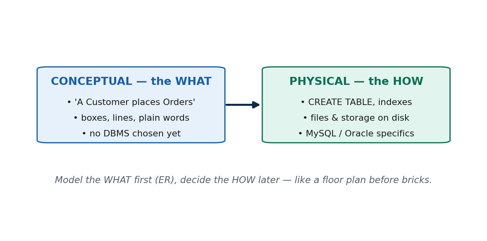

> 🎙️ **Deliver:** Write **WHAT vs HOW** big on the board. A conceptual model answers *what* data the
> system holds and how the things relate; it says **nothing** about tables, files, or which DBMS. Give
> the airline example (Passenger / Flight / Booking) *before* naming Oracle or MySQL. Then correct the
> big misconception: "modelling is NOT drawing tables — tables come much later, in S12."

**📖 In Depth — read this for revision**

A **conceptual data model** is a **high-level, implementation-independent description of what data a system must hold and how those pieces of data relate to one another.** The word "conceptual" is the key: it lives at the level of *concepts and real-world things* — customers, products, orders, students, courses — not at the level of tables, columns, files, or disks. It deliberately says **nothing** about *how* the data will finally be stored or which database software will be used. That is a feature, not a gap: by staying above those details, the model stays readable and stays valid no matter which technology you later choose.

The single most popular way to draw a conceptual model is the **Entity-Relationship (ER) model**, invented by Peter Chen. In **Chen notation** you draw **rectangles for entities** (the things, e.g. STUDENT, COURSE), **ovals for attributes** (their properties, e.g. name, roll number), and **diamonds for relationships** (the associations between things, e.g. ENROLLS). The whole of Unit 2 is essentially learning to read and draw these three shapes correctly. The ER model is popular precisely because it is **technology-neutral** and **easy for non-technical stakeholders** — a finance manager or a college registrar can look at boxes-and-lines and confirm "yes, that's how our system works," even though they could never read a `CREATE TABLE` statement.

Why bother with a model *above* the tables at all? Because a conceptual model is a **communication tool** and a **thinking tool**. It lets designers, business people, and programmers agree on *what the system is about* before anyone commits to expensive implementation decisions. Consider an **airline reservation system**: on a whiteboard you draw PASSENGER, FLIGHT, and BOOKING, with a line saying a passenger *makes* a booking for a flight. That drawing is complete and useful **before** anyone decides whether the airline will run Oracle or MySQL, whether the data lives on one server or ten. The same model maps onto any of those choices later.

**The misconception to kill early.** Many students think *"modelling = drawing the database tables."* It does not. A conceptual (ER) model sits **above** tables. It has entities and relationships, not rows and foreign keys. The translation from ER into actual tables is a separate, later step — the **mapping algorithm** we reach in S12. If you draw tables on day one, you have skipped the thinking and locked yourself into a structure before you understood the problem. Keep the layers straight: **concept first, tables later.**

**A worked mini-illustration — the college exam system.** Suppose your college asks you to build a system that records exam results. Before touching any software, you sketch: a rectangle **STUDENT**, a rectangle **COURSE**, a rectangle **RESULT** (or a relationship linking student and course to a grade). You add ovals for the obvious properties — a student's roll number and name, a course's code and title. You draw a line: a student *takes* a course and *earns* a result. That entire picture is a conceptual model. It is correct and reviewable by the exam section **before** you decide the database will be MySQL, before you decide how many servers, before a single table exists. That is the power of modelling *what* before *how*.

> **🌍 Real life — the Daraz whiteboard, before Daraz existed.** Long before Daraz served its first
> order, someone stood at a whiteboard and drew three boxes — **CUSTOMER**, **PRODUCT**, **ORDER** —
> and connected them: *a customer places an order; an order contains products.* That drawing is a
> **conceptual (ER) model**: pure real-world things and relationships, with no mention of tables,
> MySQL, or servers. Only after everyone agreed the picture was right did engineers turn it into
> tables and choose the storage. Contrast a startup that skips this and starts typing `CREATE TABLE`
> on day one: three months in, they discover "delivery address" was never modelled as something a
> customer can have *several* of — and now fixing it means rewriting live tables. The whiteboard hour
> would have caught it for free.

> **🔮 Hypothetical scenario — test yourself.** Imagine two teams are each handed the same brief:
> *"build a library system."* Team A spends the first afternoon at a whiteboard drawing MEMBER, BOOK,
> and a BORROWS line between them, and walks the librarian through it. Team B skips that and
> immediately writes table-creation code. Six weeks later the librarian says, "oh, a member can be on
> a waiting list for a book they haven't borrowed yet." Which team absorbs that change more cheaply,
> and *why*? (Team A — because their **conceptual model** is above the tables, so adding a WAITS_FOR
> relationship is a cheap edit to a picture, whereas Team B has to unpick committed table structures.)
> The lesson: modelling *what* before *how* makes change cheap.

> **🎯 Model exam answer.** *"What is a conceptual data model? Why is the ER model widely used?"*
> A **conceptual data model** is a **high-level, implementation-independent** description of *what*
> data a system stores and how the data relate — expressed in terms of real-world things, not tables
> or storage. The **ER (Entity-Relationship) model** is the most widely used conceptual notation
> because it is **technology-neutral** (independent of any specific DBMS) and **easy for
> non-technical stakeholders to understand** (rectangles = entities, ovals = attributes, diamonds =
> relationships in Chen notation). It captures the design *before* implementation decisions are made.

> **🧠 Analogy & memory hook.** An **architect's floor plan** shows rooms and how they connect, drawn
> and approved long before any bricks are laid or any decision is made about brand of cement. The ER
> model is the floor plan of a database. **Hook: "Model the *what*; the *how* comes later."**

> **🔑 Key terms:** *conceptual (high-level) data model* · *implementation-independent / technology-neutral* · *Entity-Relationship (ER) model* · *Chen notation* (rectangle = entity, oval = attribute, diamond = relationship) · *stakeholder-readable*.

---

#### Concept 2 — The Database Design Process (the Full Pipeline) `[THEORY]` `[EXAMPLE]` `[~12 min]`

[SLIDE] **Four stages: Requirements → Conceptual → Logical → Physical**

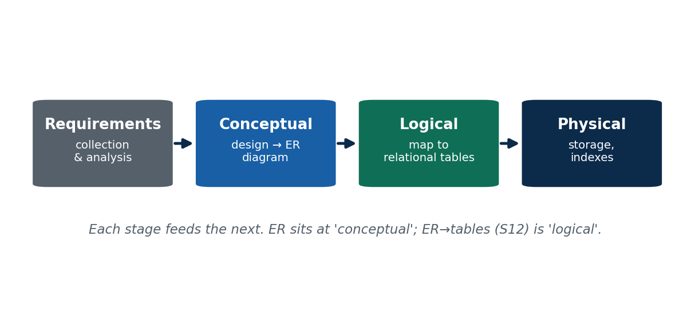

> 🎙️ **Deliver:** Draw the four-box pipeline left to right on the board and keep it there all
> session — every later concept hangs off it. Stress that **each stage feeds the next**: ER sits at
> the *conceptual* box; the mapping-to-tables we do in S12 is the *logical* box. Tell the eSewa
> requirements-first story, then the "team that skipped requirements" rework case.

**📖 In Depth — read this for revision**

Designing a database is not one act — it is a **pipeline of four stages**, each producing an output that feeds the next. Learning the pipeline tells you *where* everything in this unit fits.

1. **Requirements collection & analysis.** You talk to the people who will use the system and write down *what data must be stored* and *what operations must be supported*. Output: a requirements document. This is the stage most likely to be skipped and most expensive to skip.
2. **Conceptual design.** You turn those requirements into a **conceptual model — the ER diagram.** This is where entities, attributes, and relationships are identified. Output: an ER diagram that is independent of any DBMS. (This is Concept 1, and the bulk of Unit 2.)
3. **Logical design.** You **map** the ER diagram onto the data model of a chosen family of DBMS — for us, the **relational model** (tables). Output: a set of table definitions with keys and foreign keys. This is exactly the **mapping algorithm of S12.**
4. **Physical design.** You decide *how* the tables are physically stored for good performance — indexes, file organization, storage layout. Output: the physical schema. This is the DBA's territory (and connects to the internal level of the three-schema architecture from Unit 1).

The crucial idea is **flow**: the output of each stage is the input to the next. Requirements shape the ER diagram; the ER diagram is mechanically converted into tables; the tables are then tuned for storage. If a stage is done badly, everything downstream inherits the damage. And notice how this pipeline maps onto Unit 1's abstraction levels: conceptual design produces the *conceptual* schema, logical design produces the *logical/representational* schema, physical design produces the *internal* schema.

**A worked example — building eSewa's wallet.** Imagine the team designing a digital wallet like eSewa. **Stage 1:** they sit with the finance team and gather requirements — *"we store users, their balances, and every transaction; we must support top-up, send-money, and view-statement."* **Stage 2:** they draw an ER diagram — entities USER and TRANSACTION, with a relationship "a user *makes* transactions," plus attributes like balance and amount. **Stage 3:** they map that ER diagram to relational tables — a `User` table, a `Transaction` table, a foreign key linking them. **Stage 4:** they add indexes on user-id so a statement loads instantly, and decide how to store years of transaction history. Four stages, each handing its output to the next.

**Why skipping a stage is the classic disaster.** Picture a team that skips Stage 1 (requirements) and jumps straight to creating tables. They build `User` and `Transaction` tables and start coding. Halfway through, someone asks: *"where do we record **where** the top-up money came from — bank, card, or agent?"* Nobody captured "top-up source" as a requirement, so there's no place for it. Now they must alter live tables, migrate existing data, and rewrite code that already assumed the old structure. That **rework** costs many times what a one-hour requirements meeting would have cost. In industry, missing or vague requirements is repeatedly found to be the **number-one cause of costly rework** — which is why the pipeline starts, deliberately, with requirements.

> **🌍 Real life — eSewa's wallet, stage by stage.** eSewa didn't begin with code; it began with the
> **finance team's requirements**: store users, balances, and transactions, and support top-up,
> send-money, and statements. Those requirements became a **conceptual ER diagram** (USER *makes*
> TRANSACTION), which was **mapped to relational tables** (a `User` table, a `Transaction` table, a
> foreign key), which were finally **tuned physically** with indexes so your yearly statement loads
> in a tap. Now the contrast: a real pattern in Nepali startups is teams that skip requirements and
> code tables first — then discover mid-build that "top-up source" or "cashback" was never captured,
> and pay for it in painful live-data migrations. Requirements → Conceptual → Logical → Physical,
> in that order, is what keeps the cost down.

> **🔮 Hypothetical scenario — test yourself.** Suppose your team is building a food-delivery app and,
> to "save time," you skip straight to designing tables without gathering requirements. Two weeks in,
> the client mentions casually: *"of course a customer can save multiple addresses, and each order
> needs the rider's live location."* Neither was in your tables. Ask yourself: **which pipeline stage
> did you skip, what did it cost, and where should those two facts have been captured?** (You skipped
> **requirements collection**; the cost is reworking live tables and code; both facts should have
> surfaced in Stage 1 and shaped the **conceptual ER diagram** in Stage 2.) Every stage you skip, a
> later stage pays for — with interest.

> **🎯 Model exam answer.** *"Describe the phases of the database design process."*
> Database design proceeds through four phases: **(1) Requirements collection & analysis** — capture
> what data and what operations are needed; **(2) Conceptual design** — build a DBMS-independent **ER
> diagram**; **(3) Logical design** — **map** the ER diagram to the relational model (tables with
> keys and foreign keys); **(4) Physical design** — choose storage structures and indexes for
> performance. Each phase's output feeds the next; the ER model sits at the conceptual phase, and
> ER-to-table mapping is the logical phase.

> **🧠 Analogy & memory hook.** Building a house: **survey the family's needs** (requirements) → draw
> the **floor plan** (conceptual/ER) → produce **detailed construction drawings** (logical/tables) →
> **actually build with chosen materials** (physical/storage). **Hook: "Requirements → Conceptual →
> Logical → Physical (RCLP)."**

> **🔑 Key terms:** *database design process* · *requirements collection & analysis* · *conceptual design (ER)* · *logical design (mapping to relational)* · *physical design (storage/indexes)* · *rework* (the cost of skipping a stage).

---

#### Concept 3 — Data Requirements vs Functional Requirements `[THEORY]` `[~11 min]`

[SLIDE] **Two kinds of requirement: what to *store* vs what to *do***

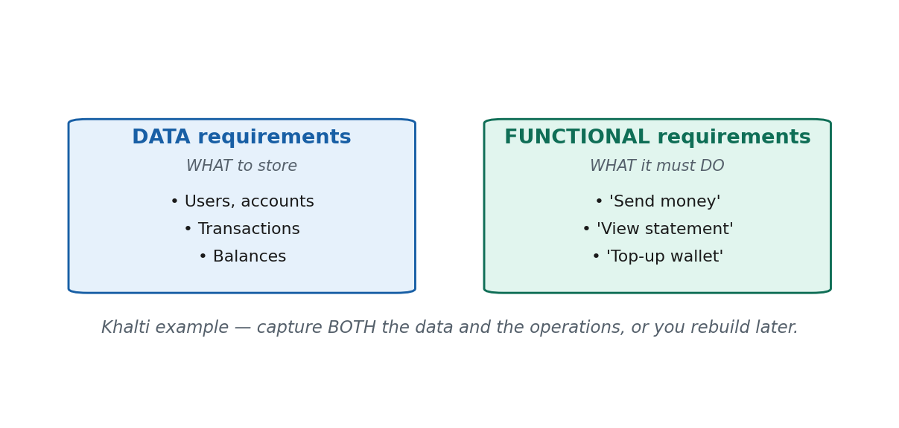

> 🎙️ **Deliver:** Split the board in two: "STORE" on the left, "DO" on the right. Data requirements =
> the nouns you must store; functional requirements = the verbs/operations the system must support.
> Use Khalti: data = users, transactions; functional = "send money," "view statement." Correct the
> misconception "requirements are only about data" — you must also capture the operations.

**📖 In Depth — read this for revision**

During Stage 1 of the design pipeline (requirements collection) you actually gather **two different kinds of requirement**, and confusing them is a common beginner mistake.

- **Data requirements** describe **what data the system must store.** They are, roughly, the *nouns* of the system: the things and their properties. For a wallet app, the data requirements include: users (with a name, phone number, balance), transactions (with an amount, date, and status), and merchants. Data requirements are what shape the **entities and attributes** of your ER diagram.
- **Functional requirements** describe **what operations or transactions the system must support** — what users must be able to *do*. They are, roughly, the *verbs*: the actions and processes. For the same wallet, functional requirements include: *send money to another user*, *top up the balance*, *view a statement*, *pay a merchant*. Functional requirements shape the **operations** the database must serve efficiently, and they influence which relationships and which access paths matter.

Both are essential, and they are **captured together but serve different purposes.** Data requirements tell you *what to model as entities and attributes*; functional requirements tell you *what the design must be able to do quickly and correctly*. A design that stores all the right data but can't support a needed operation is just as broken as one that supports operations on data it never stored.

**The misconception to correct.** Beginners often think *"requirements are only about the data."* Not so. If you capture only the data (users, balances, transactions) but never write down the operations (send money, view statement), you might build a perfectly structured database that, say, makes generating a monthly statement painfully slow — because nobody flagged that "view statement" was a frequent, important operation the design had to serve well. **Always capture both the nouns and the verbs.**

**A worked example — Khalti.** Gathering requirements for a Khalti-style wallet, you would write two lists. *Data requirements:* a USER (name, mobile number, KYC status, balance) and a TRANSACTION (amount, timestamp, type, status, counterparty). *Functional requirements:* the system must let a user **send money**, **top up**, **pay a bill**, and **view their statement** for any date range. The first list drives your entities and attributes; the second tells you, for instance, that transactions must be efficiently retrievable *by user and by date* — which will influence relationships now and indexes later. Miss either list and the system disappoints its users.

> **🌍 Real life — Khalti's two lists.** Behind Khalti sit two kinds of requirement. The **data
> requirements** are the things it stores: users (name, number, balance, KYC) and transactions
> (amount, date, type, status). The **functional requirements** are the things you can *do*: send
> money, top up, pay a bill, view your statement. Notice both had to be captured: the data list gave
> Khalti its USER and TRANSACTION entities; the functional list — especially "view statement for a
> date range" — is *why* your history loads instantly instead of grinding through millions of rows.
> A team that captured only the data would have stored everything correctly and *still* shipped a
> painfully slow statement screen, because nobody flagged that operation as one the design must serve
> fast. Nouns *and* verbs.

> **🔮 Hypothetical scenario — test yourself.** Imagine you're gathering requirements for a college
> library system and you write down only this: *"store members, books, and who borrowed what."* You've
> captured solid **data requirements** — but you stop there. On launch day the librarian asks, "how
> do I see *which books are overdue today* and *send a reminder*?" — and the system can't do it
> smoothly. Which kind of requirement did you forget, and name two you should have listed? (You forgot
> the **functional requirements** — the *operations*; e.g. "list overdue books," "issue a reminder,"
> "reserve a book," "renew a loan.") Storing the right nouns is only half the job; you must also list
> the verbs.

> **🎯 Model exam answer.** *"Differentiate data requirements and functional requirements with an
> example."* **Data requirements** specify *what data* must be stored — the things and their
> properties (the nouns), e.g. for Khalti: users, balances, transactions. **Functional requirements**
> specify *what operations* the system must support — the actions (the verbs), e.g. send money, top
> up, view statement. Data requirements shape the ER model's **entities and attributes**; functional
> requirements shape the **operations** the design must serve. Both must be captured; recording only
> data is a common, costly mistake.

> **🧠 Analogy & memory hook.** Opening a restaurant: the **ingredients you stock** are the *data
> requirements*; the **dishes you promise to cook** are the *functional requirements*. Stock without
> a menu, or a menu without stock, and you fail. **Hook: "Data = the nouns to store; functional = the
> verbs to do."**

> **🔑 Key terms:** *data requirements* (what to store — nouns → entities/attributes) · *functional requirements* (what operations to support — verbs → transactions) · *requirements collection & analysis* · the rule: *capture both nouns and verbs*.

---

#### 🛠 ACTIVITY — "Nouns and Verbs of a Nepali app" `[ACTIVITY]` `[~5 min]`

[SLIDE] **Think–Pair–Share**

- In pairs (2–3 min): pick a Nepali app (**eSewa, Khalti, Daraz, Nagarik App, Foodmandu**). Write **two data requirements** (nouns to store) and **two functional requirements** (operations to support).
- Then say **which pipeline stage** turns your nouns into an ER diagram (answer: conceptual design).
- Share aloud (2 min); the lecturer sorts each answer into the STORE column or the DO column.

> 🎙️ Speaker note: The point is the *split* — students reliably list data (nouns) and forget
> operations (verbs). Push every pair to name at least one verb. Good Daraz answers: data = products,
> customers, orders; functional = search product, place order, track delivery.

---

### 🧠 CHECK FOR UNDERSTANDING `[QUIZ]` `[~5 min]`

**MCQ 1.** Which design phase produces the ER diagram?
a) physical  b) ✅ **conceptual**  c) implementation  d) testing

**MCQ 2.** A conceptual data model is independent of:
a) the real-world requirements  b) ✅ **the specific DBMS / storage**  c) the entities  d) the stakeholders

**Discussion:** *Pick a Nepali app and list two data requirements and two functional requirements for it.*

---

### 💡 REAL-LIFE APPLICATION `[~3 min]`
Every software and data-engineering project in Nepal — at fintechs, e-commerce firms, and government IT — begins with **requirements gathering followed by a conceptual (ER) model**. Skipping straight to tables is repeatedly the **number-one cause of costly rework**: features that don't fit, live-data migrations, and rewrites. "Can you draw the ER model before you code?" is a standard interview and on-the-job expectation for any junior developer or analyst.

### 📝 SUMMARY & TAKEAWAYS `[~2 min]`
1. A **conceptual data model** describes *what* data you hold, not *how* it's stored; the **ER model** (Chen notation) is the standard, technology-neutral, stakeholder-readable notation.
2. Design flows through four stages: **Requirements → Conceptual (ER) → Logical (tables) → Physical (storage)**; each feeds the next.
3. Requirements come in two kinds: **data requirements** (nouns to store) and **functional requirements** (verbs/operations to support) — capture both.

**Next session (S6):** the building blocks of the ER model — **entities, entity types/sets, attributes, and keys.**

---
---

# S6 — Entity Types, Entity Sets, Attributes & Keys
**Lecture hour 6 of 8 · 50 minutes**

### 🎯 OPENING — Hook `[~5 min]`

[SLIDE] **"Same shape, different data."**

> **Deliver (≈2 min):** Put it up: *"On the Nagarik App, **you** are a citizen. **Your friend** is a
> citizen. Same 'shape' — a citizenship number, a name, a date of birth — but different actual data."*
> Ask: "What's the *shape*, and what's the *data*?"
>
> **Land it (≈3 min):** The shape — the category "citizen," with its fixed set of properties — is an
> **entity type**. You, personally, are one **entity**. Everyone registered on the app right now is
> the **entity set**. Today we make those words precise, then learn how to describe an entity
> (attributes) and how to tell one entity from another (keys). These are the literal building blocks
> of every ER diagram.

> 🎙️ Speaker note: Tie it straight back to Unit 1's schema-vs-instance — entity *type* is design-time
> (like a schema), entity *set* is a snapshot (like an instance). If they got S2, this clicks fast.
> Agenda: entity/type/set → attribute types → keys.

**Agenda preview:** (1) entity, entity type, entity set; (2) attributes and their four types; (3) keys — candidate, primary, composite.

---

### 📚 CONTENT `[~35 min]`

#### Concept 1 — Entity, Entity Type, Entity Set `[THEORY]` `[~11 min]`

[SLIDE] **The category, one member, and all members right now**

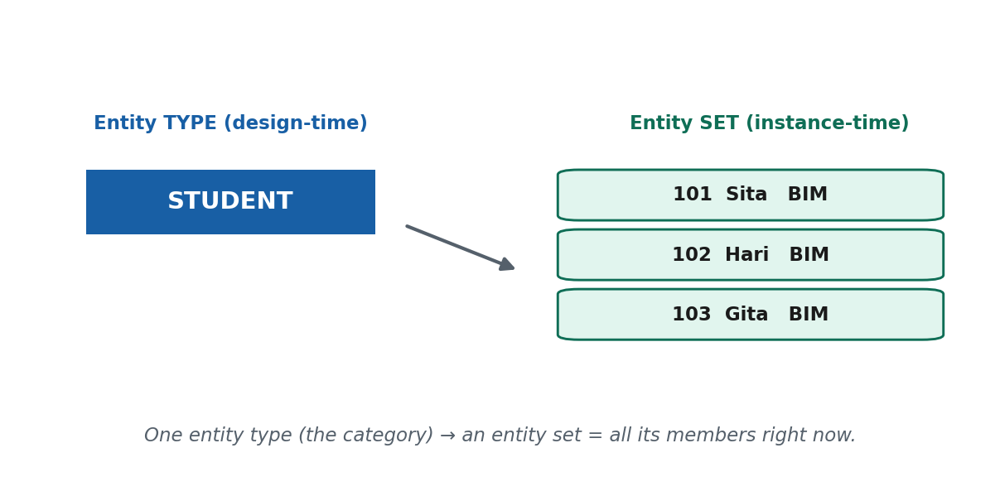

> 🎙️ **Deliver:** Draw a rectangle labelled **STUDENT** — that's the entity *type* (the category). Write
> "Sita" beside it — that's one *entity*. Draw a dotted circle around a list of names — that's the
> entity *set* right now. Explicitly link back to S2: **type ≈ schema (design-time), set ≈ instance
> (a moment's data).**

**📖 In Depth — read this for revision**

Three closely related words anchor the whole ER model, and — exactly as with data/information/database in Unit 1 — you must keep them sharp.

- An **entity** is a **single real-world thing** that exists and can be distinguished from other things. It can be concrete (a specific student named Sita, a particular car, one physical book) or conceptual (a specific course, a specific bank loan). The key idea: an entity is *one individual thing*.
- An **entity type** is the **category or template** that all entities of the same kind share — the definition of *what properties things of this kind have*. STUDENT is an entity type: it says "things of this kind have a roll number, a name, and a program." An entity type is **design-time**; it is decided when you design the database and rarely changes. In **Chen notation** an entity type is drawn as a **rectangle**.
- An **entity set** is the **collection of all entities of a given type that exist at a particular moment**. The entity set of STUDENT is *all the students currently enrolled, right now*. It is **instance-time**: it changes constantly as students join and leave, even though the entity type stays fixed.

The cleanest way to lock this in is to **connect it to Unit 1's schema-vs-instance distinction.** An entity **type** behaves like a **schema** — it is the stable design, the mould. An entity **set** behaves like an **instance** — it is the actual data poured into that mould at one moment, and it changes all the time. There is **one entity type** (STUDENT) but an **endless succession of entity sets** as students come and go. If you understood "one schema, many instances," you already understand "one entity type, many entity sets."

**Worked illustration.** Consider the entity type **STUDENT**. One entity is the individual student *Sita Sharma, roll 101*. Another entity is *Hari Thapa, roll 102*. The entity set of STUDENT is the whole current roster — say 60 students today. Tomorrow one student drops out and a new one enrols: the entity set is now a different collection of 60, but the entity type STUDENT — "a thing with a roll number, name, and program" — has not changed at all. Same type, new set.

**The misconception to correct.** Students often say *"an entity is just a row in a table."* That is *later* thinking. At the conceptual level, an **entity is a real-world thing** — a person, a product, a course. The *row* is only how that entity will eventually be **represented** once we map the ER model to tables in S12. Keep the layers straight: the entity (real-world thing) comes first; the row (its stored representation) comes much later. Confusing them is the same error as confusing the floor plan with the built house.

> **🌍 Real life — CUSTOMER on Daraz.** On Daraz, **CUSTOMER** is an **entity type** — the category
> "a registered shopper," defined by properties like a customer ID, a name, and an email. *You*, with
> your specific ID and order history, are one **entity**. Every person registered on Daraz *at this
> moment* — millions of them — is the **entity set** of CUSTOMER. New sign-ups this evening enlarge
> the set; deactivated accounts shrink it — yet the *type* "CUSTOMER" is unchanged. Contrast the
> mistake of thinking "a customer is just a row": the row in Daraz's table is only how your
> real-world customer-hood gets *stored* later. The entity is you; the row is your footprint in the
> database.

> **🔮 Hypothetical scenario — test yourself.** Imagine you photograph your class attendance sheet
> every single day for a semester. The printed structure — the columns "roll, name, present/absent" —
> never changes; each day's photo shows different ticks. Map this onto ER vocabulary: what is the
> **entity type**, what is **one entity**, and what is the **entity set** on any given day? (Entity
> type = the category STUDENT with its fixed properties; one entity = one named student on the sheet;
> the entity set = the specific group of students recorded *that day*.) Now the clincher: a new
> student joins in week 8 — did the entity **type** change, or just the **set**? (Just the set — same
> as adding an instance under an unchanged schema.)

> **🎯 Model exam answer.** *"Differentiate entity type and entity set with an example."*
> An **entity** is a single real-world thing (e.g. the student Sita). An **entity type** is the
> category/template all such things share — a design-time definition of their properties (e.g.
> STUDENT, drawn as a rectangle in Chen notation); it is stable. An **entity set** is the collection
> of all entities of that type existing at a given moment (e.g. all students enrolled today); it
> changes constantly. Relationship: one entity type has many entity sets over time — analogous to one
> **schema** having many **instances**.

> **🧠 Analogy & memory hook.** A biscuit **cutter** is the entity type; each **biscuit** it cuts is
> an entity; **all the biscuits on the tray right now** are the entity set. Change the biscuits, keep
> the cutter. **Hook: "Type = the cutter; entity = one biscuit; set = the tray right now."**

> **🔑 Key terms:** *entity* (one real-world thing) · *entity type* (category/template, design-time, rectangle in Chen) · *entity set* (all entities of a type at a moment, instance-time) · the parallel: *type ≈ schema, set ≈ instance*.

---

#### Concept 2 — Attributes and Their Types `[THEORY]` `[EXAMPLE]` `[~13 min]`

[SLIDE] **Four flavours of attribute: simple, composite, derived, multivalued**

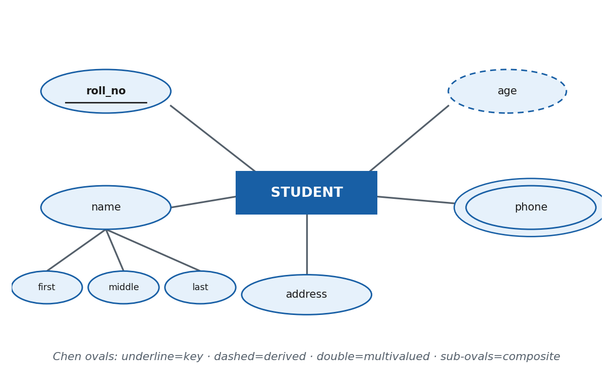

> 🎙️ **Deliver:** In **Chen notation** attributes are **ovals** attached to the entity rectangle. Draw
> one of each: a plain oval (simple), an oval that branches into smaller ovals (composite), a
> **dashed** oval (derived), a **double** oval (multivalued). Anchor every type to a college STUDENT.
> Hit the "age" misconception hard — never store what you can compute.

**📖 In Depth — read this for revision**

An **attribute** is a **property that describes an entity** — a fact about it. In **Chen notation**, attributes are drawn as **ovals** connected by a line to their entity's rectangle. Attributes come in four important types, and classifying them correctly now is what decides good table design later.

- **Simple (atomic) attribute** — a single, indivisible value that you would not sensibly split further. Examples: a citizenship number, a roll number, a price. Drawn as a plain oval.
- **Composite attribute** — an attribute made up of **smaller sub-attributes** that can be broken down. The classic examples are a **full name** = (first name, middle name, last name) and an **address** = (district, municipality, ward, street). In Chen notation the composite oval **branches into child ovals**. You can use the whole thing (the full address) or its parts (just the district).
- **Derived attribute** — a value that is **not stored** but **computed from other data** when needed. The classic example is **age**, computed from date of birth. Drawn as a **dashed oval**. Contrast this with a **stored attribute** (like date of birth itself), which is kept as-is.
- **Multivalued attribute** — an attribute that can hold **more than one value** for a single entity. Examples: a person's **phone numbers** (someone may have several) or a user's multiple **email addresses**. Drawn as a **double oval**.

**The stored-vs-derived contrast — and a misconception to kill.** Beginners often want to *store* a person's age. This is a mistake. Age is **derived** from date of birth; if you store it, then every birthday it becomes wrong, and you'd have to update millions of rows daily to keep it correct — a source of **update anomalies** (data that silently drifts out of date). The rule: **store what cannot be computed (date of birth); derive what can (age).** The same logic applies to a "total" that is just the sum of line items — compute it, don't store a copy that can fall out of sync.

**A worked example — a college STUDENT entity.** Look at all four types on one entity:
- *Simple:* `roll_no` — one atomic value.
- *Composite:* `full_name` = (first, middle, last); `address` = (district, municipality, ward).
- *Derived:* `current_semester`, computed from the admission year and the current date (or `age` from date of birth).
- *Multivalued:* `contact_numbers` — a student may give a personal number *and* a guardian's number.

That single STUDENT entity, drawn in Chen notation, shows a plain oval, a branching oval, a dashed oval, and a double oval — a complete tour of attribute types.

**Why the classification matters (a forward link).** These four types are not academic hair-splitting; they **directly decide how the ER maps to tables in S12.** A multivalued attribute cannot live as a single column — it becomes its **own separate table**. A composite attribute is **flattened** into its component columns. A derived attribute is **left out entirely** and computed on demand. So the classification you do here in S6 is exactly the information the mapping algorithm consumes later. Get it right now and the tables fall out cleanly.

> **🌍 Real life — Daraz's "multiple delivery addresses."** On Daraz you can save several delivery
> addresses — home, office, a relative's place — and pick one at checkout. That is a textbook
> **multivalued attribute** (a customer has *many* addresses), and because each address itself breaks
> into district, municipality, and ward, it is also **composite** — a *multivalued composite
> attribute*, drawn as a double oval that branches. Now the contrast: Daraz would never *store* your
> "age," only your date of birth — because age is a **derived** value that would rot every birthday.
> The way Daraz treats these attributes is exactly what forces "addresses" into its own table later,
> while "age" appears in no table at all. Attribute type quietly dictates table shape.

> **🔮 Hypothetical scenario — test yourself.** Imagine you're modelling a Khalti user and you're
> tempted to add two columns: `age` and `all_phone_numbers` (planning to cram several numbers into one
> text box separated by commas). Predict what goes wrong with each. (`age` is **derived** — it's wrong
> the day after every birthday and creates update anomalies, so it should never be stored; storing
> several numbers in one box breaks the **multivalued** attribute rule — you can't reliably search or
> validate one number, so it must become its own table.) Then reclassify each attribute correctly.
> Spotting these two traps *is* the skill this concept teaches.

> **🎯 Model exam answer.** *"List and explain the types of attributes with examples."*
> **Simple (atomic):** a single indivisible value (e.g. `roll_no`). **Composite:** made of
> sub-parts (e.g. `name` = first + middle + last; `address` = district + ward). **Derived:** computed
> from other data, not stored (e.g. `age` from date of birth — dashed oval). **Multivalued:** may
> hold several values for one entity (e.g. `phone_numbers` — double oval). In **Chen notation**
> attributes are ovals; composites branch, derived are dashed, multivalued are doubled. Derived and
> multivalued attributes especially affect how the entity maps to tables later.

> **🧠 Analogy & memory hook.** A **postal address on an envelope**: written as one line it *looks*
> simple, but it's really **composite** (district, ward, street); your **age** is never printed on the
> envelope because it can be **derived** from your date of birth; and you might list **several**
> contact numbers — **multivalued**. **Hook: "Simple = one; Composite = parts; Derived = computed;
> Multivalued = many."**

> **🔑 Key terms:** *attribute* (oval in Chen) · *simple/atomic* · *composite* (branches into sub-attributes) · *derived* (computed, dashed oval, not stored) · *stored* · *multivalued* (double oval) · *update anomaly* (why you don't store derived values).

---

#### Concept 3 — Keys `[THEORY]` `[~11 min]`

[SLIDE] **How do you tell one entity from another?**

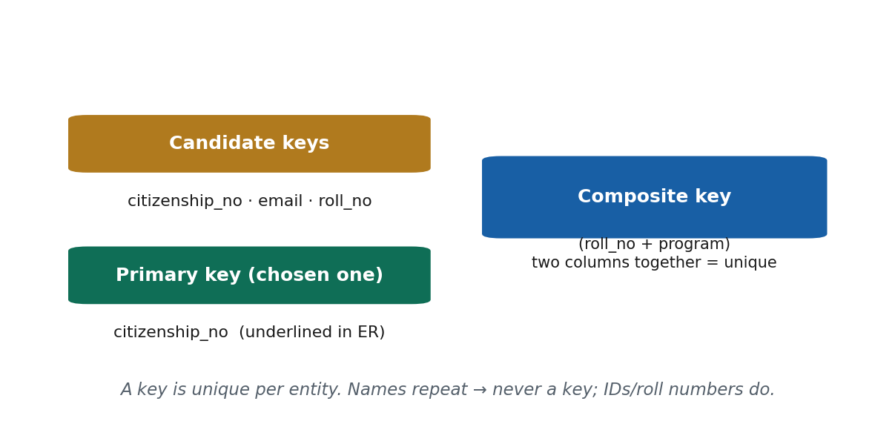

> 🎙️ **Deliver:** Ask "if two students are both named 'Ram Thapa', how does the system tell them
> apart?" — that's what a **key** solves. In **Chen notation** a key attribute is **underlined**. Walk
> candidate → primary → composite. Kill the "name can be a key" misconception with the two-Rams case.

**📖 In Depth — read this for revision**

A **key** is a **uniqueness constraint**: an attribute (or a combination of attributes) whose value is **guaranteed to be unique for every entity** of a type — so it can be used to tell one entity apart from every other. Keys are how a system reliably distinguishes "this student" from "that student," even when they share a name. In **Chen notation**, a key attribute is shown by **underlining** it.

There are a few related notions of key:

- **Candidate key** — *any* attribute (or minimal set of attributes) that could serve as a unique identifier. An entity type can have several candidate keys. For a student, both `roll_no` and `citizenship_number` might each be unique — so both are candidate keys.
- **Primary key** — the **one candidate key the designer chooses** as the official, main identifier for the entity type. If we pick `roll_no` as the primary key, then `citizenship_number` remains a candidate key but is not the primary one. The primary key is the underlined attribute in the diagram.
- **Composite key** — a key made of **more than one attribute together**, used when no single attribute is unique on its own but a *combination* is. For example, a student might be uniquely identified only by (`roll_no` + `program`) if roll numbers restart within each program.

The essential property of any key is **uniqueness**: no two entities in the entity set may share the same key value at the same time. A good key is also **stable** (it doesn't change) and **minimal** (no unnecessary extra attributes).

**The misconception to correct — "a name can be a key."** It cannot, in general. **Names repeat.** In any real college there will be two students named "Ram Thapa," and in a country of millions there are countless duplicate names. If you used name as the key, the system could not tell the two Rams apart, and their marks, fees, or records would collide. That is exactly why real systems key on things *designed* to be unique: a **citizenship number** or **national ID** for a citizen, a **roll number** for a student, a **customer ID** for a shopper. Choose a key by asking "**could two different real things ever share this value?**" — if yes, it is not a key.

**A worked example.** For the entity type STUDENT, suppose every student has a unique `roll_no`, and every student also has a unique `citizenship_number`. Both are **candidate keys**. The registrar decides `roll_no` is the everyday identifier, so `roll_no` becomes the **primary key** (underlined in the ER diagram); `citizenship_number` stays a candidate key. Now imagine a different college where roll numbers are only unique *within a program* (BIM has a roll 1, and BBA also has a roll 1). Then neither `roll_no` alone nor `program` alone is unique, but the **combination** (`roll_no`, `program`) is — that combination is a **composite key**.

> **🌍 Real life — your citizenship number on the Nagarik App.** The Nagarik App keys each citizen on
> their **citizenship / national ID number**, not their name — because names repeat constantly across
> Nepal, but that ID is *designed* to be unique to one person. That ID is the **primary key** for a
> citizen; a phone number might be another **candidate key**. Contrast a naive system that tried to
> identify citizens by name: the moment two "Sita Sharma"s appear, their records — land, taxes,
> benefits — could be confused, with serious consequences. Choosing a genuinely unique key is not a
> technicality; on a national system it's the difference between records that stay straight and
> records that quietly merge two people's lives.

> **🔮 Hypothetical scenario — test yourself.** Suppose a college decides to identify students by
> `full_name` alone. Within a month, two students named "Ram Thapa" enrol in the same program.
> Predict three concrete problems, then propose a proper key. (Problems: their marks could be filed
> against the wrong Ram; a fee paid by one could be credited to the other; you can't reliably fetch
> "Ram's" record because the query returns two. Fix: use a **unique roll number** as the **primary
> key**, or a **composite key** if roll numbers repeat across programs.) The test for any proposed
> key: *could two different real things ever share this value?* If yes, it fails.

> **🎯 Model exam answer.** *"What is a key? Differentiate candidate, primary, and composite keys."*
> A **key** is a uniqueness constraint — an attribute or set of attributes whose value uniquely
> identifies each entity. A **candidate key** is any minimal attribute set that could serve as a
> unique identifier (an entity type may have several). The **primary key** is the one candidate key
> chosen as the main identifier (underlined in Chen notation). A **composite key** is a key made of
> more than one attribute together, used when no single attribute is unique alone (e.g. `roll_no` +
> `program`). Names should not be keys because they repeat.

> **🧠 Analogy & memory hook.** In a class full of students who might share a name, the **roll number**
> is what the teacher calls out to be sure of *exactly one* student. **Hook: "A key = the roll number
> that no two share."**

> **🔑 Key terms:** *key / uniqueness constraint* · *candidate key* · *primary key* (chosen identifier, underlined in Chen) · *composite key* (multiple attributes together) · *key attribute* · the test: *unique, stable, minimal*.

---

#### 🛠 ACTIVITY — "Label the attributes of a Khalti account" `[ACTIVITY]` `[~5 min]`

[SLIDE] **Think–Pair–Share**

- In pairs (3 min): list the attributes of a **Khalti user account**, and label each as **simple / composite / derived / multivalued**. Then pick the **primary key** and name one other **candidate key**.
- Likely answers: `user_id` (simple, primary key), `mobile_number` (candidate key), `full_name` (composite), `age` (derived — don't store!), `linked_bank_accounts` or `saved_numbers` (multivalued).
- Share (2 min); the lecturer draws the winning account as a Chen fragment — plain oval, branching oval, dashed oval, double oval, one underlined.

> 🎙️ Speaker note: Watch for two reliable slips — students storing `age` (it's derived) and treating
> multiple saved numbers as one field (it's multivalued). Those two mistakes are the whole lesson.

---

### 🧠 CHECK FOR UNDERSTANDING `[QUIZ]` `[~5 min]`

**MCQ 1.** "Age" computed from date of birth is a ___ attribute:
a) stored  b) multivalued  c) ✅ **derived**  d) composite

**MCQ 2.** All STUDENT entities existing at one moment form the:
a) entity type  b) ✅ **entity set**  c) attribute  d) relationship

**Discussion:** *List the attributes of a Khalti user account and label each simple / composite / derived / multivalued.*

---

### 💡 REAL-LIFE APPLICATION `[~3 min]`
Correctly classifying attributes — especially spotting **multivalued** ones (multiple addresses, phone numbers) and **derived** ones (age, totals) — is what decides table design later and prevents duplicated, out-of-sync data in real systems like Daraz, Khalti, and bank cores. And choosing a genuinely unique **key** (national ID, roll number, customer ID — never a name) is the single most common design decision a junior developer or analyst is trusted to get right.

### 📝 SUMMARY & TAKEAWAYS `[~2 min]`
1. **Entity type** = the category (design-time, like a schema, a rectangle); **entity set** = all its members right now (instance-time); **entity** = one real-world thing.
2. Attributes come in four flavours — **simple, composite, derived, multivalued** (ovals in Chen notation) — and never store what you can derive.
3. A **key** uniquely identifies an entity; a **primary key** is the chosen identifier (underlined); **composite keys** combine attributes. Names are not keys.

**Next session (S7):** how entities *connect* — **relationship types and sets, roles, and structural constraints** (cardinality and participation).

---
---

# S7 — Relationship Types, Sets, Roles & Structural Constraints
**Lecture hour 7 of 8 · 50 minutes**

### 🎯 OPENING — Hook `[~5 min]`

[SLIDE] **"The verbs are where the modelling happens."**

> **Deliver (≈2 min):** Put two sentences on screen: *"A student **enrolls in** a course."* *"A
> customer **places** an order."* Underline the verbs. Say: "We've spent S6 on the *nouns* — entities
> and attributes. Today is about the **verbs** — the associations between things. And it's the verbs,
> not the nouns, where most real modelling decisions are made and most mistakes happen."
>
> **Land it (≈3 min):** In Chen notation those verbs become **diamonds** joining rectangles. But a
> line isn't enough — we must also say *how many* and *whether it's mandatory*. That's the heart of
> today: relationships, their degree, roles, and two structural constraints — **cardinality** and
> **participation**.

> 🎙️ Speaker note: This is the densest session (4 concepts). Keep each tight and lean on the
> diagrams. Agenda: relationship type/set/degree → roles & recursive → cardinality ratio →
> participation.

**Agenda preview:** (1) relationship type, set, degree; (2) roles and recursive relationships; (3) cardinality ratio (1:1, 1:N, M:N); (4) participation (total vs partial).

---

### 📚 CONTENT `[~35 min]`

#### Concept 1 — Relationship Type, Set, and Degree `[THEORY]` `[~9 min]`

[SLIDE] **The association between entities — as a diamond**

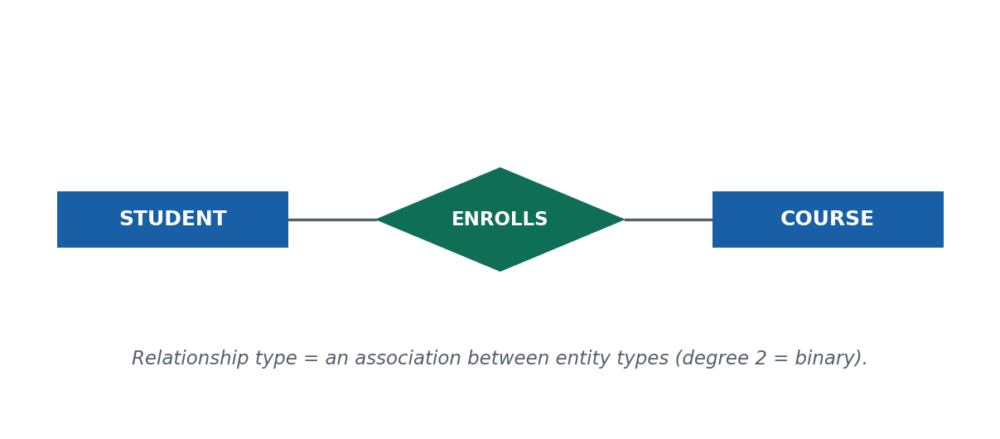

> 🎙️ **Deliver:** Draw STUDENT ▭ — ◇ENROLLS — ▭ COURSE. The diamond is the relationship *type*. Explain
> degree = number of rectangles the diamond touches (this one = 2 = binary). Reuse the type/set idea
> from S6: the relationship *set* is the actual pairings right now.

**📖 In Depth — read this for revision**

Entities rarely stand alone; the interesting part of a model is how they **connect**. A **relationship** is an **association among entities**, and just like entities, relationships have a type/set structure.

- A **relationship type** is a **named association between entity types** — the *kind* of connection. ENROLLS between STUDENT and COURSE is a relationship type; WORKS_FOR between EMPLOYEE and DEPARTMENT is another. In **Chen notation** a relationship type is drawn as a **diamond** connected by lines to the participating entity rectangles. It is design-time and stable.
- A **relationship set** is the **collection of actual associations that exist at a given moment** — the specific pairings. If Sita enrolls in DBMS and Hari enrolls in Networking, those two specific (student, course) pairs are members of the relationship set of ENROLLS. Like an entity set, it changes constantly. (Type is to set as schema is to instance — the same pattern yet again.)
- The **degree** of a relationship is the **number of entity types that participate** in it. A relationship connecting **two** entity types is **binary** (degree 2) — by far the most common. Three is **ternary** (degree 3), and *n* is **n-ary**. Almost every relationship you meet, and every one in this session, is binary.

**A worked illustration.** Take ENROLLS between STUDENT and COURSE. The **relationship type** is the diamond ENROLLS joining the two rectangles — the general fact that "students enroll in courses." The **relationship set** at exam-registration time is the concrete list of pairings: (Sita, DBMS), (Sita, Networking), (Hari, DBMS), and so on. The **degree** is 2, because exactly two entity types (STUDENT and COURSE) take part — it is a binary relationship.

**The misconception to correct — "a relationship is just a foreign key."** Students who have seen a little SQL sometimes say a relationship "is" a foreign key. At the **conceptual level it is not**: a relationship is a *real-world association* between things — the fact that a student is connected to a course. A **foreign key is only one possible later implementation** of that association, produced by the mapping algorithm in S12. In fact, some relationships (M:N ones, as we'll see) don't become a foreign key at all — they become a whole junction table. So resist collapsing the idea into "foreign key." At this stage a relationship is a meaning, drawn as a diamond; how it is stored comes later.

> **🌍 Real life — PLACES between CUSTOMER and ORDER on Daraz.** On Daraz, the **relationship type**
> PLACES connects CUSTOMER and ORDER: "customers place orders." Its **relationship set** right now is
> the enormous, ever-changing list of who-placed-which-order this minute — a fresh pairing added
> every time someone checks out. Its **degree** is 2 (binary): exactly two entity types take part.
> Notice what the relationship is *not*: it isn't the `customer_id` column that Daraz will eventually
> store in the orders table — that column is just how the association gets *implemented* after
> mapping. The conceptual truth "a customer places an order" exists first, as a diamond, regardless of
> how it's finally stored.

> **🔮 Hypothetical scenario — test yourself.** Imagine you're modelling a hospital and you draw a
> diamond **TREATS** between DOCTOR and PATIENT. Answer three questions: (a) What is the relationship
> **type** here? (b) If Dr. Karki treats patients Sita and Hari today, what belongs to the
> relationship **set**? (c) What is the **degree**? (Answers: (a) TREATS — the general association
> "doctors treat patients"; (b) the pairs (Karki, Sita) and (Karki, Hari); (c) 2 — binary, two entity
> types.) Now the trap: a classmate says "TREATS is just a foreign key." Why is that wrong at the
> conceptual level? (Because it's a *real-world association* first; the foreign key is only a later
> implementation of it.)

> **🎯 Model exam answer.** *"Define relationship type, relationship set, and degree with an example."*
> A **relationship type** is a named association between entity types (e.g. ENROLLS between STUDENT
> and COURSE; a diamond in Chen notation). A **relationship set** is the collection of actual
> associations existing at a moment (e.g. the pairs (Sita, DBMS), (Hari, Networking)). The **degree**
> is the number of participating entity types — 2 is **binary** (most common), 3 is **ternary**, n is
> **n-ary**. A relationship is a conceptual association, *not* a foreign key (that is a later
> implementation).

> **🧠 Analogy & memory hook.** "**Marriage**" is a relationship *type*; the actual list of married
> couples today is the relationship *set*; it joins two kinds of person, so its *degree* is 2. **Hook:
> "Type = the verb; set = today's pairings; degree = how many entities the verb joins."**

> **🔑 Key terms:** *relationship* (association among entities) · *relationship type* (named, design-time, diamond in Chen) · *relationship set* (current associations) · *degree* (binary = 2, ternary = 3, n-ary) · *not* a foreign key at the conceptual level.

---

#### Concept 2 — Roles and Recursive (Self) Relationships `[THEORY]` `[EXAMPLE]` `[~8 min]`

[SLIDE] **When an entity type relates to itself**

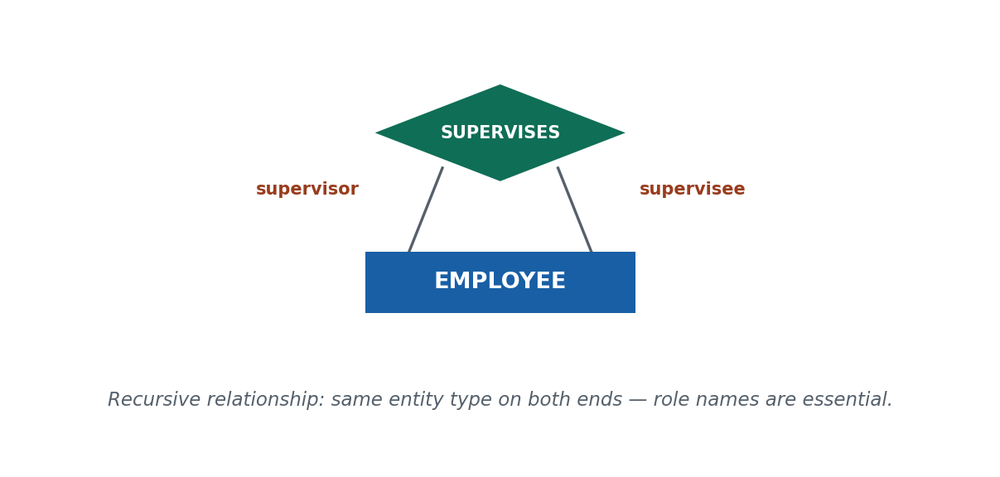

> 🎙️ **Deliver:** Draw ONE rectangle EMPLOYEE with a diamond SUPERVISES looping back to it. Ask: "if
> both ends are 'employee', how do we tell who's the boss?" — that's what **role names** solve. Label
> the two lines "supervisor" and "supervisee." Give the Ntc example and the student-mentor case.

**📖 In Depth — read this for revision**

A **role name** is the **part that an entity plays in a relationship** — it names *how* an entity participates. In most binary relationships the roles are obvious from the entity names (in ENROLLS, STUDENT plays the "enrollee" role and COURSE plays the "enrolled-in" role), so we don't bother labelling them. But roles become **essential** in one special situation: the **recursive relationship**.

A **recursive (self) relationship** is one where **the same entity type participates more than once** — the diamond connects a rectangle back to *itself*. The classic example is **supervision**: an EMPLOYEE *supervises* other EMPLOYEEs. Here both ends of the relationship are the same entity type, EMPLOYEE, so you **cannot tell the two ends apart without role names.** You must explicitly label one line **"supervisor"** and the other **"supervisee"** (or "manager" and "subordinate"). Without those labels the diagram is ambiguous — you'd have no way to know which employee is managing which.

This is *the* reason role names exist as a named concept. In ordinary binary relationships between two *different* entity types, roles are implicit and optional. In recursive relationships between one entity type and itself, roles are **mandatory for clarity** — they are the only thing distinguishing the two otherwise-identical ends.

**A worked example — supervision at Ntc.** Model the staff of Nepal Telecom. There is one entity type, EMPLOYEE, and a recursive relationship SUPERVISES connecting it to itself. A senior engineer supervises three junior engineers. In the relationship set, the senior engineer plays the **"supervisor"** role and each junior plays the **"supervisee"** role. Both are EMPLOYEE entities — the role names are what let the diagram (and the database) say clearly "this employee manages those employees" rather than the reverse.

> **🌍 Real life — a senior student MENTORS a junior at your college.** Picture a college peer-mentoring
> scheme: the entity type is STUDENT, and a recursive relationship **MENTORS** connects STUDENT to
> itself — a senior student mentors a junior. Because both ends are "student," the diagram is
> meaningless until you add **role names**: one line "mentor," the other "mentee." Now it reads
> correctly. Contrast leaving the roles off: the system couldn't tell whether Sita mentors Gita or
> Gita mentors Sita — the two ends are indistinguishable. The role names carry the *direction* of the
> relationship, which is information that would otherwise be lost. (Ntc's employee supervision works
> exactly the same way — "supervisor" and "supervisee.")

> **🔮 Hypothetical scenario — test yourself.** Imagine modelling replies on a discussion forum: a
> POST can be a reply to another POST. You draw one rectangle POST and a recursive diamond REPLIES_TO
> looping back to it. Question: why is the diagram *ambiguous* until you add role names, and what two
> role names would you use? (Ambiguous because both ends are POST, so nothing says which post is the
> original and which is the reply; sensible roles: "parent post" and "reply post.") Now generalise:
> what feature of a relationship forces you to use role names? (When **the same entity type appears on
> both ends** — a recursive relationship.)

> **🎯 Model exam answer.** *"What is a recursive relationship, and why does it need role names?"*
> A **recursive (self) relationship** is one in which the **same entity type participates more than
> once** — the relationship connects an entity type to itself (e.g. EMPLOYEE SUPERVISES EMPLOYEE). A
> **role name** states the part an entity plays. Recursive relationships **require role names** (e.g.
> "supervisor" and "supervisee") because both ends are the same entity type and would otherwise be
> indistinguishable; the role names carry the direction/meaning of the association.

> **🧠 Analogy & memory hook.** In a **family tree**, "parent" and "child" are the *same* kind of thing
> — a person — so you must label which is which; the labels are the roles. **Hook: "Same type on both
> ends → you must name the roles."**

> **🔑 Key terms:** *role name* (the part an entity plays) · *recursive / self relationship* (same entity type participates twice) · why roles are *mandatory* for recursive relationships (to distinguish the two identical ends).

---

#### Concept 3 — Cardinality Ratio (1:1, 1:N, M:N) `[THEORY]` `[~10 min]`

[SLIDE] **How many? — the four cardinality ratios**

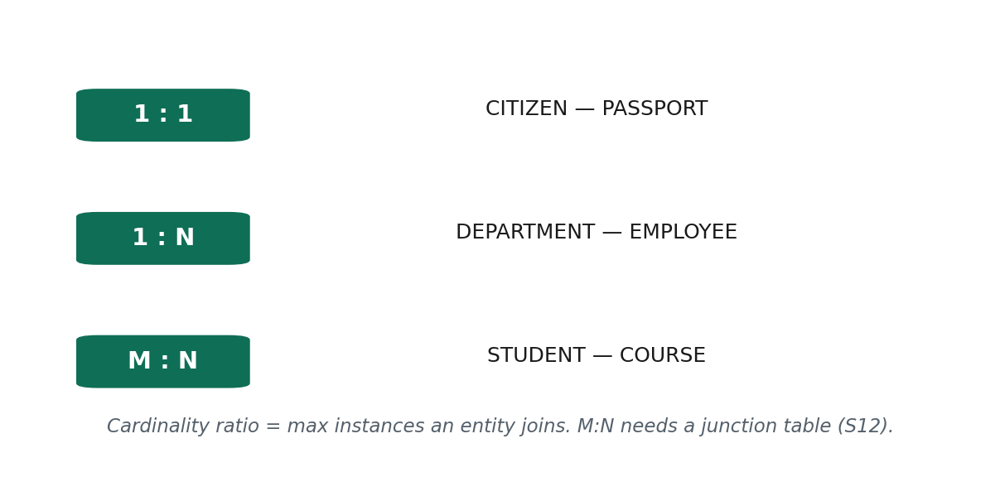

> 🎙️ **Deliver:** This is the most exam-heavy idea in the session. For each ratio, one crisp example:
> 1:1 CITIZEN–PASSPORT, 1:N DEPARTMENT–EMPLOYEE, M:N STUDENT–COURSE. Teach the "read it both ways"
> trick: check the max on *each* side. Flag that M:N needs a junction table in S12.

**📖 In Depth — read this for revision**

The **cardinality ratio** of a binary relationship specifies the **maximum number of relationship instances an entity can take part in** — in plain terms, *how many* of one thing can relate to *how many* of the other. There are three (really four, counting direction) cases:

- **One-to-one (1:1)** — each entity on each side relates to **at most one** entity on the other. Example: a **CITIZEN has one PASSPORT**, and each passport belongs to one citizen. Rare, but real.
- **One-to-many (1:N)** — one entity on the "one" side relates to **many** on the other, but each of those many relates back to only one. Example: a **DEPARTMENT has many EMPLOYEES**, but each employee belongs to **one** department. (Read the other direction and it's **N:1** — the same relationship seen from the other side.)
- **Many-to-many (M:N)** — entities on **both** sides can relate to **many** on the other. Example: a **STUDENT enrolls in many COURSES**, and each **COURSE has many STUDENTS.** Very common.

**The technique that never fails: read it both ways.** To find the cardinality ratio, fix one entity and ask "how many of the other can it relate to?" — then do the same from the other side. *"Can one department have many employees?"* Yes → "many" on the employee side. *"Can one employee belong to many departments?"* No, one → "one" on the department side. Many-and-one = **1:N**. Do this on both sides and the ratio falls out mechanically. This two-way check is the single most useful exam skill in this session.

**The misconception to correct — "M:N can be stored directly."** An M:N relationship **cannot** be stored as a simple foreign key in either table — there is no single "the other side" to point to, because there are many on both sides. In S12 you will see that every M:N relationship must be broken out into a **separate junction (relationship) table** that holds pairs of keys. So when you spot an M:N relationship now, make a mental note: *this one will need a junction table later.* Recognising M:N early is what saves you from a broken schema.

**A worked example — the classic three.** *1:1:* on the Nagarik App a CITIZEN relates to at most one PASSPORT and vice versa. *1:N:* at a bank, one BRANCH employs many EMPLOYEES, but each employee works at one branch. *M:N:* at college, one STUDENT enrolls in many COURSES and one COURSE enrolls many STUDENTS — and this last one, being M:N, will become a junction table (say ENROLLMENT) when mapped.

> **🌍 Real life — Daraz ORDER and PRODUCT is M:N.** On Daraz one **order** can contain many
> **products** (a phone, a case, and a charger in one checkout), and one **product** appears in many
> different orders. Reading it both ways — "one order → many products?" yes; "one product → many
> orders?" yes — gives you **many-to-many (M:N)**. That's why Daraz can't just bolt a `product_id`
> onto the orders table: there are many products per order. Later (S12) this M:N becomes an
> **ORDER_ITEM junction table**, one row per (order, product) pair. Contrast a 1:N like
> DEPARTMENT–EMPLOYEE, where a single `department_id` on the employee is enough. The cardinality ratio
> you read off the diagram *decides* whether you get a simple foreign key or a whole extra table.

> **🔮 Hypothetical scenario — test yourself.** Imagine an eSewa-style wallet where you model USER and
> TRANSACTION with a relationship MAKES. Work out the cardinality ratio by reading it both ways: "can
> one user make many transactions?" and "can one transaction belong to many users?" (One user → many
> transactions = yes; one transaction → one user = yes → the ratio is **1:N**, with USER on the "one"
> side.) Now change the model to "a transaction is between a *sender* and a *receiver*" — does the
> ratio change, and what does that tell you about how the FK will be placed later? (It becomes two
> separate relationships; each is still 1:N from a user's side, and each contributes a foreign key.)

> **🎯 Model exam answer.** *"Define cardinality ratio and give an example of each type."*
> The **cardinality ratio** specifies the maximum number of relationship instances an entity may
> participate in. **1:1** — each entity relates to at most one on the other side (CITIZEN–PASSPORT).
> **1:N** — one entity relates to many, each of which relates back to one (DEPARTMENT–EMPLOYEE).
> **M:N** — entities on both sides relate to many (STUDENT–COURSE). Determine it by checking the
> maximum on **each** side. An **M:N** relationship must become a **junction table** when mapped.

> **🧠 Analogy & memory hook.** Marriage in law = **1:1** (one spouse each); a mother and her children
> = **1:N** (one mother, many children, each child one mother); students and the clubs they join =
> **M:N** (many each way). **Hook: "Read the max on both sides; M:N means a junction table later."**

> **🔑 Key terms:** *cardinality ratio* · *1:1* · *1:N (and N:1)* · *M:N* · the *read-it-both-ways* technique · M:N ⇒ *junction table* (preview of S12).

---

#### Concept 4 — Participation (Total vs Partial) `[THEORY]` `[~8 min]`

[SLIDE] **Must every entity take part? — total vs partial**

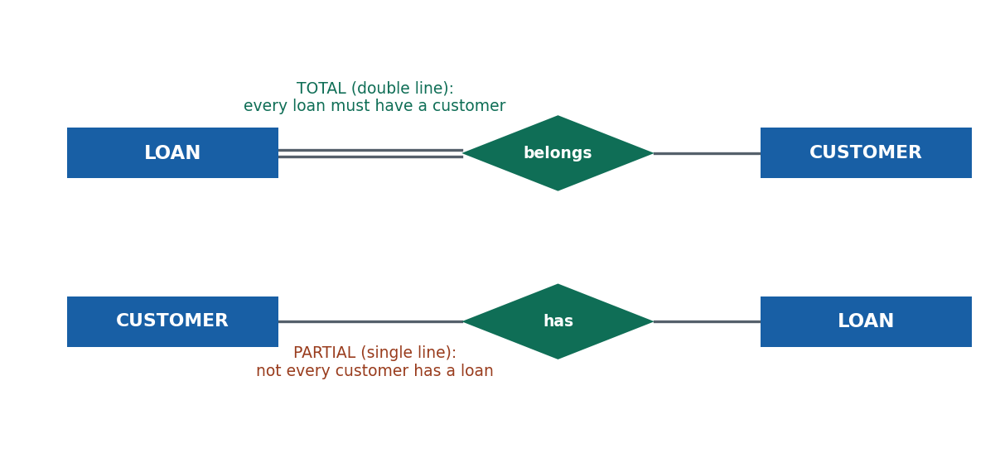

> 🎙️ **Deliver:** In Chen notation, **double line = total** (mandatory), **single line = partial**
> (optional). Use the bank: every LOAN must belong to a CUSTOMER (total), but not every CUSTOMER has
> a loan (partial). Draw both lines. Stress: cardinality answers *how many*, participation answers
> *whether at all*.

**📖 In Depth — read this for revision**

Where the **cardinality ratio** tells you *how many* (the maximum), the **participation constraint** tells you *whether an entity must take part at all* (the minimum). It is the second of the two **structural constraints**, and the two answer different questions — don't conflate them.

- **Total participation** means **every entity** of that type **must** participate in the relationship — participation is mandatory. In **Chen notation** it is drawn as a **double line** between the entity and the relationship diamond.
- **Partial participation** means an entity **may or may not** participate — participation is optional. It is drawn as a **single line.**

The classic phrasing: total participation is a relationship an entity *cannot exist without*; partial participation is one it *can go without*. Crucially, **the two sides of one relationship can have different participation.** In "a LOAN belongs to a CUSTOMER," the *loan* side is total (a loan cannot exist without a customer — every loan must belong to someone) while the *customer* side is partial (a customer may have no loan at all). One relationship, two different participation constraints.

**Why it matters (a forward link).** Participation, together with cardinality, is what drives real schema decisions later: whether a foreign key can be `NULL` (partial) or must always be filled (total), and — combined with cardinality — where a foreign key goes or whether a junction table is needed. So the single-vs-double line you draw now is not decoration; it becomes an enforced rule in the real database.

**A worked example — a loan at NIC Asia Bank.** Model CUSTOMER and LOAN with a relationship HAS. Every loan **must** be tied to a customer — a loan with no owner is meaningless — so the LOAN side has **total participation** (double line). But not every customer has taken a loan; plenty just have savings accounts — so the CUSTOMER side has **partial participation** (single line). The finished fragment shows a double line on the loan end and a single line on the customer end: a compact, precise statement of a real banking rule.

> **🌍 Real life — every loan belongs to a customer at NIC Asia.** At a bank like NIC Asia, model
> CUSTOMER —HAS— LOAN. Every single **loan must belong to a customer** — there is no such thing as an
> ownerless loan — so the loan's participation is **total** (double line). But a **customer** might
> have only a savings account and no loan at all, so the customer's participation is **partial**
> (single line). This isn't hair-splitting: it becomes a hard rule in the live system — the database
> will *refuse* to create a loan record with no customer attached, while happily allowing customers
> with zero loans. Contrast a system that made both sides partial by mistake: it could end up with
> orphaned loans belonging to nobody — a genuine data-integrity and audit disaster for a bank.

> **🔮 Hypothetical scenario — test yourself.** Imagine modelling a college where every COURSE must be
> taught by a TEACHER, but a teacher on sabbatical might teach no course this semester. Decide the
> participation on **each** side of the TEACHES relationship, and say which line is single and which
> is double. (COURSE side = **total**, double line — a course must have a teacher; TEACHER side =
> **partial**, single line — a teacher may teach nothing this term.) Now the design consequence: in
> the real database, which side's foreign key is allowed to be empty (`NULL`)? (The optional/partial
> side.) This is how a line on a diagram becomes an enforced rule in code.

> **🎯 Model exam answer.** *"Differentiate total and partial participation with an example."*
> The **participation constraint** states whether an entity's participation in a relationship is
> mandatory. **Total participation** — every entity of the type *must* participate (drawn as a
> **double line**); e.g. every LOAN must belong to a CUSTOMER. **Partial participation** — an entity
> *may or may not* participate (drawn as a **single line**); e.g. a CUSTOMER need not have any loan.
> The two sides of one relationship can differ. Participation gives the *minimum*, whereas cardinality
> ratio gives the *maximum*.

> **🧠 Analogy & memory hook.** On a form, a **required field** (starred) is **total** participation —
> you cannot submit without it; an **optional field** is **partial**. **Hook: "Total = double line =
> compulsory; partial = single line = optional."**

> **🔑 Key terms:** *participation constraint* · *total participation* (mandatory, double line) · *partial participation* (optional, single line) · *structural constraints* (cardinality = max, participation = min) · effect on nullable foreign keys later.

---

#### 🛠 ACTIVITY — "Cardinality and participation on eSewa" `[ACTIVITY]` `[~6 min]`

[SLIDE] **Model it in pairs**

- In pairs (3–4 min): on eSewa, model **USER** and **TRANSACTION** with a relationship. Decide (a) the **cardinality ratio** by reading it both ways, and (b) the **participation** on each side. Draw the fragment in Chen notation with the right lines.
- Expected: cardinality **1:N** (one user, many transactions; each transaction one user); participation — TRANSACTION side **total** (every transaction belongs to a user, double line), USER side **partial** (a brand-new user may have zero transactions, single line).
- Share (2 min); compare fragments on the board.

> 🎙️ Speaker note: The two skills being drilled are the *read-it-both-ways* cardinality check and the
> *can-it-exist-without* participation check. Reinforce that cardinality = "how many" and
> participation = "whether at all" — they are independent.

---

### 🧠 CHECK FOR UNDERSTANDING `[QUIZ]` `[~5 min]`

**MCQ 1.** "One department has many employees, and each employee is in one department" is:
a) 1:1  b) ✅ **1:N**  c) M:N  d) recursive

**MCQ 2.** A double line from an entity to a relationship diamond means:
a) many-to-many  b) a weak entity  c) ✅ **total participation**  d) a recursive role

**Discussion:** *On eSewa, model the relationship between USER and TRANSACTION — what is its cardinality ratio and its participation on each side?*

---

### 💡 REAL-LIFE APPLICATION `[~3 min]`
Cardinality and participation are not diagram decoration — together they **directly drive the schema.** Cardinality decides whether a relationship becomes a foreign key (1:N) or a whole junction table (M:N); participation decides whether that foreign key can be empty or must always be filled. Getting these two constraints right is the core of correct schema design in every real Nepali system — banks refusing ownerless loans, Daraz splitting orders and products into a junction table. It is exactly what separates a working database from one that quietly corrupts.

### 📝 SUMMARY & TAKEAWAYS `[~2 min]`
1. A **relationship** is an association among entities (a diamond in Chen); it has a **type**, a **set**, and a **degree** (binary = 2 is normal).
2. **Roles** name the parts entities play and are **mandatory in recursive relationships** (same entity type on both ends).
3. Two **structural constraints**: **cardinality ratio** (1:1, 1:N, M:N — *how many*) and **participation** (total/double line vs partial/single line — *whether at all*).

**Next session (S8):** entities that can't stand on their own — **weak entity types**, their identifying relationships, and partial keys.

---
---

# S8 — Weak Entity Types (Identifying Relationship, Partial Key)
**Lecture hour 8 of 8 · 50 minutes**

### 🎯 OPENING — Hook `[~5 min]`

[SLIDE] **"Delete the order — the line items vanish."**

> **Deliver (≈2 min):** Put it up: *"An 'order item' on Daraz means nothing on its own. What is 'item
> #2'? Item #2 of *which* order? Delete the order, and its line items simply cease to make sense."*
> Ask: "Can 'order item' even be identified without knowing its order?"
>
> **Land it (≈3 min):** No — and that makes it a **weak entity**: an entity that *cannot be
> identified by its own attributes alone* and depends on another entity for its identity. Some things
> in the world genuinely can't stand on their own. Today: weak vs strong entities, the **identifying
> relationship** that ties a weak entity to its owner, and the **partial key** that distinguishes weak
> entities of the same owner.

> 🎙️ Speaker note: The one trap to pre-empt all session: "weak" does **not** mean "unimportant" — it
> means "identity-dependent." Say it now and repeat it. Agenda: weak vs strong → identifying
> relationship → partial key.

**Agenda preview:** (1) weak vs strong entity types; (2) the identifying (owner) relationship; (3) the partial key (discriminator).

---

### 📚 CONTENT `[~35 min]`

#### Concept 1 — Weak vs Strong (Regular) Entity Types `[THEORY]` `[~12 min]`

[SLIDE] **Entities that can't be identified on their own**

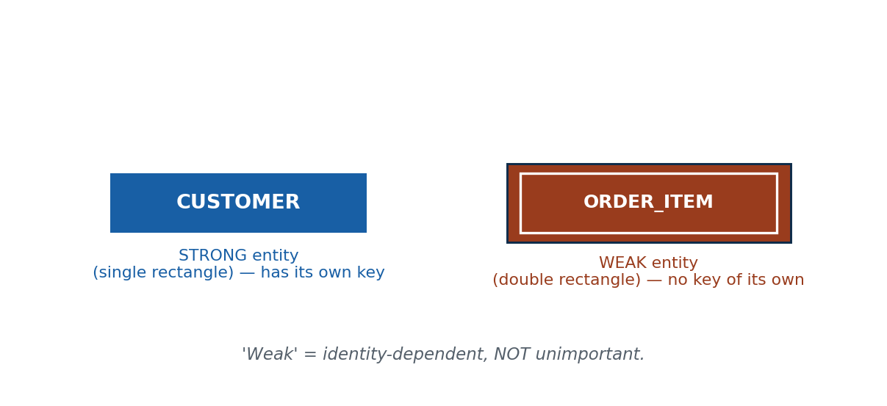

> 🎙️ **Deliver:** Draw a normal rectangle (STRONG, e.g. EMPLOYEE) next to a **double rectangle** (WEAK,
> e.g. DEPENDENT). The strong one has its own key; the weak one doesn't — it borrows identity from its
> owner. Use the two-employees-both-have-a-child-"Ram" example to make "no key of its own" concrete.
> Kill the "weak = unimportant" misconception immediately.

**📖 In Depth — read this for revision**

Up to now every entity type has had a **key of its own** — a `roll_no`, a `citizenship_number`, a `customer_id` — that uniquely identifies its entities. Such an entity type is called a **strong (regular) entity type.** But some entity types genuinely **have no key attribute of their own**; they can only be identified *through* another entity. These are **weak entity types.**

- A **strong (regular) entity type** has its own key attribute(s) and can be identified independently. Drawn as a normal **single rectangle** in Chen notation. Example: EMPLOYEE (identified by employee ID), STUDENT (identified by roll number).
- A **weak entity type** has **no key attribute of its own** and is identified only in combination with another entity — its **owner** (or **identifying**) entity. Drawn as a **double rectangle** in Chen notation. Example: **DEPENDENT** (a family member of an employee): two different employees might each have a child named "Ram," so "Ram" is not unique on its own — you can only identify a dependent as *"the dependent named Ram belonging to employee 501."*

The defining property is **identity dependence**: a weak entity cannot be told apart from other weak entities *without reference to its owner*. Its own attributes, even taken together, are not guaranteed to be unique across the whole entity set — they are only unique *within* one owner. This is a real and common situation, not an edge case.

**The misconception to correct — "weak = unimportant / optional."** This is the single most common error, and it's worth being emphatic about: **"weak" has nothing to do with importance.** A weak entity can be absolutely critical to the business — order line items, loan installments, and exam answer sheets are all weak entities, and no bank or shop would call them unimportant. **"Weak" means *identity-dependent*** — it lacks a key of its own and leans on an owner for identification. Read "weak" as "can't identify itself," never as "doesn't matter."

**A worked example — DEPENDENT of an EMPLOYEE.** A company records each employee's dependents (children, spouse) for insurance. A dependent has a name, a relationship, and a date of birth — but **none of these is unique.** Employee 501 has a son "Ram"; employee 640 also has a son "Ram." The name "Ram" alone identifies nobody. The dependent DEPENDENT is therefore a **weak entity** (double rectangle), and it can only be pinned down as *"Ram, dependent of employee 501."* Its identity is borrowed from the owning EMPLOYEE. Compare EMPLOYEE itself, a strong entity with its own unique employee ID — it stands on its own.

> **🌍 Real life — ORDER_ITEM on Daraz.** When you check out on Daraz, your order breaks into line
> items: item 1 is the phone, item 2 is the case, item 3 is the charger. But "item 2" means nothing
> by itself — item 2 of *which* order? An **ORDER_ITEM** has no key of its own; it is identified only
> as *"line 2 of order #88921."* That makes it a **weak entity** (double rectangle), owned by ORDER.
> Delete order #88921 and its items lose all meaning — they can't exist independently. Now the
> important contrast with the misconception: order items are *not* unimportant — they are literally
> what the customer is buying and paying for. They're "weak" only in the technical sense of
> *identity-dependent*. (A bank's **INSTALLMENT** of a LOAN works identically: "installment 3" is
> meaningless without its loan.)

> **🔮 Hypothetical scenario — test yourself.** Imagine a hotel booking system. You have a strong
> entity HOTEL (with a hotel ID) and you want to model ROOM. Room "101" exists in the Everest Hotel —
> but room "101" also exists in the Yak Hotel, and in a hundred other hotels. Is ROOM a strong or a
> weak entity, and why? (Weak — the room number "101" is **not unique on its own**; it's only unique
> *within* a hotel, so a room can only be identified as "room 101 of the Everest Hotel." It depends on
> HOTEL for identity.) Now check yourself against the misconception: does calling ROOM "weak" mean
> rooms are unimportant to a hotel? (Absolutely not — it means identity-dependent, nothing more.)

> **🎯 Model exam answer.** *"What is a weak entity type? How does it differ from a strong entity type?"*
> A **strong (regular) entity type** has a key attribute of its own and can be identified
> independently (single rectangle in Chen notation; e.g. EMPLOYEE). A **weak entity type** has **no
> key of its own** and can be identified only through an owning (identifying) entity (double
> rectangle; e.g. DEPENDENT, ORDER_ITEM). Its attributes are unique only *within* one owner, not
> across the whole set. Note: "weak" means **identity-dependent**, not unimportant.

> **🧠 Analogy & memory hook.** A **hotel room number** ("101") only makes sense *inside* a specific
> hotel — on its own it identifies nothing. The room is weak; the hotel is its owner. **Hook: "Weak =
> can't identify itself — it borrows identity from an owner."**

> **🔑 Key terms:** *strong (regular) entity type* (own key, single rectangle) · *weak entity type* (no own key, double rectangle) · *owner / identifying entity* · *identity dependence* · the correction: *weak = identity-dependent, NOT unimportant*.

---

#### Concept 2 — The Identifying (Owner) Relationship `[THEORY]` `[EXAMPLE]` `[~11 min]`

[SLIDE] **The double diamond that ties a weak entity to its owner**

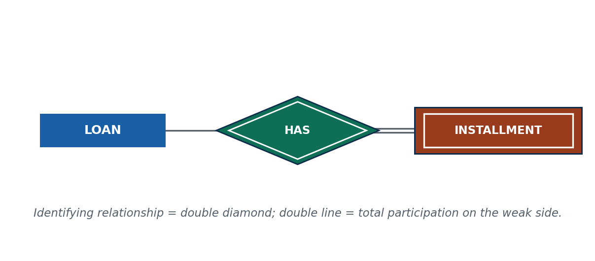

> 🎙️ **Deliver:** Draw EMPLOYEE ▭ ══ ◈HAS_DEPENDENT ══ ▨DEPENDENT (double rectangle). The relationship
> tying a weak entity to its owner is drawn as a **double diamond**, and the weak side always has
> **total participation** (double line — a dependent *must* have an employee). Give LOAN—has—INSTALLMENT.

**📖 In Depth — read this for revision**

Because a weak entity has no key of its own, it must be **connected to its owner** by a special relationship that supplies its identity. This is the **identifying relationship** (also called the *owner relationship*).

- The **identifying relationship** is the relationship type that links a **weak entity** to its **owner (identifying) entity** — the entity that provides the identity. In **Chen notation** it is drawn as a **double diamond** (to distinguish it from ordinary relationships, which are single diamonds).
- The weak entity's participation in this relationship is **always total** (drawn as a double line): a weak entity **cannot exist without its owner.** A dependent must belong to some employee; an order item must belong to some order. There is no such thing as an ownerless weak entity — that's precisely what "identity-dependent" means.

So a weak-entity fragment in Chen notation has a recognisable signature: a **double rectangle** (the weak entity), joined by a **double diamond** (the identifying relationship), with a **double line** on the weak side (total participation). Three "doubles" together are the visual fingerprint of a weak entity, and examiners look for all three.

**A worked example — LOAN and INSTALLMENT at a bank.** A bank models LOAN as a strong entity (with its own loan number) and INSTALLMENT as a weak entity (an individual repayment). The **identifying relationship** LOAN —HAS→ INSTALLMENT is drawn as a **double diamond** connecting them. The installment's participation is **total** (double line): every installment must belong to a loan — an installment floating free of any loan is meaningless. The owner (LOAN) supplies the identity that the weak entity (INSTALLMENT) lacks.

> **🌍 Real life — LOAN "has" INSTALLMENT at a bank.** Take a car loan at a Nepali bank. The LOAN is a
> strong entity with its own loan number; each monthly repayment is an **INSTALLMENT**, a weak entity.
> The **identifying relationship** — drawn as a **double diamond** — is "LOAN *has* INSTALLMENT," and
> the installment side is **total** (double line): every installment must be attached to a loan.
> That's not just theory — in the live system, the bank literally cannot record an installment that
> isn't tied to a loan; the relationship enforces it. Contrast trying to model installments as a
> standalone strong entity: you'd immediately be stuck, because "installment 3" has no meaning and no
> unique identity until you say *which loan's* installment 3 it is. The double diamond is what carries
> that owner link.

> **🔮 Hypothetical scenario — test yourself.** Imagine modelling comments on a Facebook post. COMMENT
> is a weak entity owned by POST. Draw the fragment in your head: which shape is COMMENT, which shape
> is the relationship joining it to POST, and what is COMMENT's participation? (COMMENT = **double
> rectangle**; the relationship POST —HAS— COMMENT = **double diamond**; COMMENT's participation =
> **total**, double line — a comment cannot exist without a post to attach to.) Then ask: if the post
> is deleted, what must happen to its comments, and how does the "total participation" constraint
> predict that? (They must go too — because they cannot exist without their owner, which is exactly
> what total participation on the weak side encodes.)

> **🎯 Model exam answer.** *"What is an identifying relationship? State its key features."*
> An **identifying (owner) relationship** is the relationship that connects a **weak entity** to its
> **owner (identifying) entity**, supplying the identity the weak entity lacks. In **Chen notation**
> it is drawn as a **double diamond**. The weak entity's participation is **always total** (double
> line) — a weak entity cannot exist without its owner. Example: LOAN —HAS→ INSTALLMENT, where LOAN is
> the owner and INSTALLMENT is the weak entity.

> **🧠 Analogy & memory hook.** A **hotel room** is tied to its **hotel** by "belongs to"; the room
> can't exist as an identifiable thing without that link. **Hook: "The double diamond is the owner
> link — no owner, no weak entity."**

> **🔑 Key terms:** *identifying (owner) relationship* (double diamond) · *owner / identifying entity* · *total participation on the weak side* (double line, always) · the "three doubles" signature: double rectangle + double diamond + double line.

---

#### Concept 3 — The Partial Key (Discriminator) `[THEORY]` `[~7 min]`

[SLIDE] **How to tell two weak entities of the *same* owner apart**

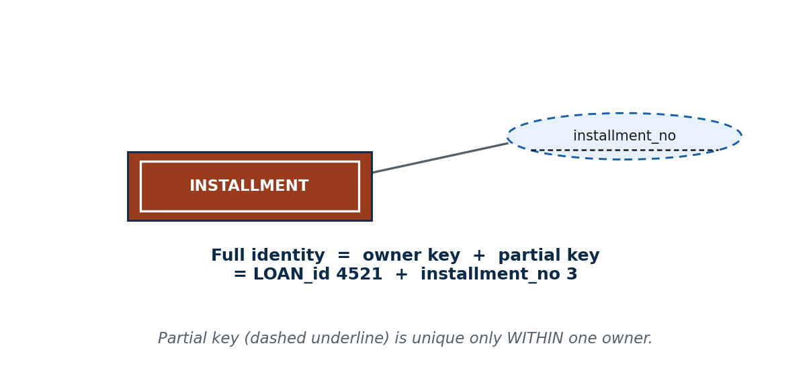

> 🎙️ **Deliver:** Ask: "If installment #3 exists for thousands of loans, how do we pick the right
> one?" The **partial key** (dashed underline) tells apart weak entities *within one owner*; full
> identity = **owner's key + partial key**. Kill the "partial key alone is unique" misconception.

**📖 In Depth — read this for revision**

A weak entity has no key of its own — but usually it *does* have some attribute that tells its siblings apart **within a single owner.** That attribute is the **partial key** (also called the **discriminator**).

- A **partial key (discriminator)** is an attribute of a weak entity that **distinguishes weak entities belonging to the *same* owner.** It is **not unique on its own** across the whole entity set — it is only unique *within* one owner. In **Chen notation** it is underlined with a **dashed (broken) line** (contrast the *solid* underline of a strong entity's primary key).
- The **full identifier** of a weak entity is therefore the combination: **owner's primary key + the weak entity's partial key.** Only together do they uniquely identify a weak entity. This is exactly the **composite key** idea from S6, now applied to weak entities.

**A worked example — installment numbers.** For INSTALLMENT (weak, owned by LOAN), the partial key is `installment_no`. Installment "3" exists for many, many loans — thousands of loans each have an installment 3 — so `installment_no` alone is **useless as an identifier.** But *within one loan* there is only one installment 3. So the full identity is **`loan_id` (the owner's key) + `installment_no` (the partial key)**: the pair (`loan_id` = 4521, `installment_no` = 3) is unique across the whole database, even though neither part is unique alone. In the diagram, `installment_no` gets a **dashed underline.**

**The misconception to correct — "the partial key alone is unique."** No. A partial key is unique **only within one owner**, never across all weak entities. Installment 3 of loan 4521 and installment 3 of loan 6002 are *different* installments that share a partial key. If you treated `installment_no` alone as unique you would confuse installments from different loans — a real accounting disaster. Always remember: **partial key + owner's key = the real identity.**

> **🌍 Real life — hotel room "101" needs its hotel.** Recall the hotel: room "101" exists in
> hundreds of hotels, so the room number is a **partial key** — unique only *inside* one hotel. The
> full identity of a room is **hotel ID + room number** (e.g. Everest Hotel + 101). A booking system
> that tried to use room number "101" alone as the identifier would happily confuse a room in
> Pokhara with a room in Kathmandu — booking the wrong guest into the wrong city. In the ER diagram,
> "room number" is underlined with a **dashed line** to signal "this identifies a room only *within*
> its hotel." The owner's key plus the partial key is what makes it truly unique — the same pattern as
> loan + installment number.

> **🔮 Hypothetical scenario — test yourself.** Imagine an exam system where ANSWER_SHEET is a weak
> entity owned by EXAM, with a partial key `seat_no`. Seat "12" is used in every single exam. A
> classmate proposes storing answer sheets keyed by `seat_no` alone. Predict the disaster, then write
> the correct full identifier. (Disaster: seat 12's sheet from the Mathematics exam collides with seat
> 12's sheet from the DBMS exam — the system can't tell them apart and could attach the wrong marks to
> the wrong exam; correct full identifier = **`exam_id` (owner key) + `seat_no` (partial key)**.) The
> rule you're proving: a partial key is unique only *within* one owner — never trust it alone.

> **🎯 Model exam answer.** *"What is a partial key? How is a weak entity uniquely identified?"*
> A **partial key (discriminator)** is an attribute of a weak entity that distinguishes weak entities
> belonging to the **same owner**; it is unique only *within* an owner, not across the whole set, and
> is shown with a **dashed underline** in Chen notation (e.g. `installment_no`). A weak entity is
> uniquely identified by the **combination of the owner's primary key and its partial key** (e.g.
> `loan_id` + `installment_no`) — neither part suffices alone.

> **🧠 Analogy & memory hook.** House number "5" repeats on every street — it identifies a house only
> **together with the street name**. Street + house number = the full address. **Hook: "Partial key
> alone repeats; owner's key + partial key = the full identity."**

> **🔑 Key terms:** *partial key / discriminator* (dashed underline in Chen) · *unique only within one owner* · *full identifier = owner's primary key + partial key* · link to the S6 *composite key* idea · the correction: *a partial key alone is not unique*.

---

#### 🛠 ACTIVITY — "Find the weak entity in a Nepali app" `[ACTIVITY]` `[~5 min]`

[SLIDE] **Think–Pair–Share**

- In pairs (3 min): find a **weak entity** in a system you use (a **comment** on a Facebook post, a **room** in a hotel booking, an **item** on a Daraz order, an **installment** on a loan). For your chosen weak entity, name (a) its **owner**, (b) its **partial key**, and (c) write out the **full identifier** (owner key + partial key).
- Draw the fragment in Chen notation: double rectangle + double diamond + double line + dashed-underlined partial key.
- Share (2 min); the lecturer checks each pair has all "three doubles" plus the dashed underline.

> 🎙️ Speaker note: Two things to verify in every answer — that participation on the weak side is
> *total*, and that the full identifier *includes the owner's key* (not the partial key alone). Those
> are the two most-tested points.

---

### 🧠 CHECK FOR UNDERSTANDING `[QUIZ]` `[~5 min]`

**MCQ 1.** A weak entity is one that:
a) is unimportant  b) ✅ **has no key of its own**  c) has no attributes  d) is always 1:1

**MCQ 2.** The full identifier of a weak entity is:
a) its partial key only  b) any of its attributes  c) ✅ **the owner's primary key + its partial key**  d) a derived attribute

**Discussion:** *Find a weak entity in a Nepali app (e.g. a comment on a Facebook post, a room in a hotel booking) and name its owner and its partial key.*

---

### 💡 REAL-LIFE APPLICATION `[~3 min]`
Weak entities are **everywhere** in real systems: invoice line-items, loan installments, exam answer-sheets per exam, comments on posts, rooms in a hotel. Modelling them wrong — treating a partial key as if it were unique, or forgetting the owner link — corrupts data integrity in exactly the places a business can least afford it (billing, accounting, exams). Recognising the "three doubles" signature and the owner-key-plus-partial-key identity rule is a routine, high-stakes part of designing any real Nepali database.

### 📝 SUMMARY & TAKEAWAYS `[~2 min]`
1. A **weak entity** has **no key of its own** (double rectangle) and depends on an **owner** for identity — "weak" means *identity-dependent*, not unimportant.
2. An **identifying relationship** (double diamond) ties the weak entity to its owner, and the weak side always has **total participation** (double line).
3. A **partial key** (dashed underline) distinguishes weak entities of the *same* owner; the full identity is **owner's primary key + partial key**.

**Next session (S9):** putting it all together into clean, correctly-named **ER diagrams** and avoiding common design pitfalls.

---
---

> **Batch note:** S9–S12 (ER degree>2, specialization/generalization, ER→table mapping) and the consolidated end-of-unit quiz will be appended next.
