# IT 220 — Unit 2: Data Modelling (ER Model) — S9–S12 batch
### Full Lecturer-Ready + Student-Revision Material (S9–S12 of S5–S12)

**Program:** BIM, 4th Semester · **Credits:** 3 · **Unit weight:** 8 lecture hours
**Sessions:** S9–S12 (50 min each) · **Local context:** Nepal / South Asia · **Notation:** Chen / EER

> **How to read this file.** Same two-reader format as the S5–S8 material: lecturer cues in `> 🎙️`
> blocks and `[~X min]` markers; student-revision depth in **📖 In Depth**, **🌍 Real life**,
> **🔮 Hypothetical**, **🎯 Model exam answer**, **🧠 Analogy & hook**, and **🔑 Key terms**.
> Diagrams live in `images/`. This batch closes Unit 2 and covers outcomes 5–8.

---

## Batch outcomes (S9–S12)
5. Draw clean, correctly-named ER diagrams and avoid common design pitfalls.  *(S9)*
6. Handle relationships of degree higher than two (ternary and beyond).  *(S10)*
7. Apply specialization/generalization with disjoint/overlap and total/partial constraints.  *(S11)*
8. Convert (map) a complete ER diagram into relational tables using the standard algorithm.  *(S12)*

---
---

# S9 — ER Diagrams, Naming Conventions & Design Issues
**Lecture hour 9 of 8+... (session 9) · 50 minutes**

### 🎯 OPENING — Hook `[~5 min]`
[SLIDE] *"Here are two ER diagrams of the same college system — one is clear, one is a spaghetti mess. What makes the difference?"* → conventions and good design choices, not just correct symbols.

---

### 📚 CONTENT `[~35 min]`

#### Concept 1 — ER Notation Recap (one consolidated legend) `[THEORY]` `[~10 min]`
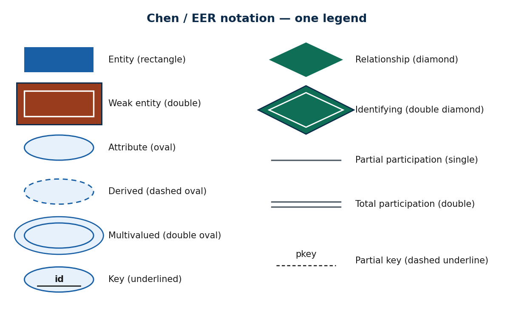

**📖 In Depth.** Everything from S5–S8 in one place. **Rectangle** = (strong) entity; **double rectangle** = weak entity. **Oval** = attribute; **dashed oval** = derived; **double oval** = multivalued; **underlined** attribute = key; **dashed underline** = partial key (of a weak entity). **Diamond** = relationship; **double diamond** = identifying relationship. A **single line** = partial participation; a **double line** = total participation. Read a fragment by naming each shape aloud — that habit catches most errors before they reach the tables.

> **🌍 Real life.** Any real college ER diagram (STUDENT, COURSE, ENROLLS, DEPARTMENT) uses exactly this symbol set; a reviewer who knows the legend can verify the model in minutes.

> **🎯 Model exam answer.** *"List the Chen ER symbols."* Rectangle = entity; double rectangle = weak entity; oval = attribute (dashed = derived, double = multivalued, underline = key, dashed underline = partial key); diamond = relationship; double diamond = identifying relationship; single line = partial and double line = total participation.

> **🧠 Hook:** "Name every shape aloud — the legend is the alphabet of ER."

> **🔑 Key terms:** entity · weak entity · attribute (derived/multivalued/key) · relationship · identifying relationship · participation lines · partial key.

---

#### Concept 2 — Naming Conventions `[THEORY]` `[~12 min]`
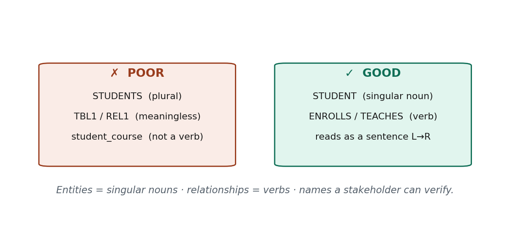

**📖 In Depth.** Good names make a diagram self-explanatory. **Entity types are singular nouns** (STUDENT, not STUDENTS) — a rectangle stands for the *type*, one specimen of the kind. **Relationships are verbs** (ENROLLS, TEACHES, PLACES) so the fragment reads left-to-right as a sentence: *STUDENT — ENROLLS — COURSE*. Use consistent case and meaningful names; avoid `TBL1`, `REL2`. Naming is not cosmetic: names are what a non-technical stakeholder reads to confirm the model, and they become table/column names after mapping — bad names breed miscommunication and mapping errors.

> **🌍 Real life.** A relationship named `REL1` tells the registrar nothing; renamed `TEACHES` (TEACHER–TEACHES–COURSE) it reads like plain English and the registrar can confirm or correct it on the spot.

> **🔮 Hypothetical.** You inherit a diagram full of `E1`, `E2`, `R3`. Why will the mapping to tables be error-prone, and what one change most improves it? (Meaningless names hide what each construct *is*, so mistakes go unnoticed; renaming to singular-noun entities and verb relationships makes errors visible.)

> **🎯 Model exam answer.** *"State ER naming conventions."* Entity types = singular nouns (STUDENT); relationship types = verbs (ENROLLS) so the diagram reads as a sentence; use consistent, meaningful names (never TBL1/REL2). Good names let stakeholders verify the model and become clean table/column names after mapping.

> **🧠 Analogy & hook.** Naming variables `x1`, `x2` in code vs `studentAge` — same diagram lesson. **Hook: "Entities are singular nouns; relationships are verbs."**

> **🔑 Key terms:** singular-noun entity · verb relationship · reads-as-a-sentence · meaningful/consistent naming.

---

#### Concept 3 — Design Issues: Attribute vs Entity vs Relationship `[THEORY]` `[~13 min]`
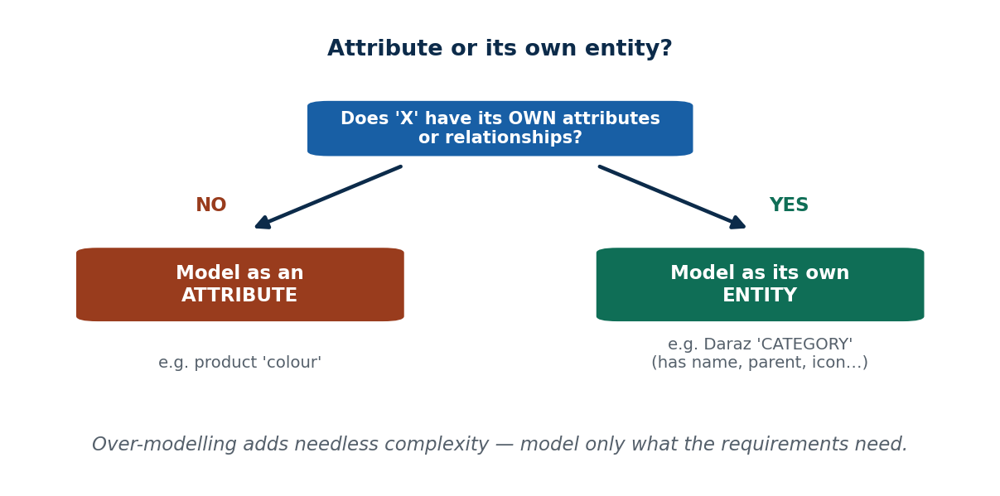

**📖 In Depth.** The hardest modelling choices are not about symbols but about *what should be what*. The key decision: **should a concept be an attribute of an entity, or its own entity?** Rule of thumb — **if the concept has its own attributes or its own relationships, model it as an entity; otherwise an attribute is enough.** "Colour" of a product is just a value → attribute. "Category" on Daraz has a name, a parent category, an icon, and relates to many products → its own **entity**. A second decision: **attribute vs relationship** — a connection between two *things* is a relationship; a plain property is an attribute. Beware **over-modelling**: more entities is not "better design"; model exactly what the requirements need, no more.

> **🌍 Real life.** On Daraz, "category" looks like it could be a text attribute of PRODUCT — but because categories have their own data (name, parent, icon) and group many products, Daraz models CATEGORY as a separate entity. "Colour", with no data of its own, stays an attribute.

> **🔮 Hypothetical.** For an eSewa-like app, should "merchant" be an attribute of TRANSACTION or its own entity? (Its own entity — a merchant has a name, PAN, settlement account, and relates to many transactions; it carries its own data and relationships.)

> **🎯 Model exam answer.** *"When should something be a separate entity rather than an attribute?"* Model it as its own entity when it has its own attributes and/or participates in its own relationships (e.g. CATEGORY, MERCHANT); keep it as an attribute when it is a plain value with no data of its own (e.g. colour, status). Avoid over-modelling — extra entities add needless complexity.

> **🧠 Analogy & hook.** Is "colour" a sticker on a box (attribute) or a whole filing cabinet with its own contents (entity)? **Hook: "Own attributes/relationships → entity; plain value → attribute."**

> **🔑 Key terms:** attribute-vs-entity decision · attribute-vs-relationship · over-modelling · "has its own attributes/relationships" test.

---

#### 🛠 ACTIVITY — "Attribute or entity?" `[~5 min]`
[SLIDE] In pairs (3 min): for a Foodmandu-style app, decide whether each of *cuisine*, *restaurant*, *delivery-address*, *rating* is an attribute or its own entity, and justify with the "own attributes/relationships" test. Share (2 min).
> 🎙️ Expected: restaurant = entity; delivery-address = entity (or multivalued composite attribute of CUSTOMER); cuisine = attribute (or small entity if it groups data); rating = attribute of a review.

### 🧠 CHECK FOR UNDERSTANDING `[~5 min]`
- **MCQ1.** Best name for the entity of course-takers: a) ENROLLS  b) STUDENTS  c) ✅ **STUDENT**  d) TBL1
- **MCQ2.** Model X as its own entity (not an attribute) when: ✅ **it has its own attributes/relationships**
- **Discussion:** For an eSewa-like app, is "merchant" an attribute of TRANSACTION or its own entity? Justify.

### 💡 REAL-LIFE APPLICATION `[~3 min]`
Clean, well-named ER diagrams are the shared language between analysts, developers, and DBAs in every Nepali IT company; the attribute-vs-entity call decides how many tables you get.

### 📝 SUMMARY `[~2 min]`
1. One consistent notation legend is the alphabet of ER.
2. Entities = singular nouns; relationships = verbs (reads as a sentence).
3. Model something as an entity only when it has its own attributes/relationships; don't over-model.
**Next (S10):** when two entities aren't enough — higher-degree (ternary) relationships.

---
---

# S10 — Relationship Types of Degree Higher Than Two (Ternary etc.)
**Session 10 · 50 minutes**

### 🎯 OPENING — Hook `[~5 min]`
[SLIDE] *"A supplier supplies a product for a project. Three things in one fact — can a normal two-sided arrow capture that?"* → ternary relationships.

---

### 📚 CONTENT `[~35 min]`

#### Concept 1 — Degree Revisited: Binary, Ternary, n-ary `[THEORY]` `[~10 min]`
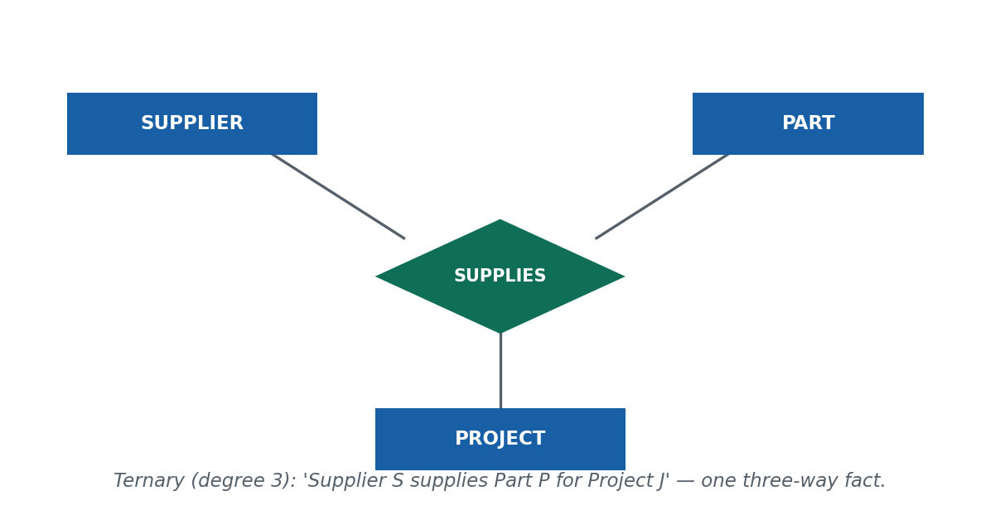

**📖 In Depth.** The **degree** of a relationship is the number of entity types it connects (recap from S7). **Binary** = 2 (by far the most common), **ternary** = 3, **n-ary** = n. A ternary relationship captures a single fact that genuinely involves three things at once: SUPPLIES(SUPPLIER, PART, PROJECT) means "supplier S supplied part P *for* project J" — one three-way association, drawn as one diamond touching three rectangles. A college timetable fact TEACHES(TEACHER, COURSE, ROOM/TIMESLOT) is another natural ternary.

> **🌍 Real life.** A logistics/procurement system records "this supplier delivered this part for this project" — a single fact about three entities; splitting it apart loses the point.

> **🎯 Model exam answer.** *"What is the degree of a relationship? Define ternary."* Degree = number of entity types participating in a relationship. Binary = 2, ternary = 3, n-ary = n. A ternary relationship (e.g. SUPPLIES(SUPPLIER, PART, PROJECT)) associates three entity types in one fact and is drawn as one diamond connected to three rectangles.

> **🧠 Hook:** "Degree = how many entity types the diamond touches."

> **🔑 Key terms:** degree · binary (2) · ternary (3) · n-ary · one diamond, three rectangles.

---

#### Concept 2 — Why a Ternary Is NOT Three Binaries `[THEORY]` `[EXAMPLE]` `[~13 min]`
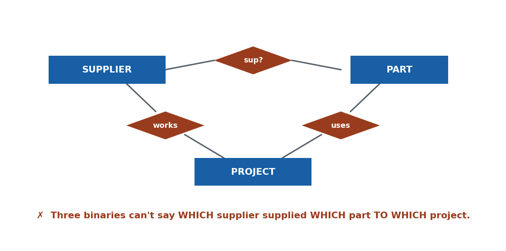

**📖 In Depth.** The tempting shortcut is to replace a ternary with three binary relationships. Often this **loses information**, because the binaries record pairwise facts but not the *combination*. "Supplier S supplies Part P" + "Part P is used in Project J" + "Supplier S works on Project J" are three true pairwise facts that still **do not tell you that S supplied P specifically to J** — S might supply P to a different project. Only the ternary SUPPLIES(S, P, J) records the three-way truth. So: three binaries are not equivalent to a ternary whenever the meaning lives in the combination of all three.

> **🌍 Real life.** In a delivery system, "customer–restaurant", "restaurant–rider", "rider–customer" as three binaries can't reconstruct *which* rider carried *which* order from *which* restaurant to *which* customer on a given trip — that combined fact needs one relationship.

> **🔮 Hypothetical.** A teammate models a Pathao ride as three binaries (rider–passenger, rider–route, passenger–route). What single business fact is lost, and how do you fix it? (Which passenger rode which route with which rider on one trip; fix with a ternary — or an associative RIDE entity.)

> **🎯 Model exam answer.** *"Why can't every ternary be split into three binaries?"* Because three binary relationships record only pairwise facts; they cannot capture that the three entities were associated *together* in one instance. E.g. S–P, P–J, S–J do not imply S supplied P to J. When the meaning is in the combination, a single ternary (or an associative entity) is required.

> **🧠 Analogy & hook.** A three-party contract is not the same as three separate two-party agreements. **Hook: "Three binaries lose the combined fact."**

> **🔑 Key terms:** ternary ≠ three binaries · loss of the combined fact · pairwise vs three-way association.

---

#### Concept 3 — Constraints & the Associative Entity `[THEORY]` `[~12 min]`
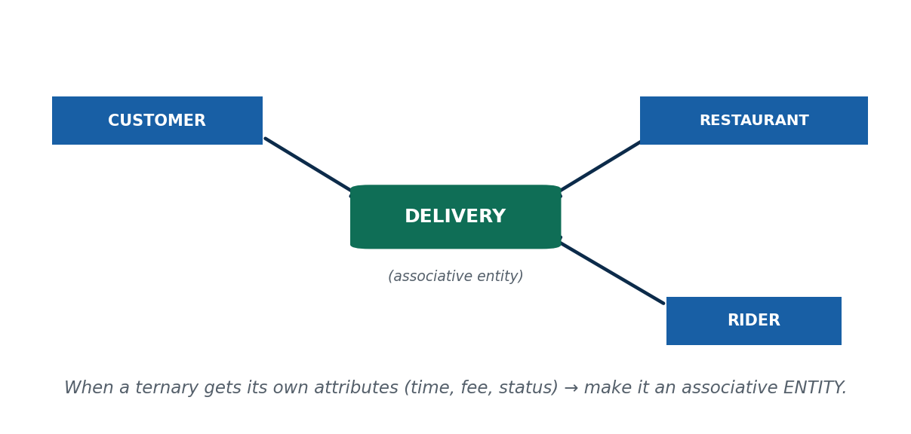

**📖 In Depth.** Higher-degree relationships can carry cardinality constraints too, but they get hard to read. A cleaner, very common technique is to convert an n-ary relationship into an **associative (intermediate) entity**: replace the diamond with a rectangle that links to each participant, especially when the relationship **has its own attributes** (a delivery has a time, fee, and status). Most real designs are binary; ternary is occasional and n > 3 is rare — reach for an associative entity when a ternary would otherwise need its own attributes or its own relationships.

> **🌍 Real life.** Foodmandu/Pathao Food model a DELIVERY that links CUSTOMER, RESTAURANT, and RIDER and stores delivery time, fee, and status — an associative entity, cleaner than a bare ternary diamond.

> **🎯 Model exam answer.** *"What is an associative entity and when is it used?"* An associative (intermediate) entity replaces a relationship (often ternary/n-ary) with a rectangle linked to each participant. It is used when the relationship needs its own attributes or relationships, or to make a higher-degree association clearer. Example: DELIVERY linking CUSTOMER, RESTAURANT, RIDER with time/fee/status.

> **🧠 Analogy & hook.** When a "meeting" between three people needs its own agenda and minutes, it becomes a thing in its own right. **Hook: "Ternary + its own attributes → make it an associative entity."**

> **🔑 Key terms:** associative/intermediate entity · n-ary cardinality · "prefer binary" · relationship with its own attributes.

---

#### 🛠 ACTIVITY — "Ternary or associative?" `[~5 min]`
[SLIDE] In pairs (3 min): model a Pathao ride involving RIDER, PASSENGER, and ROUTE. Decide whether a ternary is justified or an associative RIDE entity is cleaner, and list two attributes that would push you toward the entity. Share (2 min).
> 🎙️ Expected: if the ride has fare, distance, time, rating → associative RIDE entity wins.

### 🧠 CHECK FOR UNDERSTANDING `[~5 min]`
- **MCQ1.** A relationship among three entity types is: a) binary  b) recursive  c) ✅ **ternary**  d) weak
- **MCQ2.** Splitting a ternary into three binaries is risky because: ✅ **it can lose the combined-fact meaning**
- **Discussion:** Model a Pathao ride (RIDER, PASSENGER, ROUTE) — ternary or associative entity?

### 💡 REAL-LIFE APPLICATION `[~3 min]`
Logistics, delivery, and booking systems (common in Nepal's startup scene) frequently need ternary thinking; getting it wrong silently loses business facts like "who delivered what to whom".

### 📝 SUMMARY `[~2 min]`
1. Degree = number of participating entity types; ternary = 3.
2. A ternary ≠ three binaries when the meaning is in the combination.
3. Prefer binary; use a ternary or an associative entity only when needed (especially if it has its own attributes).
**Next (S11):** modelling "kinds of" — specialization and generalization.

---
---

# S11 — Specialization & Generalization (EER)
**Session 11 · 50 minutes**

### 🎯 OPENING — Hook `[~5 min]`
[SLIDE] *"On the Nagarik App a USER can be a citizen, a government employee, or a business owner — same person-record, but each kind stores extra things. How do we model 'kinds of'?"* → specialization/generalization.

---

### 📚 CONTENT `[~35 min]`

#### Concept 1 — Specialization & Generalization `[THEORY]` `[~12 min]`
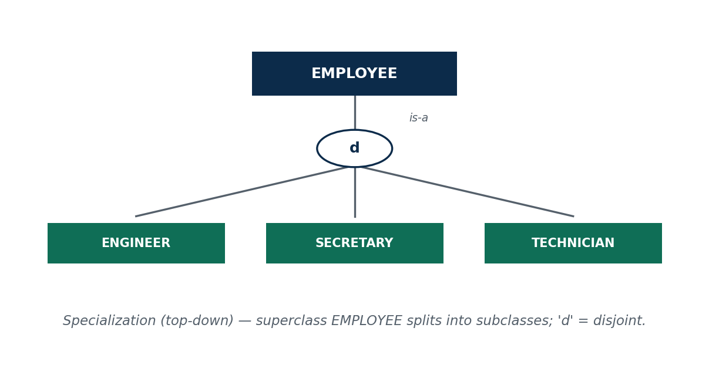

**📖 In Depth.** These are the **EER (Enhanced ER)** constructs for "is-a" hierarchies. **Specialization** is **top-down**: you take a superclass and split it into **subclasses** that share the superclass's attributes but add their own (EMPLOYEE → ENGINEER, SECRETARY, TECHNICIAN). **Generalization** is **bottom-up**: you notice several entity types share attributes and combine them into a common superclass (CAR and TRUCK → VEHICLE). They are **the same idea in opposite directions** — both produce a superclass/subclass hierarchy with an **is-a** relationship, and both give subclasses **attribute inheritance**.

> **🌍 Real life.** A bank ACCOUNT is specialized into SAVINGS and CURRENT; a platform USER generalizes/ specializes into CUSTOMER and MERCHANT. Each subclass is still "an account" / "a user" (is-a) but stores extra fields.

> **🔮 Hypothetical.** You have SAVINGS_ACCOUNT and CURRENT_ACCOUNT tables with 80% identical columns. Which direction of the tool applies, and what superclass would you introduce? (Generalization — bottom-up — introduce ACCOUNT holding the shared attributes.)

> **🎯 Model exam answer.** *"Differentiate specialization and generalization."* Specialization is top-down: splitting a superclass into subclasses that inherit its attributes and add specific ones (EMPLOYEE → ENGINEER, SECRETARY). Generalization is bottom-up: combining similar entity types into a superclass (CAR, TRUCK → VEHICLE). Both create an is-a hierarchy with inheritance; they are inverse directions of one idea.

> **🧠 Analogy & hook.** Biological taxonomy: animal → mammal → dog. **Hook: "Specialization = split down; generalization = combine up; both are is-a."**

> **🔑 Key terms:** superclass/subclass · specialization (top-down) · generalization (bottom-up) · is-a · attribute inheritance · EER.

---

#### Concept 2 — Constraints: Disjoint/Overlap × Total/Partial `[THEORY]` `[~13 min]`
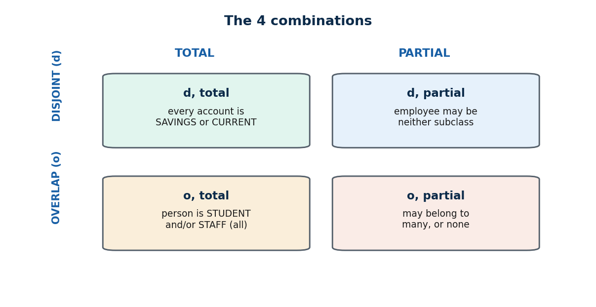

**📖 In Depth.** Two independent constraints govern a specialization. **(1) Disjoint vs Overlap** — the *disjointness* constraint. **Disjoint (d)**: an entity belongs to **at most one** subclass (an ACCOUNT is SAVINGS *or* CURRENT, not both). **Overlap (o)**: an entity may belong to **several** subclasses (a college PERSON can be both STUDENT and STAFF). **(2) Total vs Partial** — the *completeness* constraint. **Total** (double line): every superclass member **must** belong to some subclass (every EMPLOYEE is PERMANENT or CONTRACT). **Partial**: a member **may belong to none**. The two constraints are independent, giving **four combinations** (d-total, d-partial, o-total, o-partial).

> **🌍 Real life.** Bank ACCOUNT → SAVINGS/CURRENT is **disjoint, total** (exactly one type, every account has one). College PERSON → STUDENT/STAFF is **overlap, partial** (a TA is both; a visitor is neither).

> **🔮 Hypothetical.** On Daraz, USER → CUSTOMER and SELLER. Disjoint or overlap? Total or partial? (Overlap — one account can both buy and sell; partial — a brand-new user may be neither yet — so **overlap, partial**.)

> **🎯 Model exam answer.** *"Explain the constraints on specialization."* Two constraints. Disjointness: disjoint (d) — an entity is in at most one subclass; overlap (o) — it may be in several. Completeness: total — every superclass entity must be in some subclass (double line); partial — some need not be. They are independent → four combinations (d/o × total/partial), e.g. ACCOUNT→SAVINGS/CURRENT is disjoint-total.

> **🧠 Analogy & hook.** Disjoint/overlap = "pick one lane vs pick many"; total/partial = "everyone must choose vs choosing optional". **Hook: "d/o = how many subclasses; total/partial = must you join one."**

> **🔑 Key terms:** disjoint (d) · overlap (o) · total (double line) · partial · completeness vs disjointness · four combinations.

---

#### Concept 3 — Attribute Inheritance & Specific Attributes `[THEORY]` `[~10 min]`
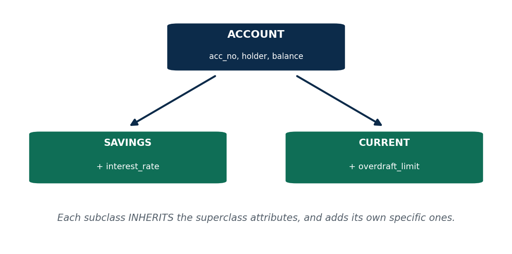

**📖 In Depth.** A subclass **inherits all attributes (and relationships) of its superclass** and then adds its own **specific (local) attributes**. SAVINGS inherits ACCOUNT's acc_no, holder, balance and adds `interest_rate`; CURRENT inherits the same and adds `overdraft_limit`. This is why factoring shared attributes up into a superclass avoids repetition — the shared fields live once, in the superclass. Inheritance also flows through relationships: if ACCOUNT relates to CUSTOMER, every subclass does too.

> **🌍 Real life.** In an HR system every EMPLOYEE has id, name, salary (superclass); an ENGINEER additionally has an engineering license number, a SECRETARY a typing speed — specific attributes on top of the inherited ones.

> **🎯 Model exam answer.** *"What is attribute inheritance in specialization?"* A subclass automatically receives all attributes and relationships of its superclass (inheritance) and adds its own specific attributes. E.g. SAVINGS and CURRENT inherit ACCOUNT's acc_no/holder/balance; SAVINGS adds interest_rate, CURRENT adds overdraft_limit.

> **🧠 Analogy & hook.** A child inherits family traits and adds personal ones. **Hook: "Inherit the shared, add the specific."**

> **🔑 Key terms:** attribute inheritance · specific/local attribute · inherited relationships · factoring shared attributes upward.

---

#### 🛠 ACTIVITY — "Classify the specialization" `[~5 min]`
[SLIDE] In pairs (3 min): for a platform USER → CUSTOMER and SELLER, decide disjoint/overlap and total/partial, and list one specific attribute for each subclass. Share (2 min).
> 🎙️ Expected: overlap (can be both), partial (may be neither yet); CUSTOMER: default_address; SELLER: store_name, PAN.

### 🧠 CHECK FOR UNDERSTANDING `[~5 min]`
- **MCQ1.** "Every employee must be permanent or contract" is a ___ constraint: a) overlap  b) disjoint  c) ✅ **total**  d) partial
- **MCQ2.** A subclass receives the superclass's attributes via: ✅ **inheritance**
- **Discussion:** On Daraz, USER → CUSTOMER and SELLER — disjoint or overlap? total or partial? Justify.

### 💡 REAL-LIFE APPLICATION `[~3 min]`
Banking (account types), HR (employee types), and e-commerce (user roles) all rely on specialization; choosing disjoint/total correctly prevents impossible records (an account that is both types) and missing ones (a member in no subclass).

### 📝 SUMMARY `[~2 min]`
1. Specialization (down) and generalization (up) are inverses sharing is-a and inheritance.
2. Disjoint vs overlap controls multi-subclass membership; total vs partial controls mandatory membership — four combinations.
3. Subclasses inherit shared attributes and add specific ones.
**Next (S12):** turning all these ER constructs into real tables.

---
---

# S12 — Converting ER Diagrams to Tables (Mapping Algorithm) — closes Unit 2
**Session 12 · 50 minutes**

### 🎯 OPENING — Hook `[~5 min]`
[SLIDE] *"We've drawn beautiful diagrams. But MySQL doesn't understand diamonds and ovals — it understands tables. How do we translate?"* → the ER-to-relational mapping algorithm.

---

### 📚 CONTENT `[~35 min]`

#### Concept 1 — The 7-Step Mapping Algorithm `[THEORY]` `[~11 min]`
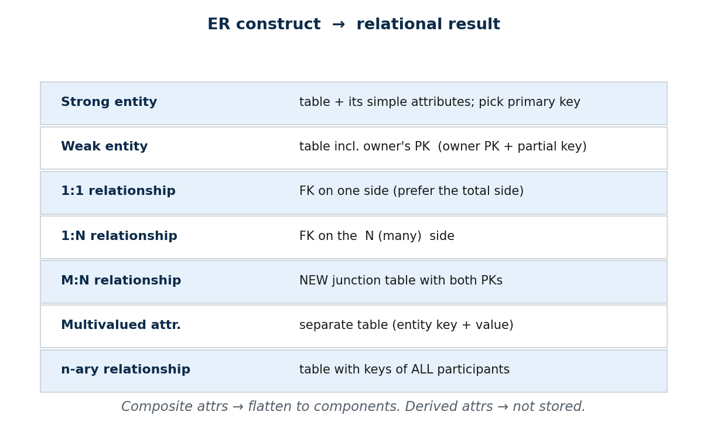

**📖 In Depth.** A mechanical algorithm converts any ER diagram into relational tables:
1. **Strong entity** → a table with its simple attributes; choose a primary key.
2. **Weak entity** → a table that includes the **owner's primary key** as part of its composite primary key (owner PK + partial key).
3. **1:1 relationship** → put a foreign key on one side (prefer the total-participation side).
4. **1:N relationship** → put the foreign key on the **N (many)** side.
5. **M:N relationship** → create a **new junction table** whose primary key is both entities' primary keys.
6. **Multivalued attribute** → a separate table (entity's key + the value).
7. **n-ary relationship** → a table with the primary keys of all participating entities.
Also: **composite** attributes are flattened into their component columns; **derived** attributes are **not stored**.

> **🌍 Real life.** This is exactly the step every developer does between an approved ER design and the first `CREATE TABLE` (Unit 5) — from diagram to running schema.

> **🎯 Model exam answer.** *"State the ER-to-relational mapping steps."* (1) strong entity → table + PK; (2) weak entity → table with owner PK + partial key; (3) 1:1 → FK on one (total) side; (4) 1:N → FK on the N side; (5) M:N → junction table with both PKs; (6) multivalued attribute → separate table; (7) n-ary → table with all participants' keys. Composite attrs flatten; derived attrs are not stored.

> **🧠 Hook:** "FK on the N side; junction table for M:N; separate table for multivalued/weak."

> **🔑 Key terms:** mapping algorithm · foreign key · junction table · composite→flatten · derived→omit.

---

#### Concept 2 — Mapping 1:N (Foreign Key on the N Side) `[THEORY]` `[EXAMPLE]` `[~9 min]`
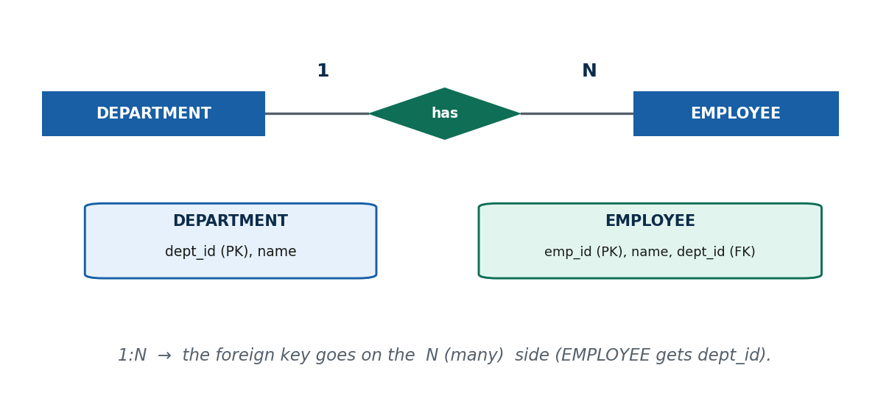

**📖 In Depth.** For a 1:N relationship, the foreign key goes on the **many** side — each "many" row points to its one partner. DEPARTMENT (1) — has — EMPLOYEE (N) maps to a `DEPARTMENT(dept_id PK, name)` table and an `EMPLOYEE(emp_id PK, name, dept_id FK)` table: the FK `dept_id` lives in EMPLOYEE. Putting it on the "1" side would force a department to store many employee ids in one column — which breaks first normal form (Unit 4).

> **🌍 Real life.** On Daraz, CUSTOMER (1) — places — ORDER (N): the ORDER table carries a `customer_id` foreign key; you never store a list of order-ids inside CUSTOMER.

> **🔮 Hypothetical.** A classmate puts the FK on the "1" side of a 1:N. What goes wrong? (The one row must hold many foreign values in a single column — non-atomic, breaks 1NF and makes queries/updates unreliable.)

> **🎯 Model exam answer.** *"Where does the foreign key go in a 1:N relationship, and why?"* On the N (many) side, because each many-side row relates to exactly one entity on the one side, so a single FK column suffices. Placing it on the one side would require a multi-valued column, violating atomicity.

> **🧠 Analogy & hook.** Many students each carry one class ID card; the class doesn't carry every student. **Hook: "1:N → FK on the many side."**

> **🔑 Key terms:** 1:N mapping · foreign key placement · N-side FK · atomic column (1NF preview).

---

#### Concept 3 — Mapping M:N (the Junction Table) `[THEORY]` `[~9 min]`
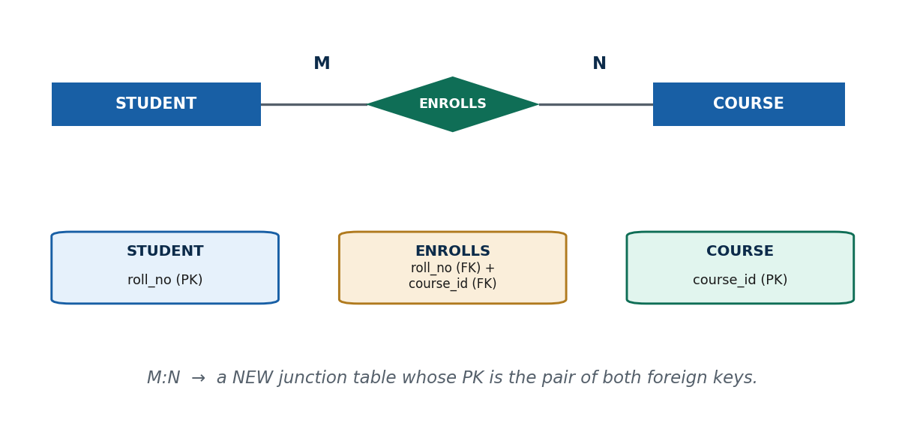

**📖 In Depth.** An M:N relationship cannot be a single foreign key on either side. It maps to a **new junction (relationship) table** whose rows are pairs of the two entities' primary keys; that pair is the junction table's **composite primary key** (and each half is a foreign key). STUDENT (M) — ENROLLS — COURSE (N) → `STUDENT(roll_no PK)`, `COURSE(course_id PK)`, and `ENROLLS(roll_no FK, course_id FK)` with (roll_no, course_id) as the composite key. Any attributes of the relationship (e.g. enrollment date, grade) go **into the junction table**.

> **🌍 Real life.** Daraz ORDER (M) — contains — PRODUCT (N) becomes an `ORDER_ITEM(order_id FK, product_id FK, quantity, price)` junction table — one row per product in an order.

> **🔮 Hypothetical.** Someone maps M:N by storing a comma-separated list of product-ids in the ORDER table. Name two concrete problems. (You can't query/aggregate one product cleanly, and you can't attach per-item data like quantity — the junction table solves both.)

> **🎯 Model exam answer.** *"How is an M:N relationship mapped, and where do its attributes go?"* It becomes a new junction table whose composite primary key is the two participating entities' primary keys (each a foreign key); any attributes of the relationship are stored as columns of the junction table (e.g. ENROLLS date/grade). Example: STUDENT–COURSE → ENROLLS(roll_no, course_id).

> **🧠 Analogy & hook.** A guest list matching guests to events — one row per (guest, event) pair. **Hook: "M:N → a junction table of paired keys."**

> **🔑 Key terms:** junction/relationship table · composite primary key · relationship attributes → junction · one row per pair.

---

#### Concept 4 — Common Mapping Mistakes `[THEORY]` `[~6 min]`
**📖 In Depth.** Three recurring errors: **(a)** storing an M:N as "a list of ids in a column" instead of a junction table (non-atomic, unqueryable); **(b)** putting the 1:N foreign key on the "1" side instead of the N side; **(c)** storing derived attributes (age, order total) instead of computing them — they drift out of date. Mapping specialization/generalization is a separate small topic: common options are **one table per subclass**, or a **single table with a type field**; full treatment is deferred to normalization (Unit 4).

> **🌍 Real life.** A slow, buggy reporting screen is often traced back to one of these three mapping mistakes made months earlier.

> **🎯 Model exam answer.** *"List common ER-to-table mapping mistakes."* (1) M:N stored as a multi-valued column instead of a junction table; (2) 1:N foreign key placed on the one side instead of the N side; (3) storing derived attributes rather than computing them. Correct: junction table for M:N, FK on the N side, omit derived attributes.

> **🧠 Hook:** "No lists in a column; FK on the N side; never store derived."

> **🔑 Key terms:** non-atomic column · FK-placement error · storing-derived error · subclass mapping options.

---

#### 🛠 CAPSTONE SOLVED PROBLEM — map a college ER end-to-end `[~ built into deck]`
**Problem.** Map a college ER: STUDENT and COURSE (M:N ENROLLS with a grade), DEPARTMENT (1:N with STUDENT), and a student's multiple phone numbers.
**Worked answer (tables):**
- `DEPARTMENT(dept_id PK, name)`
- `STUDENT(roll_no PK, name, dept_id FK)`  ← 1:N FK on the N (student) side
- `COURSE(course_id PK, title, credits)`
- `ENROLLS(roll_no FK, course_id FK, grade)`  PK = (roll_no, course_id)  ← M:N junction, relationship attribute `grade` inside
- `STUDENT_PHONE(roll_no FK, phone)`  PK = (roll_no, phone)  ← multivalued attribute → own table

### 🧠 CHECK FOR UNDERSTANDING `[~5 min]`
- **MCQ1.** An M:N relationship maps to: a) FK on either side  b) ✅ **a new junction table**  c) nothing  d) a derived attribute
- **MCQ2.** In a 1:N relationship the foreign key is placed on the: ✅ **N (many) side**
- **Discussion:** Take the eSewa USER–TRANSACTION model (S7) and write the tables (keys + FKs) it maps to.

### 💡 REAL-LIFE APPLICATION `[~3 min]`
This mapping is the exact bridge between design and `CREATE TABLE` (Unit 5) — the step every developer performs to turn an approved diagram into a running database in any Nepali tech job.

### 📝 SUMMARY `[~2 min]`
1. A 7-step algorithm mechanically turns ER into tables.
2. FK on the N side; junction table for M:N; separate table for multivalued/weak entities.
3. Flatten composite attributes; never store derived data.
**Next unit (Unit 3):** querying these tables formally with relational algebra and calculus.

---
---

## END-OF-UNIT CONSOLIDATED QUIZ (Unit 2, S5–S12)
*Answers marked ✅. Use for revision/assessment.*

### Part A — Multiple choice
1. ER model is used mainly at which phase? ✅ **conceptual**
2. All students enrolled today form a/an: ✅ **entity set**
3. "Age" from date of birth is a/an ___ attribute: ✅ **derived**
4. Multiple saved phone numbers is a/an ___ attribute: ✅ **multivalued**
5. "One department, many employees" is: ✅ **1:N**
6. A double line to a relationship denotes: ✅ **total participation**
7. A weak entity is one that: ✅ **has no key of its own**
8. Full identifier of a weak entity = ✅ **owner's PK + partial key**
9. A relationship among three entity types is: ✅ **ternary**
10. "An account is savings or current, never both" is: ✅ **disjoint**
11. An M:N relationship maps to: ✅ **a junction table**
12. In a 1:N relationship the FK goes on the: ✅ **N side**

### Part B — Short answer
1. Differentiate entity type vs entity set (one example each).
2. List the four attribute types with a Nepali example of each.
3. Define cardinality ratio and participation; how do they differ?
4. Why does a weak entity need an identifying relationship and a partial key?
5. Difference between disjoint and overlap specialization constraints.

### Part C — Diagramming / applied
1. Draw an ER for a college **library**: MEMBER, BOOK, BORROWS (with date), a book has multiple COPIES (weak). Mark keys, partial key, cardinality, participation.
2. Given a Daraz fragment (CUSTOMER 1:N ORDER, ORDER M:N PRODUCT, customer has multiple ADDRESSES), apply the mapping algorithm and write all tables with PKs and FKs.
3. For a banking USER, model a specialization into CUSTOMER and EMPLOYEE; justify disjoint/overlap and total/partial, and list each subclass's specific attributes.

### Part D — Discussion
1. A teammate models a food-delivery fact as three binaries — explain what is lost and when a ternary is the right call.
2. When should a real-world concept (e.g. Daraz "category") be an attribute vs its own entity? Argue both sides.
