# IT 220 — Unit 3: Relational Algebra & Relational Calculus (S13–S17)
### Full Lecturer-Ready + Student-Revision Material

**Program:** BIM, 4th Semester · **Credits:** 3 · **Unit weight:** 5 lecture hours
**Sessions:** S13–S17 (50 min each) · **Local context:** Nepal / South Asia

> Notation policy: every operator is shown as its **formal symbol + a plain-English gloss + a worked
> example** on the sample data. Same two-reader format as Units 1–2.
>
> **Running schema (tiny on purpose, reused across all five sessions):**
> `Student(sid, name, program, city)` · `Enrollment(sid, course, grade)` · `Course(course, credit)` · `Instructor(iid, name, dept)`

---

## Unit 3 — Learning Outcomes
1. Explain what relational algebra is and why it is the *procedural* foundation of SQL.
2. Apply the unary operations SELECT (σ) and PROJECT (π).
3. Apply the set operations UNION (∪), INTERSECTION (∩), DIFFERENCE (−), CARTESIAN PRODUCT (×) with union-compatibility.
4. Apply JOIN (theta/equi/natural, ⋈) and DIVISION (÷), and compose operations.
5. Use aggregate/grouping (ℱ) and outer joins, and read/write Tuple (TRC) and Domain (DRC) relational calculus.

---
---

# S13 — Introduction to Relational Algebra · SELECT (σ) & PROJECT (π)
**Lecture hour 13 · 50 minutes**

### 🎯 OPENING — Hook `[~5 min]`
[SLIDE] *"When you search 'students from Pokhara with grade A' on the college portal, the system silently does two tiny operations — pick the right rows, then keep only the columns you asked for. Today we name them."* → σ and π.

### 📚 CONTENT `[~35 min]`

#### Concept 1 — What Relational Algebra Is `[THEORY]` `[~12 min]`
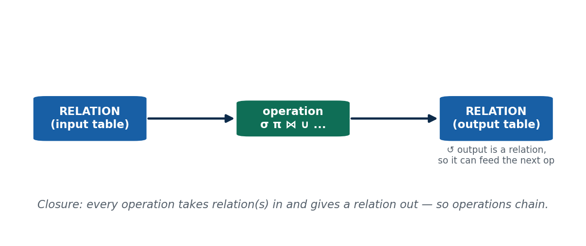

**📖 In Depth.** **Relational algebra** is a formal, **procedural** query language: a set of **operations** that each take one or two **relations** (tables) as input and produce a **relation** as output. Because the output is always a relation, operations **chain** — this is the **closure property**, and it is what lets you build a big query out of small steps (like snapping LEGO bricks together). Relational algebra is **procedural** — you specify *how* to compute the answer, step by step — in contrast to relational *calculus* (S16–S17), which is **declarative** (you describe *what* you want). Relational algebra is the theoretical basis of SQL: a DBMS optimizer translates your SQL into a relational-algebra expression to plan execution.

> **🌍 Real life.** The eSewa transaction-history screen is a chain of relational-algebra steps over a Transactions relation: filter to your account, keep the columns shown, sort. Every SQL `SELECT` you write is turned into relational algebra under the hood.

> **🎯 Model exam answer.** *"What is relational algebra?"* A formal, procedural query language: a set of operations that take relation(s) as input and yield a relation as output. Its **closure property** (output is always a relation) lets operations be composed. It is procedural (specifies *how*) and is the theoretical foundation of SQL.

> **🧠 Analogy & hook.** Operations are LEGO bricks — each takes a table and snaps onto the next. **Hook: "Relation in → relation out → chain."**

> **⚠️ Misconception.** *"Relational algebra is just SQL."* No — SQL is a practical language; relational algebra is the underlying math: closed-form, **removes duplicates by definition**, no display formatting.

> **🔑 Key terms:** relational algebra · procedural · relation (input/output) · closure property · basis of SQL.

---

#### Concept 2 — SELECT (σ) & PROJECT (π) `[THEORY]` `[EXAMPLE]` `[~13 min]`
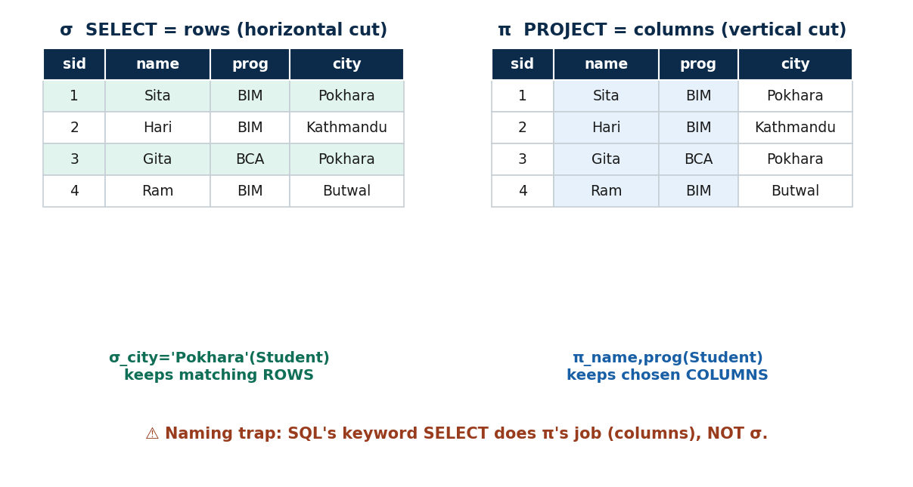

**📖 In Depth.** The two **unary** operations (one input relation each):
- **SELECT — σ (sigma).** `σ_<condition>(R)` keeps the **rows** (tuples) of R that satisfy the condition — a **horizontal** filter. The condition uses `=, ≠, <, >, ≤, ≥` and `AND/OR/NOT`. The result has the **same schema** as R; the number of columns (degree) is unchanged and the number of rows (cardinality) is ≤ the original. Example: `σ_city='Pokhara'(Student)` → only the Pokhara students.
- **PROJECT — π (pi).** `π_<attribute list>(R)` keeps only the **listed columns** — a **vertical** filter — and drops the rest. The result schema is just those attributes, and **duplicate rows are removed automatically** (relations are sets). Example: `π_name,program(Student)`.

**The naming trap (say it explicitly).** In relational algebra, **σ picks ROWS**. Confusingly, SQL's keyword `SELECT` does the **column** job — that is **π**, not σ. Keep them straight: σ = rows, π = columns.

> **🌍 Real life.** Every "search + show selected fields" feature — a college result lookup, a Khalti transaction filter — is **σ then π**: filter the rows you want, then keep the columns to display. These are the two most-used operations in all of querying.

> **🎯 Model exam answer.** *"Differentiate SELECT (σ) and PROJECT (π)."* σ_condition(R) filters **rows** satisfying a condition (horizontal; same schema; cardinality ≤ R). π_attrs(R) keeps chosen **columns** (vertical; schema = listed attrs; duplicates removed). σ = rows, π = columns; SQL's `SELECT` keyword actually performs π.

> **🧠 Analogy & hook.** σ = a horizontal cut; π = a vertical cut. **Hook: "σ picks rows, π picks columns — and SQL SELECT is really π."**

> **⚠️ Misconception.** *"π keeps duplicate rows like SQL."* Pure relational algebra removes duplicates automatically; SQL needs `DISTINCT`.

> **🔑 Key terms:** SELECT (σ, rows) · PROJECT (π, columns) · condition · same-schema · duplicate removal · SQL-SELECT-is-π trap.

---

#### 🛠 CAPSTONE — compose σ then π (built into deck as a solved problem)
"Names of students from Pokhara" = `π_name( σ_city='Pokhara'(Student) )`. Filter rows first (σ), then trim columns (π).

#### 🛠 ACTIVITY `[~5 min]`
Open any app with a filter (Daraz price filter, eSewa date filter). Which part is σ (rows) and which is π (columns)?

### 🧠 CHECK FOR UNDERSTANDING `[~5 min]`
- MCQ1: Which operation reduces the number of *columns*? (a) σ (b) ✅ π (c) ∪ (d) ⋈
- MCQ2: `σ_credit>3(Course)` changes → ✅ the number of rows
- Discussion: which phone-app filter is σ and which is π?

### 💡 REAL-LIFE APPLICATION `[~3 min]`
Every "search then show selected fields" screen (result lookup, transaction filter) is σ then π.

### 📝 SUMMARY `[~2 min]`
(1) Relational algebra = procedural, closed operations over relations. (2) σ filters rows by condition. (3) π keeps chosen columns and drops duplicates. **Next:** treating whole relations as sets — ∪, ∩, −, ×.

---
---

# S14 — Set-Theory Operations: ∪, ∩, −, ×
**Lecture hour 14 · 50 minutes**

### 🎯 OPENING — Hook `[~5 min]`
[SLIDE] *"A college merges its morning and day-shift student lists for one notice. How do you combine two tables without listing anyone twice — and what if the columns don't match?"* → set operations + union compatibility.

### 📚 CONTENT `[~35 min]`

#### Concept 1 — UNION, INTERSECTION, DIFFERENCE (+ union compatibility) `[THEORY]` `[~17 min]`
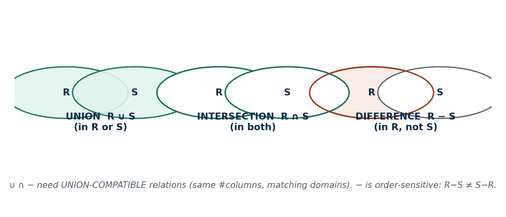

**📖 In Depth.** These three treat relations as **sets of tuples**, and all three require the two relations to be **union-compatible**: the **same number of attributes** with **matching domains**, column by column (the column *names* may differ, the domains must align).
- **UNION — R ∪ S:** all tuples in R **or** S, with duplicates removed. e.g. `MorningStudents ∪ DayStudents`.
- **INTERSECTION — R ∩ S:** tuples in **both**. e.g. students in 'DBMS' ∩ students in 'Java' = those taking both.
- **DIFFERENCE — R − S:** tuples in R **but not** in S. It is **not commutative**: `R − S ≠ S − R`. e.g. `AllStudents − GraduatedStudents` = currently active students.

> **🌍 Real life.** UNION merges mailing lists; INTERSECTION finds customers with **both** an eSewa **and** a Khalti account; DIFFERENCE finds lapsed users = `AllUsers − ActiveUsers`. Everyday analytics.

> **🎯 Model exam answer.** *"State the set operations and their compatibility rule."* ∪ (in either), ∩ (in both), − (in R not S) all require **union-compatible** relations (same #attributes, matching domains). − is **not commutative**. All remove duplicates (set semantics).

> **🧠 Hook:** "Same shape first (union-compatible); ∪ = either, ∩ = both, − = only-in-R."

> **⚠️ Misconception.** *"Any two tables can be UNIONed"* / *"R−S = S−R."* Both wrong — check compatibility first, and order matters for −.

> **🔑 Key terms:** union-compatible · UNION (∪) · INTERSECTION (∩) · DIFFERENCE (−, not commutative) · set semantics.

---

#### Concept 2 — CARTESIAN PRODUCT (×) `[THEORY]` `[~13 min]`
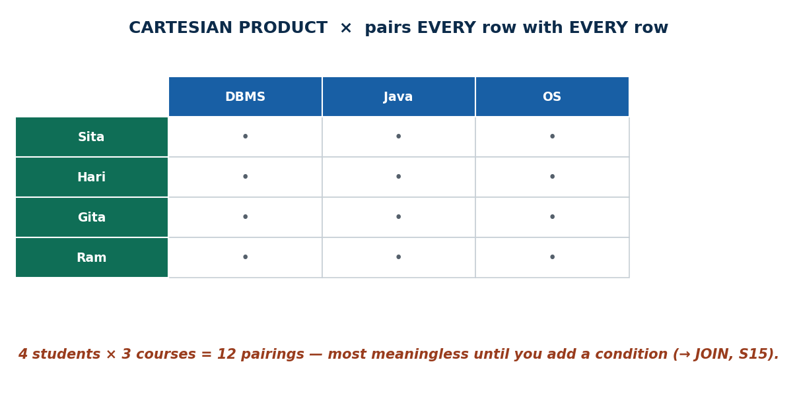

**📖 In Depth.** `R × S` pairs **every** tuple of R with **every** tuple of S. The result's **degree = sum** of the two degrees, and its **cardinality = product** of the two cardinalities. Unlike ∪/∩/−, it does **not** need union compatibility. On its own it is usually **meaningless and huge** — 4 students × 3 courses = 12 pairings, most nonsensical. It becomes useful only when followed by a **σ** that keeps the meaningful pairs — and that combination (× then σ) is exactly a **JOIN** (S15).

> **🌍 Real life.** If R has 5 rows and S has 4, `R × S` has 20 rows. You rarely want the raw product; you want it filtered — which is a join.

> **🎯 Model exam answer.** *"What is the Cartesian product?"* `R × S` pairs every tuple of R with every tuple of S; degree = sum, cardinality = product; no union compatibility needed. Alone it is meaningless/large; followed by a selection it becomes a JOIN.

> **🧠 Analogy & hook.** × invites every student to dance with every course; the real matchmaking happens only when you add a condition. **Hook: "× pairs everything; a condition makes it a JOIN."**

> **⚠️ Misconception.** *"Cartesian product combines related rows."* No — it blindly pairs everything; relating them needs a following condition.

> **🔑 Key terms:** CARTESIAN PRODUCT (×) · degree = sum · cardinality = product · no compatibility needed · raw material for JOIN.

#### 🛠 ACTIVITY `[~5 min]`
Give a Nepali example where you'd want INTERSECTION (overlap) vs DIFFERENCE (what's missing). If R has 5 and S has 4 rows, how many in R × S? (20.)

### 🧠 CHECK FOR UNDERSTANDING `[~5 min]`
- MCQ1: Which does NOT require union compatibility? (a) ∪ (b) ∩ (c) ✅ × (d) −
- MCQ2: R (5 rows) × S (4 rows) → ✅ 20 rows
- Discussion: real INTERSECTION vs DIFFERENCE example.

### 📝 SUMMARY `[~2 min]`
(1) ∪/∩/− need union-compatible relations. (2) − is order-sensitive. (3) × pairs everything — the raw material for JOIN. **Next:** add a condition to × → JOIN, plus DIVISION.

---
---

# S15 — Binary Operations: JOIN (⋈) & DIVISION (÷)
**Lecture hour 15 · 50 minutes**

### 🎯 OPENING — Hook `[~5 min]`
[SLIDE] *"Your marksheet shows the course name and your grade together — but those two facts live in two different tables. What stitches them into one row?"* → JOIN.

### 📚 CONTENT `[~35 min]`

#### Concept 1 — JOIN: from × to Theta Join (⋈_θ) `[THEORY]` `[~11 min]`
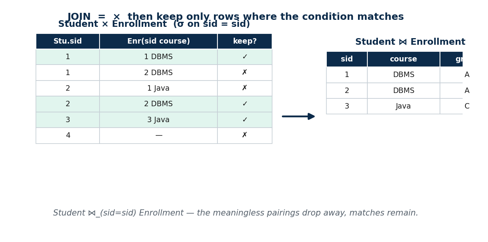

**📖 In Depth.** A **JOIN** is a **Cartesian product followed by a SELECT** on a matching condition: `R ⋈_θ S = σ_θ(R × S)`. It keeps only the pairs that satisfy the join condition θ, throwing away the meaningless pairings of ×. A **theta join** joins on **any** comparison θ (`=, <, >, ≤, ≥, ≠`) — e.g. pair students with scholarship slabs where `marks ≥ slab_threshold`.

> **🌍 Real life.** A bank statement is `Account ⋈ Transactions`; a Daraz invoice is `Order ⋈ Product ⋈ Customer`. Joins build every report that combines tables.

> **🎯 Model exam answer.** *"What is a join?"* A join is a Cartesian product followed by a selection on a condition: `R ⋈_θ S = σ_θ(R × S)`. A **theta join** uses any comparison operator in θ; it keeps only matching pairs.

> **🧠 Hook:** "JOIN = × + condition."

> **🔑 Key terms:** JOIN (⋈) · theta join (⋈_θ) · join condition · × + σ.

---

#### Concept 2 — Equijoin vs Natural Join (⋈) `[THEORY]` `[EXAMPLE]` `[~12 min]`
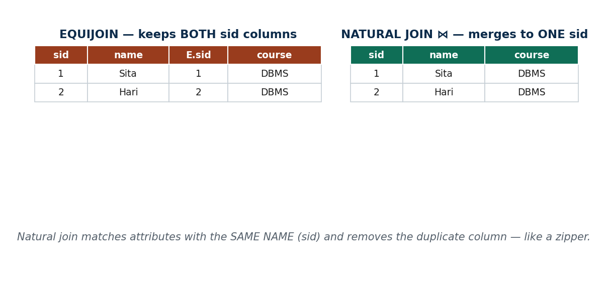

**📖 In Depth.**
- An **equijoin** is a theta join whose condition uses only **equality** (`=`). e.g. `Student ⋈_(Student.sid = Enrollment.sid) Enrollment`. The join column appears **twice** (both `sid`s).
- A **natural join — R ⋈ S** is an equijoin on **all attributes with the same name**, and it then **automatically removes the duplicate column**. `Student ⋈ Enrollment` joins on `sid` and yields one clean `sid`; then `π_name,course,grade(Student ⋈ Enrollment)` produces a marksheet row.

> **🌍 Real life.** Your marksheet: `π_name,course,grade(Student ⋈ Enrollment)` — the natural join on `sid` stitches the two tables into one clean row per enrollment.

> **🎯 Model exam answer.** *"Differentiate equijoin and natural join."* An **equijoin** joins on an equality condition and **keeps both** matching columns. A **natural join (⋈)** joins on **all like-named attributes** and **removes the duplicate** column. Natural join = equijoin on same-named attributes + drop duplicate.

> **🧠 Analogy & hook.** Natural join = a zipper — matching `sid` teeth line up and merge into one. **Hook: "Equijoin keeps both; natural join zips to one."**

> **⚠️ Misconception.** *"Natural join matches by column position"* / *"equijoin removes the duplicate."* Natural join matches by identical **name** (a rename silently breaks it); only the **natural** join drops the duplicate column.

> **🔑 Key terms:** equijoin (= only, both columns) · natural join (⋈, same-named attrs, duplicate removed) · join on name not position.

---

#### Concept 3 — DIVISION (÷) `[THEORY]` `[~12 min]`
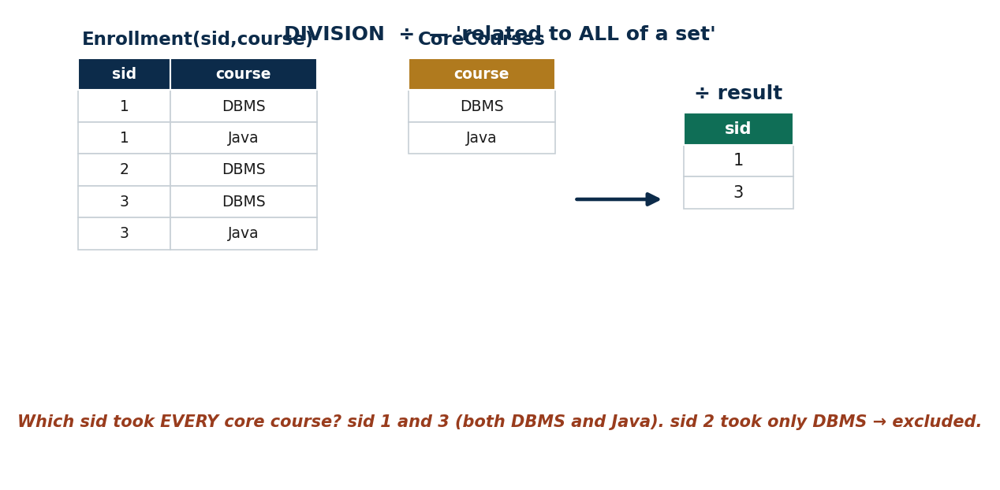

**📖 In Depth.** `R ÷ S` returns the tuples in R that are associated with **all** tuples in S — the **"for all"** (universal) operation. It answers *"find X related to **every** Y"* queries. Example: *"Which students are enrolled in **all** core courses?"* = `Enrollment(sid,course) ÷ CoreCourses(course)`. On the sample data, sid 1 and 3 took both DBMS and Java → they survive; sid 2 took only DBMS → excluded. This is the hardest operation, so anchor it: it is **ALL**, not **any**.

> **🌍 Real life.** *"Which delivery riders have covered **every** district in the valley?"* = `Coverage(rider,district) ÷ ValleyDistricts(district)`. Division powers "qualified for **all** requirements" checks (graduation eligibility, completed all KYC steps).

> **🎯 Model exam answer.** *"What does DIVISION do?"* `R ÷ S` returns the tuples of R associated with **all** tuples of S — the universal ("for all") operation. e.g. students enrolled in **every** core course = `Enrollment ÷ CoreCourses`.

> **🧠 Hook:** "Division = related to ALL of a set (for-all), not any."

> **⚠️ Misconception.** *"Division finds X in ANY of the set."* No — it is **ALL** (universal), not **any** (existential).

> **🔑 Key terms:** DIVISION (÷) · universal / "for all" · R ÷ S · all-not-any.

#### 🛠 ACTIVITY `[~5 min]`
Describe a real "must match ALL of them" situation (a rider covering all districts, a student passing all subjects) — that's division.

### 🧠 CHECK FOR UNDERSTANDING `[~5 min]`
- MCQ1: Which join automatically drops the duplicate join column? (a) theta (b) equijoin (c) ✅ natural join (d) ×
- MCQ2: "Students enrolled in every core course" → ✅ DIVISION
- Discussion: a real "must match ALL" situation.

### 📝 SUMMARY `[~2 min]`
(1) JOIN = × + condition. (2) theta → equi → natural narrows down; natural join removes the duplicate column. (3) DIVISION answers "related to ALL." **Next:** aggregates, outer joins, and the declarative world of calculus.

---
---

# S16 — Additional Operations (Aggregate ℱ, Outer Joins) · Tuple Relational Calculus
**Lecture hour 16 · 50 minutes**

### 🎯 OPENING — Hook `[~5 min]`
[SLIDE] *"Basic relational algebra can't answer 'what's the average grade?' or keep a student who enrolled in nothing. We need a few extra tools — and a totally different way of asking questions."* → aggregates, outer joins, then calculus.

### 📚 CONTENT `[~35 min]`

#### Concept 1 — Aggregate Functions & Grouping (ℱ) `[THEORY]` `[~11 min]`
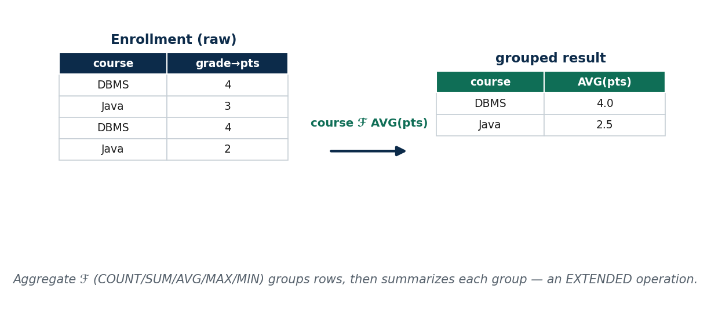

**📖 In Depth.** The aggregate operator **ℱ (script F)** applies **COUNT, SUM, AVG, MAX, MIN**, optionally **grouped** by attributes: `<grouping attrs> ℱ <function list>(R)`. Grouping partitions the rows into groups, then computes one summary value per group. It is **not** one of the basic operations — it is an **extension** (basic algebra has no built-in counting). Example: `program ℱ COUNT(sid)(Student)` = students per program; `course ℱ AVG(grade)(Enrollment)` = average grade per course.

> **🌍 Real life.** Dashboards live on aggregates: `merchant ℱ SUM(amount)(Transactions)` = total collected per merchant on Khalti; students per program on a college portal.

> **🎯 Model exam answer.** *"What is the aggregate/grouping operation?"* `<grouping> ℱ <functions>(R)` partitions R by the grouping attributes and applies aggregate functions (COUNT/SUM/AVG/MAX/MIN) per group. It is an **extended** (not basic) operation. e.g. `course ℱ AVG(grade)(Enrollment)`.

> **🧠 Hook:** "ℱ = group, then summarize each group."

> **⚠️ Misconception.** *"Aggregate is a basic relational operation."* It is an **additional/extended** operation; basic algebra can't count.

> **🔑 Key terms:** aggregate (ℱ) · COUNT/SUM/AVG/MAX/MIN · grouping · extended operation.

---

#### Concept 2 — Outer Joins (⟕ ⟖ ⟗) `[THEORY]` `[~12 min]`
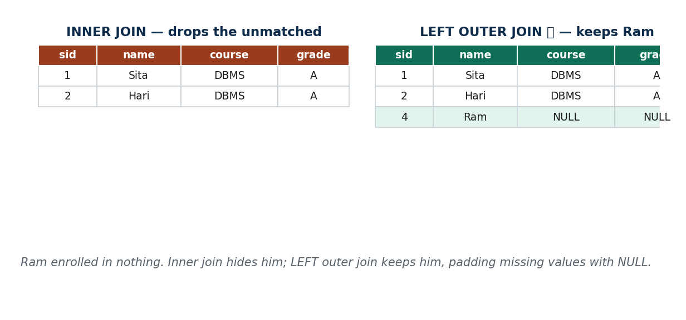

**📖 In Depth.** An **inner** join (natural/theta) **drops** rows with no match. **Outer joins keep the unmatched rows too**, padding the missing side with **NULL**:
- **LEFT outer (⟕)** keeps all **left** rows; **RIGHT outer (⟖)** keeps all **right** rows; **FULL outer (⟗)** keeps both.
Example: `Student ⟕ Enrollment` keeps a newly-admitted student who hasn't enrolled in anything yet (their grade columns become NULL).

> **🌍 Real life.** A bank report listing **every** account, including those with zero transactions this month = `Account ⟕ Transactions` (left outer). Inner join would silently hide the inactive accounts.

> **🎯 Model exam answer.** *"What is an outer join?"* An outer join keeps unmatched tuples (unlike an inner join, which drops them), padding missing values with NULL: LEFT (⟕) keeps all left rows, RIGHT (⟖) all right rows, FULL (⟗) both.

> **🧠 Hook:** "Inner join hides the unmatched; outer join keeps them with NULLs."

> **⚠️ Misconception.** *"Inner join shows everyone."* It silently drops rows with no match; use an outer join to keep them.

> **🔑 Key terms:** inner vs outer join · LEFT (⟕) / RIGHT (⟖) / FULL (⟗) · NULL padding.

---

#### Concept 3 — Tuple Relational Calculus (TRC) `[THEORY]` `[~12 min]`
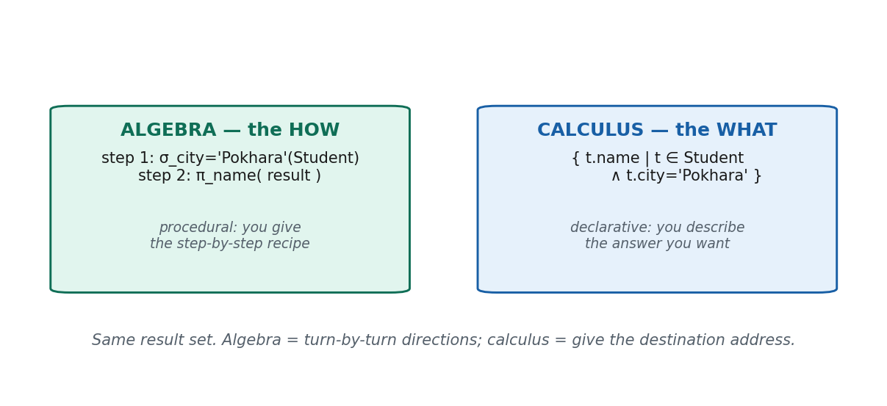

**📖 In Depth.** **Tuple relational calculus** is a **non-procedural / declarative** language: you describe **what** tuples you want, not **how** to get them. Form: `{ t | COND(t) }`, where `t` is a **tuple variable** ranging over a relation, and COND uses predicates and the quantifiers **∃ (there exists)** and **∀ (for all)**. TRC has the **same expressive power** as relational algebra (**relational completeness**). Example: `{ t.name | t ∈ Student ∧ t.program = 'BIM' }` = names of BIM students (the declarative version of π∘σ). "Students enrolled in at least one course": `{ t | t ∈ Student ∧ ∃ e (e ∈ Enrollment ∧ e.sid = t.sid) }`.

> **🌍 Real life.** Declarative thinking is exactly how you reason in SQL day to day: you state the result you want and let the DBMS find the plan.

> **🎯 Model exam answer.** *"What is tuple relational calculus?"* A declarative (non-procedural) language of the form `{ t | COND(t) }`, where `t` is a tuple variable and COND uses predicates and quantifiers (∃, ∀). It describes *what* to retrieve, not *how*, and is equal in power to relational algebra.

> **🧠 Analogy & hook.** Algebra = turn-by-turn directions; calculus = give the taxi the destination address. **Hook: "Algebra = HOW; calculus = WHAT."**

> **⚠️ Misconception.** *"Calculus and algebra give different answers."* They are equivalent in power — same result, different style.

> **🔑 Key terms:** TRC · declarative / non-procedural · tuple variable · ∃ / ∀ · relational completeness.

#### 🛠 ACTIVITY `[~5 min]`
Phrase one query about your college in plain English, then say whether you described HOW (algebra) or WHAT (calculus).

### 🧠 CHECK FOR UNDERSTANDING `[~5 min]`
- MCQ1: Which keeps students who enrolled in NO course? (a) natural join (b) equijoin (c) ✅ LEFT outer join (d) division
- MCQ2: TRC is best described as → ✅ declarative / non-procedural
- Discussion: HOW vs WHAT for a college query.

### 📝 SUMMARY `[~2 min]`
(1) Aggregates/grouping (ℱ) add counting & summarizing. (2) Outer joins keep unmatched rows with NULLs. (3) TRC describes *what* you want with tuple variables and quantifiers, equal in power to algebra. **Next:** Domain Relational Calculus closes the unit.

---
---

# S17 — Domain Relational Calculus (DRC) — closes Unit 3
**Lecture hour 17 · 50 minutes**

### 🎯 OPENING — Hook `[~5 min]`
[SLIDE] *"Yesterday we asked for whole tuples. Today we go one level finer — we name a variable for each column value and describe the answer field by field. Same power, different feel."* → DRC.

### 📚 CONTENT `[~35 min]`

#### Concept 1 — Domain Relational Calculus (DRC) `[THEORY]` `[~12 min]`
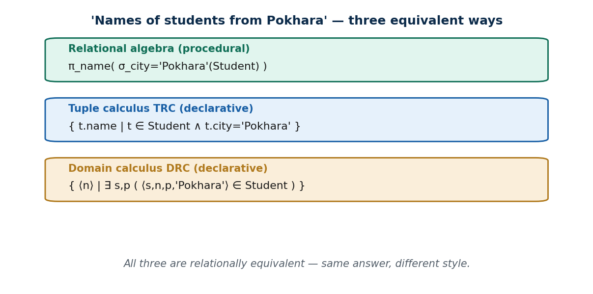

**📖 In Depth.** **Domain relational calculus** is a declarative calculus where variables range over **domains** (individual **attribute values**) rather than whole tuples. Form: `{ ⟨x1, …, xn⟩ | COND(x1, …, xn) }`, where each `xi` is a **domain variable** bound to a column, using **∃** and **∀**. It is **relationally complete** (= algebra = TRC) and is the basis of the **QBE (Query-By-Example)** "fill in the columns" interface. Example: names of Pokhara students = `{ ⟨n⟩ | ∃ s,p ( ⟨s,n,p,'Pokhara'⟩ ∈ Student ) }`.

> **🌍 Real life.** QBE interfaces — the visual "fill the columns" query builders in tools like MS Access and report designers used in many Nepali offices/banks — are **DRC made visual**.

> **🎯 Model exam answer.** *"What is domain relational calculus?"* A declarative calculus of the form `{ ⟨x1,…,xn⟩ | COND }` where each variable ranges over a **domain** (a single attribute value), using ∃/∀. It is equal in power to algebra and TRC and underlies QBE.

> **🧠 Analogy & hook.** TRC hands you the whole form (the tuple); DRC hands you the individual blanks (the fields). **Hook: "DRC = one variable per column."**

> **🔑 Key terms:** DRC · domain variable · ⟨…⟩ list · ∃/∀ · QBE · relational completeness.

---

#### Concept 2 — TRC vs DRC · Safety of Expressions `[THEORY]` `[~11 min]`

**📖 In Depth.**
- **TRC vs DRC:** a **tuple** variable ranges over whole **rows** (`t.name`); a **domain** variable ranges over single **column values** (a separate variable per attribute). DRC names every attribute explicitly in the angle-bracket list — more verbose, but it maps directly onto QBE-style "fill in the blanks" tools. The **scope** of the variable is the difference, not the power.
- **Safety:** a calculus expression is **safe** if it produces a **finite** result drawn from values actually in the database. `{ ⟨x⟩ | NOT(⟨x⟩ ∈ Student) }` is **unsafe** — infinitely many values aren't students. Unsafe expressions are disallowed.

> **🌍 Real life.** A report tool that let you write an "everything that is NOT in this table" query would try to list infinitely many values — which is why real query tools only allow safe, bounded expressions.

> **🎯 Model exam answer.** *"Differentiate TRC and DRC; what is a safe expression?"* In **TRC** a variable ranges over whole tuples; in **DRC** over individual domain values (one per column) — same power, different variable scope. A **safe** expression yields a finite result drawn from database values; unsafe expressions (e.g. `NOT ∈`) return infinite sets and are disallowed.

> **🧠 Hook:** "Tuple var = a row; domain var = a value. Safe = finite answer."

> **⚠️ Misconception.** *"Any condition you can write is a valid query."* Unsafe (infinite) expressions are not allowed.

> **🔑 Key terms:** tuple vs domain variable · scope · safe / unsafe expression · finite result.

---

#### Concept 3 — Unit 3 Synthesis: Procedural ⇄ Declarative ⇄ SQL `[THEORY]` `[~7 min]`
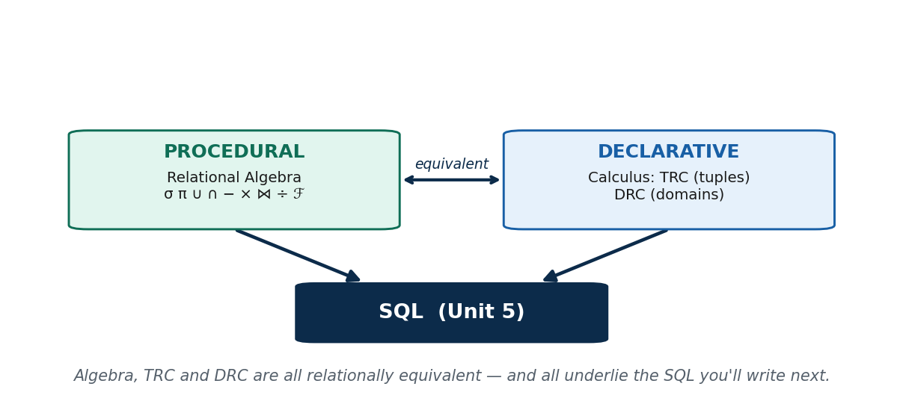

**📖 In Depth.** **Relational algebra** (procedural: σ, π, ∪, ∩, −, ×, ⋈, ÷, plus aggregates and outer joins) and **relational calculus** (declarative: **TRC** over tuples, **DRC** over domains) are all **relationally equivalent** — they express the same set of queries; algebra says **HOW**, calculus says **WHAT**. All three underlie **SQL** (Unit 5), which gives a practical, friendly syntax for everything formalized here.

> **🎯 Model exam answer.** *"How do algebra, TRC, and DRC relate?"* All three are relationally equivalent (relational completeness): algebra is procedural, TRC and DRC are declarative. Each can express the same queries, and all underlie SQL.

> **🧠 Hook:** "Algebra (HOW) ⇄ TRC/DRC (WHAT) → all equal → all become SQL."

> **🔑 Key terms:** relational equivalence · procedural vs declarative · foundation of SQL.

#### 🛠 ACTIVITY `[~5 min]`
Why might a non-programmer find DRC-style "fill in the blank" (QBE) easier than writing algebra? Where have you seen fill-in-the-blank query forms?

### 🧠 CHECK FOR UNDERSTANDING `[~5 min]`
- MCQ1: In DRC, variables range over → ✅ individual attribute values / domains
- MCQ2: An expression returning an infinite set is called → ✅ unsafe
- Discussion: where have you seen QBE-style query forms?

### 📝 SUMMARY `[~2 min]`
(1) DRC uses one variable per column, describing the answer field-by-field. (2) TRC vs DRC differ in variable scope, not power. (3) Only safe expressions; algebra, TRC, DRC are all equivalent and all feed SQL. **Next unit:** Database Normalization (Unit 4).

---
---

## END-OF-UNIT QUIZ — Unit 3 (consolidated) · answers ✅
### Part A — Multiple Choice
1. Relational algebra is ✅ procedural. 2. Selects ROWS by condition → ✅ σ. 3. π automatically removes → ✅ duplicate rows. 4. Does NOT need union compatibility → ✅ ×. 5. R(6)×S(5) → ✅ 30 rows. 6. R−S is → ✅ not commutative. 7. JOIN = × then a → ✅ SELECT. 8. Removes duplicate matching column → ✅ natural join. 9. "Enrolled in ALL core courses" → ✅ DIVISION. 10. Keep students who enrolled in NO course → ✅ LEFT OUTER JOIN. 11. TRC variable ranges over → ✅ whole tuples. 12. DRC variable ranges over → ✅ single attribute values.

### Part B — Write the expression (sample relations)
13. Names of students from Kathmandu → `π_name(σ_city='Kathmandu'(Student))`
14. Each student's name with course and grade → `π_name,course,grade(Student ⋈ Enrollment)`
15. Average grade per course → `course ℱ AVG(grade)(Enrollment)`
16. TRC: names of BIM students → `{ t.name | t ∈ Student ∧ t.program='BIM' }`

### Part C — Discussion
17. Decompose one screen of a Nepali app into σ/π/JOIN/aggregate operations.
18. Explain why algebra (HOW) and calculus (WHAT) always give the same answer, and why SQL needed both ideas.
