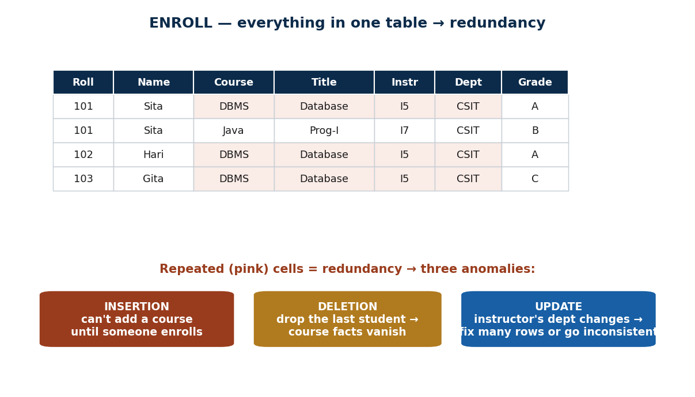
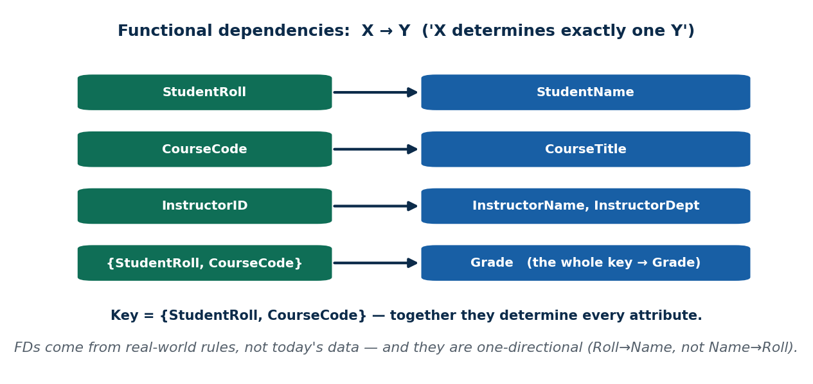
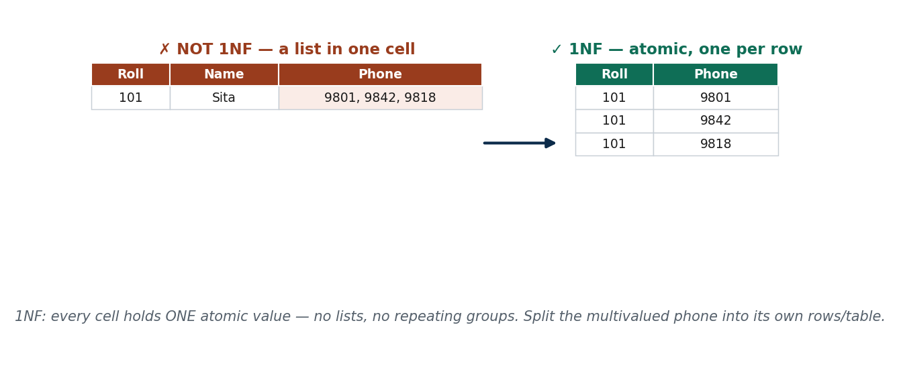
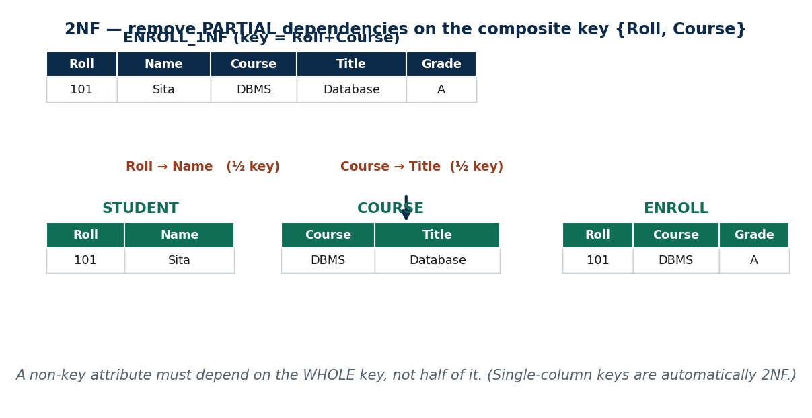
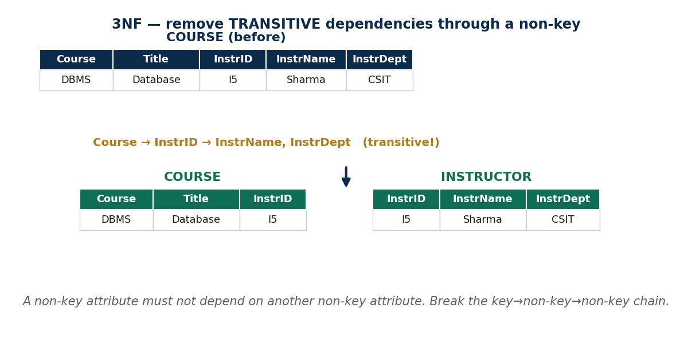
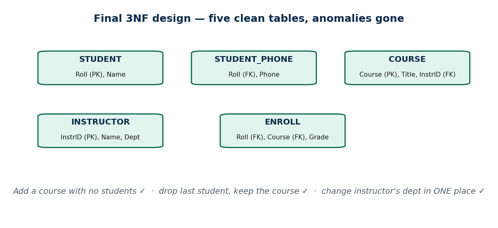
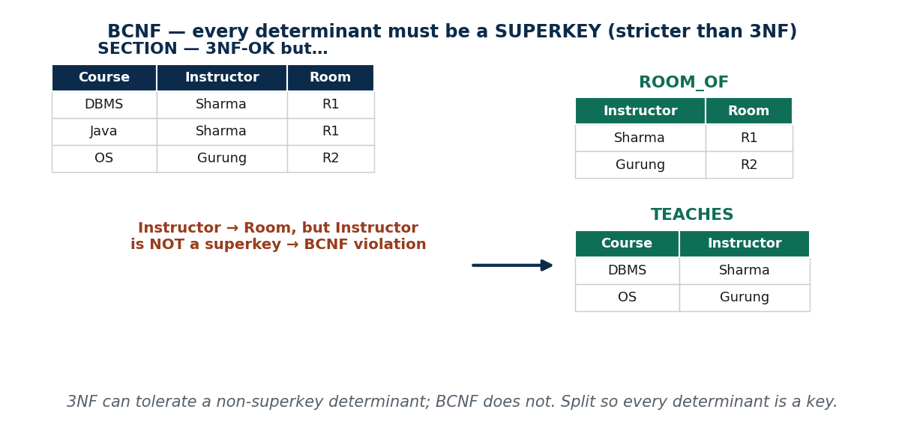
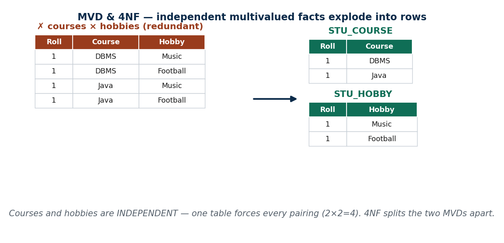
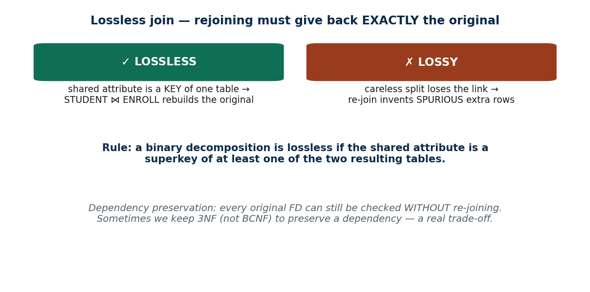
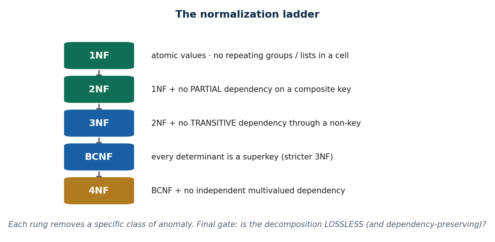

# IT 220 — Unit 4: Database Normalization (S18–S21)
### Full Lecturer-Ready + Student-Revision Material

**Program:** BIM, 4th Semester · **Credits:** 3 · **Unit weight:** 4 lecture hours
**Sessions:** S18–S21 (50 min each) · **Local context:** Nepal / South Asia

> Same two-reader format as Units 1–3. Normalization is procedural, so the deck leans on
> **solved-problem decomposition walkthroughs**.
>
> **Running example (one table threaded through all four sessions):**
> `ENROLL(StudentRoll, StudentName, StudentPhone[multi], CourseCode, CourseTitle, InstructorID, InstructorName, InstructorDept, Grade)`
> — a deliberately bad "everything in one table" enrollment sheet. We hunt its anomalies (S18), then
> decompose it 1NF → 2NF → 3NF → BCNF → 4NF (S19–S21).

---

## Unit 4 — Learning Outcomes
1. Explain informal design guidelines and identify insertion, deletion, and update anomalies.
2. Define and detect functional dependencies (FDs) and the keys they imply.
3. Apply 1NF, 2NF, 3NF to decompose a table step by step, with justification.
4. Define BCNF vs 3NF; recognise multivalued dependencies and apply 4NF.
5. Check the two correctness properties of a decomposition: lossless join and dependency preservation.

---
---

# S18 — Informal Design Guidelines & Functional Dependencies
**Lecture hour 18 · 50 minutes**

### 🎯 OPENING — Hook `[~5 min]`
[SLIDE] *"Here's one giant spreadsheet a college uses for enrollments. A student changes their phone — and we edit it in 11 rows. Miss one, and the database now believes two different numbers. What went wrong?"* → bad design breeds anomalies.

### 📚 CONTENT `[~35 min]`

#### Concept 1 — What Makes a Schema 'Good' `[THEORY]` `[~10 min]`
**📖 In Depth.** Informal design guidelines: **each relation should represent one clear thing** (don't cram student, course, and instructor facts into one table); **minimise redundancy** (don't store the same fact twice); **avoid excessive nulls**; and **avoid designs that produce spurious tuples** when tables are joined back. The all-in-one `ENROLL` sheet violates the first two badly.

> **🌍 Real life.** Every time a Nepali fintech or e-commerce team designs a new feature table, splitting entities cleanly up front (users vs orders vs merchants) is what prevents corruption later.

> **🎯 Model exam answer.** *"State the informal guidelines for good relational design."* Each relation should model one entity with clear semantics; minimise redundant storage; minimise nulls; and avoid designs that generate spurious tuples on join. Good design trades a few more tables for far less redundancy.

> **🧠 Hook:** "One table = one thing."

> **⚠️ Misconception.** *"Fewer tables = simpler = better."* Fewer tables usually means MORE redundancy and MORE anomalies.

> **🔑 Key terms:** design guidelines · one-relation-one-entity · redundancy · nulls · spurious tuples.

---

#### Concept 2 — Redundancy & the Three Anomalies `[THEORY]` `[EXAMPLE]` `[~13 min]`

**📖 In Depth.** An **anomaly** is an update problem caused by **redundant** storage. Three kinds:
- **Insertion anomaly** — you can't record a new fact until an unrelated fact exists. In `ENROLL`, you can't add a new **course** (CourseCode, CourseTitle) until some student enrolls in it — the course detail has nowhere to live.
- **Deletion anomaly** — deleting one fact accidentally erases another. If the **last student** in a course drops it, the course's (and instructor's) details vanish entirely.
- **Update anomaly** — a fact stored many times must be changed in many places; a partial update leaves the data **inconsistent**. "Instructor Sharma moves from CSIT to BIM" must be fixed in **every** row that mentions Sharma.

> **🌍 Real life.** eSewa storing a merchant's commission rate copied into every transaction row: the rate changes, and now some rows are right and some wrong — a classic update anomaly.

> **🎯 Model exam answer.** *"Name and illustrate the three anomalies."* **Insertion** — can't add a course until a student enrolls; **Deletion** — dropping the last student loses the course/instructor facts; **Update** — changing an instructor's department requires editing many rows, risking inconsistency. All stem from redundancy.

> **🧠 Analogy & hook.** Writing your home address on every page of a 200-page notebook — move house and you rewrite 200 pages. **Hook: "Redundancy → insert / delete / update anomalies."**

> **🔑 Key terms:** anomaly · insertion / deletion / update anomaly · redundancy · inconsistency.

---

#### Concept 3 — Functional Dependencies (FDs) & Keys `[THEORY]` `[~12 min]`

**📖 In Depth.** A **functional dependency** `X → Y` means *"if you know X, you know exactly one Y"* — **X determines Y**. FDs come from **real-world rules**, not from today's data, and they are **one-directional**. In `ENROLL`: `StudentRoll → StudentName`, `CourseCode → CourseTitle`, `InstructorID → InstructorName, InstructorDept`, and `{StudentRoll, CourseCode} → Grade`. A **key** is an attribute set that functionally determines **every** attribute; a **candidate key** is a minimal such set. Here the key is **{StudentRoll, CourseCode}**. These FDs are the raw material for every normal form that follows.

> **🌍 Real life.** `NationalID → citizen`: the ID pins down exactly one person; a **name** does not (two people named "Anish"). That is why keys are IDs, not names.

> **🎯 Model exam answer.** *"Define a functional dependency and a key using FDs."* `X → Y` holds if each X value is associated with exactly one Y value (X determines Y); FDs are one-directional and come from business rules. A **key** is a minimal attribute set that functionally determines all attributes of the relation.

> **🧠 Analogy & hook.** National ID → person (exact); name → person (not). **Hook: "X → Y = knowing X pins down one Y."**

> **⚠️ Misconception.** *"X → Y means Y → X too."* No — Roll → Name, but Name does not determine Roll.

> **🔑 Key terms:** functional dependency (X → Y, "determines") · one-directional · trivial vs non-trivial · candidate key.

#### 🛠 ACTIVITY `[~5 min]`
Find one FD that holds in your college marksheet, and one pair of columns where neither determines the other.

### 🧠 CHECK FOR UNDERSTANDING `[~5 min]`
- MCQ1: Being unable to add a new course because no student has enrolled is which anomaly? → ✅ insertion
- MCQ2: `CourseCode → CourseTitle` means → ✅ each code maps to exactly one title
- Discussion: an FD and a non-FD pair in your marksheet.

### 📝 SUMMARY `[~2 min]`
(1) Good schemas minimise redundancy. (2) Redundancy causes insertion/deletion/update anomalies. (3) FDs (X → Y) formalise the rules and reveal the key. **Next:** turning FDs into normal forms, starting with 1NF.

---
---

# S19 — Normal Forms & First Normal Form (1NF)
**Lecture hour 19 · 50 minutes**

### 🎯 OPENING — Hook `[~5 min]`
[SLIDE] *"One cell says StudentPhone = '9801, 9842, 9818'. Is that one value or three? Can you query 'who has 9842'? This fat cell is why 1NF exists."*

### 📚 CONTENT `[~35 min]`

#### Concept 1 — Normalization: the Ladder `[THEORY]` `[~13 min]`
**📖 In Depth.** **Normalization** is a **step-by-step** process of refining tables to reduce redundancy and anomalies, judged against the FDs and keys. The normal forms form a **ladder** — **1NF ⊂ 2NF ⊂ 3NF ⊂ BCNF ⊂ 4NF** — and each rung fixes a **specific class** of anomaly. You climb **one rung at a time**; you don't fix everything in one action.

> **🌍 Real life.** A schema review on any product team is exactly this: "is this table in 3NF? which dependency is still wrong?" — done incrementally, table by table.

> **🎯 Model exam answer.** *"What is normalization?"* A stepwise process of decomposing relations to reduce redundancy and anomalies, guided by FDs and keys, through a ladder of normal forms (1NF → 2NF → 3NF → BCNF → 4NF), each removing a specific class of anomaly.

> **🧠 Analogy & hook.** Declutter a room one drawer at a time. **Hook: "Normalize one rung at a time."**

> **⚠️ Misconception.** *"Normalization is one big action."* It is incremental — one normal form at a time.

> **🔑 Key terms:** normalization · normal form · ladder (1NF→2NF→3NF→BCNF→4NF) · incremental.

---

#### Concept 2 — First Normal Form (1NF) `[THEORY]` `[EXAMPLE]` `[~12 min]`

**📖 In Depth.** A relation is in **1NF** if **every attribute holds a single, atomic value** — no repeating groups, no multivalued cells, no nested tables. Each cell = one value. In the running example, `StudentPhone = '9801,9842,9818'` and repeating `Course1, Course2, Course3` columns both **break 1NF**. **Fix:** pull the phones into `STUDENT_PHONE(StudentRoll, Phone)` (one row per phone) and flatten the course columns into one row per (Roll, CourseCode). Result: `ENROLL_1NF(StudentRoll, StudentName, CourseCode, CourseTitle, InstructorID, InstructorName, InstructorDept, Grade)` with key `{StudentRoll, CourseCode}`. 1NF removed the fat cells — but **redundancy still remains** (sets up S20).

> **🌍 Real life.** A REST API or CSV export breaks the moment a field secretly holds a list. 1NF discipline keeps Daraz product attributes individually queryable and filterable.

> **🎯 Model exam answer.** *"What is 1NF?"* A relation is in 1NF if every attribute value is **atomic** (single-valued) with no repeating groups or nested relations. Multivalued/list cells are split into separate rows or a separate table.

> **🧠 Hook:** "1NF = one atomic value per cell."

> **⚠️ Misconception.** *"1NF just means no duplicate rows."* It is about atomic values + no repeating groups, not row uniqueness.

> **🔑 Key terms:** 1NF · atomic value · repeating group · multivalued cell · one-value-per-cell.

#### 🛠 CAPSTONE (deck solved problem) — fix ENROLL to 1NF
Pull `StudentPhone` into `STUDENT_PHONE(Roll, Phone)`; flatten repeating course columns → one row per (Roll, Course). Key = {Roll, Course}.

### 🧠 CHECK FOR UNDERSTANDING `[~5 min]`
- MCQ1: A column storing "9801, 9842, 9818" violates → ✅ 1NF
- MCQ2: 1NF primarily requires → ✅ atomic, single-valued attributes
- Discussion: find a field on an online form that would be a 1NF violation if dumped into one column.

### 📝 SUMMARY `[~2 min]`
(1) Normalization is a step-by-step ladder. (2) 1NF demands atomic values, no repeating groups. (3) We split to 1NF but redundancy remains. **Next:** 2NF and 3NF attack that leftover redundancy.

---
---

# S20 — Second (2NF) & Third (3NF) Normal Forms
**Lecture hour 20 · 50 minutes**

### 🎯 OPENING — Hook `[~5 min]`
[SLIDE] *"Our 1NF table has key {StudentRoll, CourseCode}. But StudentName depends on only StudentRoll — half the key. And InstructorDept depends on InstructorID, not the key at all. These two 'wrong dependencies' are exactly what 2NF and 3NF kill."*

### 📚 CONTENT `[~35 min]`

#### Concept 1 — Partial Dependency & 2NF `[THEORY]` `[~12 min]`

**📖 In Depth.** A relation is in **2NF** if it is in 1NF **and** no non-key attribute depends on only **part** of a composite key — i.e. **no partial dependency**. This only matters when the key is **composite**. In `ENROLL_1NF` (key `{StudentRoll, CourseCode}`): `StudentRoll → StudentName` and `CourseCode → CourseTitle` are **partial** dependencies. **Fix** by splitting the partial FDs into their own tables: `STUDENT(StudentRoll, StudentName)`, `COURSE(CourseCode, CourseTitle, InstructorID, InstructorName, InstructorDept)`, `ENROLL(StudentRoll, CourseCode, Grade)`.

> **🌍 Real life.** A shared grocery bill where some items belong to only one roommate — split them out so nobody pays for what isn't theirs.

> **🎯 Model exam answer.** *"Define 2NF."* A relation is in 2NF if it is in 1NF and has **no partial dependency** — no non-key attribute depends on only part of a composite key. Fix by moving each partially-dependent attribute to a table keyed on the part it depends on. (A single-attribute key is automatically 2NF.)

> **🧠 Hook:** "2NF: depend on the WHOLE key, not half."

> **⚠️ Misconception.** *"Every table must be forced to 2NF separately."* A table with a single-column key is already in 2NF.

> **🔑 Key terms:** 2NF · partial dependency · composite key · non-key attribute.

---

#### Concept 2 — Transitive Dependency & 3NF `[THEORY]` `[~12 min]`

**📖 In Depth.** A relation is in **3NF** if it is in 2NF **and** no non-key attribute depends on **another non-key** attribute — i.e. **no transitive dependency** (a `key → non-key → non-key` chain). In the `COURSE` table above, `CourseCode → InstructorID → InstructorName, InstructorDept` is transitive — the instructor's facts repeat for every course they teach. **Fix:** split into `COURSE(CourseCode, CourseTitle, InstructorID)` and `INSTRUCTOR(InstructorID, InstructorName, InstructorDept)`.

> **🌍 Real life.** A Khalti `Transaction` table with `MerchantID → MerchantCity → CityRegion`: region repeats in every row until you break the chain into its own table.

> **🎯 Model exam answer.** *"Define 3NF."* A relation is in 3NF if it is in 2NF and has **no transitive dependency** — no non-key attribute determines another non-key attribute. Fix by moving the dependent non-key attributes into a table keyed on their determinant.

> **🧠 Hook:** "3NF: no non-key → non-key chains."

> **⚠️ Misconception.** *"3NF means zero redundancy ever."* It removes the common transitive redundancy; a few odd cases survive — that's why BCNF exists.

> **🔑 Key terms:** 3NF · transitive dependency · non-key determinant · key→non-key→non-key chain.

---

#### Concept 3 — The Fully Decomposed Design `[THEORY]` `[~6 min]`

**📖 In Depth.** The final 3NF set: `STUDENT(StudentRoll, StudentName)`, `STUDENT_PHONE(StudentRoll, Phone)`, `COURSE(CourseCode, CourseTitle, InstructorID)`, `INSTRUCTOR(InstructorID, InstructorName, InstructorDept)`, `ENROLL(StudentRoll, CourseCode, Grade)`. Re-check the S18 anomalies: **all gone** — add a course with no students ✓, drop the last student without losing the course ✓, change an instructor's department in **one** place ✓.

> **🎯 Model exam answer.** *"Show the anomalies are gone after 3NF."* Course facts live once in COURSE (no insertion/deletion anomaly), instructor facts live once in INSTRUCTOR (a department change is a one-row update), and the five tables re-join losslessly on their shared keys.

> **🧠 Hook:** "Each fact in exactly one place."

> **🔑 Key terms:** decomposed design · one-fact-one-place · anomalies eliminated.

#### 🛠 CAPSTONE (deck solved problem) — decompose ENROLL_1NF → 2NF → 3NF
Remove partial deps (Roll→Name, Course→Title) → 2NF; remove transitive dep (InstructorID→…) → 3NF; arrive at the five-table design.

### 🧠 CHECK FOR UNDERSTANDING `[~5 min]`
- MCQ1: A non-key attribute depending on only part of a composite key is a → ✅ partial dependency
- MCQ2: `CourseCode → InstructorID → InstructorDept` is a → ✅ transitive dependency (fixed by 3NF)
- Discussion: re-run "instructor changes department" on the 5-table design — how many rows change?

### 📝 SUMMARY `[~2 min]`
(1) 2NF removes partial dependencies on a composite key. (2) 3NF removes transitive dependencies through non-key attributes. (3) The running table is now anomaly-free across five clean tables. **Next:** BCNF, MVD/4NF, and knowing a split is *safe*.

---
---

# S21 — BCNF · MVD & 4NF · Properties of Decomposition (closes Unit 4)
**Lecture hour 21 · 50 minutes**

### 🎯 OPENING — Hook `[~5 min]`
[SLIDE] *"Our 3NF design looks clean — but here's a course where every instructor uses one fixed room, and we still get a weird repeating glitch. 3NF says it's fine; reality says it isn't. Welcome to BCNF — and to knowing when a split is actually safe."*

### 📚 CONTENT `[~35 min]`

#### Concept 1 — Boyce–Codd Normal Form (BCNF) `[THEORY]` `[~11 min]`

**📖 In Depth.** A relation is in **BCNF** if **for every non-trivial FD `X → Y`, X is a superkey**. This is **stricter than 3NF**: 3NF tolerates a determinant that isn't a superkey in some prime-attribute cases; BCNF does not. Example: `SECTION(CourseCode, Instructor, Room)` where each instructor uses one fixed room (`Instructor → Room`) but `Instructor` is **not** a superkey → 3NF-OK but **BCNF-violating**. **Fix:** decompose into `ROOM_OF(Instructor, Room)` and `TEACHES(CourseCode, Instructor)`. 3NF and BCNF are equal **most** of the time; they differ when there are overlapping candidate keys or a non-superkey determinant.

> **🌍 Real life.** BCNF is the strict inspector who flags the one corner the "good-enough" 3NF building code lets slide.

> **🎯 Model exam answer.** *"Define BCNF and contrast with 3NF."* A relation is in BCNF if, for every non-trivial FD X → Y, X is a **superkey**. It is stricter than 3NF, which permits a non-superkey determinant of a prime attribute. They coincide unless there is a non-superkey determinant (often with overlapping candidate keys).

> **🧠 Hook:** "BCNF: every determinant is a superkey."

> **⚠️ Misconception.** *"3NF and BCNF are the same."* Equal most of the time, but differ when a non-superkey determines something.

> **🔑 Key terms:** BCNF · superkey · determinant · stricter-than-3NF · overlapping candidate keys.

---

#### Concept 2 — Multivalued Dependency (MVD) & 4NF `[THEORY]` `[~12 min]`

**📖 In Depth.** A **multivalued dependency** `X ↠ Y` means: for each X, there is a **set** of independent Y values, independent of the other attributes. MVDs cause a **multiplying "cartesian product" redundancy** even when there is no FD problem. **4NF** = in BCNF **and** no non-trivial MVD (unless X is a superkey). Example: `STUDENT_ACTIVITY(StudentRoll, Course, Hobby)` — a student's courses and hobbies are **independent**, so every course pairs with every hobby (2×2 = 4 rows). **Fix:** split into `(StudentRoll, Course)` and `(StudentRoll, Hobby)`.

> **🌍 Real life.** Storing a person's multiple **phones** AND multiple **emails** in one table is the classic 4NF violation — every phone pairs with every email.

> **🎯 Model exam answer.** *"Define MVD and 4NF."* An MVD `X ↠ Y` holds when X determines a set of Y values independent of the rest of the tuple. A relation is in **4NF** if it is in BCNF and has no non-trivial MVD (unless the determinant is a superkey). Fix by splitting the independent multivalued attributes into separate tables.

> **🧠 Hook:** "4NF: don't cross-multiply independent multivalued facts."

> **⚠️ Misconception.** *"4NF is the same as 1NF — both about multiple values."* 1NF bans lists **inside a cell**; 4NF bans independent multivalued facts **combined in one table**.

> **🔑 Key terms:** multivalued dependency (X ↠ Y) · 4NF · independent multivalued facts · row explosion.

---

#### Concept 3 — Lossless Join & Dependency Preservation `[THEORY]` `[~12 min]`

**📖 In Depth.** A decomposition must be **correct**, judged by two properties:
- **Lossless (non-additive) join:** re-joining the decomposed tables gives back **exactly** the original — no fewer rows, no **spurious** extra rows. Rule: a binary decomposition is lossless if the **shared attribute is a superkey of at least one** resulting table. `STUDENT ⋈ ENROLL` on `StudentRoll` rebuilds the original cleanly; a careless split that loses the link invents spurious tuples.
- **Dependency preservation:** every original FD can still be **enforced without re-joining** tables. Sometimes a decomposition is lossless but **not** dependency-preserving — a real trade-off: occasionally you keep **3NF on purpose** (rather than forcing BCNF) to preserve a dependency.

> **🌍 Real life.** Before a bank/telecom database migration, the litmus test is: are tables in (at least) 3NF/BCNF, and was every historical split **lossless** so no records were silently duplicated or lost?

> **🎯 Model exam answer.** *"State the two properties of a good decomposition."* **Lossless join** — the natural join of the pieces reproduces the original exactly (guaranteed if the common attribute is a superkey of one piece); **dependency preservation** — all original FDs remain checkable without joining. A split must be lossless; dependency preservation is desirable and can conflict with BCNF.

> **🧠 Analogy & hook.** Tearing a photo in two and taping it back: lossless = the exact photo, not a blurry overlap. **Hook: "Lossless = rebuild exactly; preserve = check FDs without re-joining."**

> **⚠️ Misconception.** *"Any split into smaller tables is safe."* A bad split is **lossy** (spurious tuples on join) — losslessness must be verified, not assumed.

> **🔑 Key terms:** lossless (non-additive) join · spurious tuples · shared attribute = superkey · dependency preservation · BCNF-vs-3NF trade-off.

---

#### Concept 4 — Unit 4 Synthesis `[THEORY]` `[~ built into deck]`

**📖 In Depth.** The whole unit: **anomalies → FDs → 1NF → 2NF → 3NF → BCNF → 4NF**, with the running `ENROLL` example at each rung, and the **final gate**: is the decomposition **lossless** and **dependency-preserving**? Each rung removes a specific class of anomaly; the ladder plus the two correctness properties is the complete toolkit.

> **🎯 Model exam answer.** *"Summarise the normalization process."* Detect anomalies → write FDs and the key → 1NF (atomic) → 2NF (no partial dep) → 3NF (no transitive dep) → BCNF (every determinant a superkey) → 4NF (no independent MVD), checking each decomposition is lossless and (ideally) dependency-preserving.

> **🧠 Hook:** "Anomalies → FDs → climb the ladder → check it's lossless."

> **🔑 Key terms:** normal-form ladder · lossless & dependency-preserving gate · anomaly-driven design.

#### 🛠 CAPSTONE (deck solved problem) — full ENROLL → BCNF/4NF with lossless check.

### 🧠 CHECK FOR UNDERSTANDING `[~5 min]`
- MCQ1: 3NF but a non-superkey determines another attribute → violates ✅ BCNF
- MCQ2: Re-joining decomposed tables produces extra, incorrect rows → the decomposition is ✅ lossy (spurious tuples)
- Discussion: a real "independent multivalued facts" case (phones and skills) and how you'd 4NF-split it.

### 📝 SUMMARY `[~2 min]`
(1) BCNF tightens 3NF so every determinant is a superkey. (2) 4NF removes independent multivalued redundancy. (3) A good decomposition must be lossless and ideally dependency-preserving. **Next unit:** putting designed schemas to work with SQL (Unit 5).

---
---

## END-OF-UNIT QUIZ — Unit 4 · answers ✅
### Part A — Multiple Choice
1. Can't record a new course until a student enrolls → ✅ insertion anomaly. 2. `InstructorID → InstructorName` is a → ✅ functional dependency. 3. A candidate key is a minimal set that → ✅ functionally determines all attributes. 4. "9801,9842,9818" in one cell violates → ✅ 1NF. 5. 2NF is only at risk with a → ✅ composite key. 6. `CourseCode → InstructorID → InstructorDept` is a → ✅ transitive dependency. 7. BCNF requires every determinant to be a → ✅ superkey. 8. Independent courses & hobbies in one table violate → ✅ 4NF. 9. A decomposition producing spurious tuples is → ✅ lossy. 10. Property letting FDs be checked without re-joining → ✅ dependency preservation.

### Part B — Short Answer
1. List the three anomalies with a one-line example of each from an all-in-one enrollment table.
2. Difference between a partial and a transitive dependency, and the normal form that removes each.
3. Why can a decomposition be lossless but not dependency-preserving? State the BCNF-vs-3NF trade-off.

### Part C — Applied decomposition
Given `ENROLL(StudentRoll, StudentName, StudentPhone[multi], CourseCode, CourseTitle, InstructorID, InstructorName, InstructorDept, Grade)`: (1) write the FDs (and any MVD); (2) identify the primary key; (3) decompose step by step to BCNF/4NF showing the table set at each stage; (4) confirm losslessness and state whether it is dependency-preserving.
**Worked final design:** `STUDENT(StudentRoll, StudentName)`, `STUDENT_PHONE(StudentRoll, Phone)`, `COURSE(CourseCode, CourseTitle, InstructorID)`, `INSTRUCTOR(InstructorID, InstructorName, InstructorDept)`, `ENROLL(StudentRoll, CourseCode, Grade)`.
