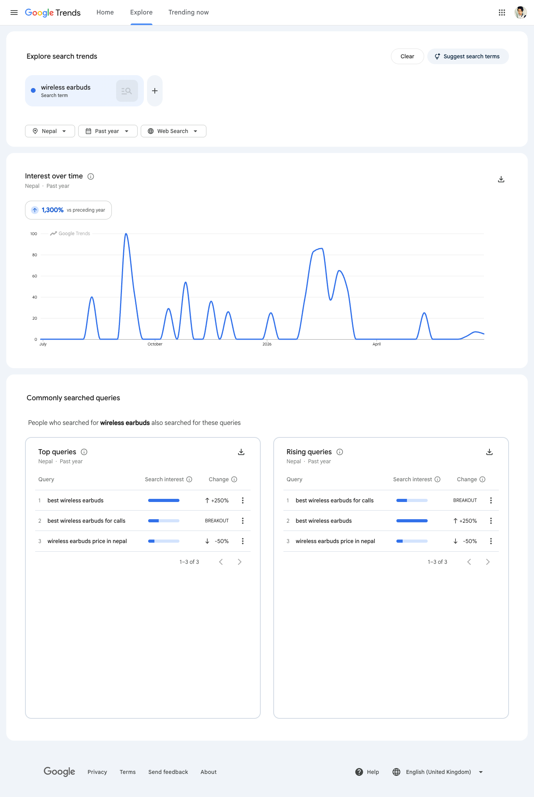
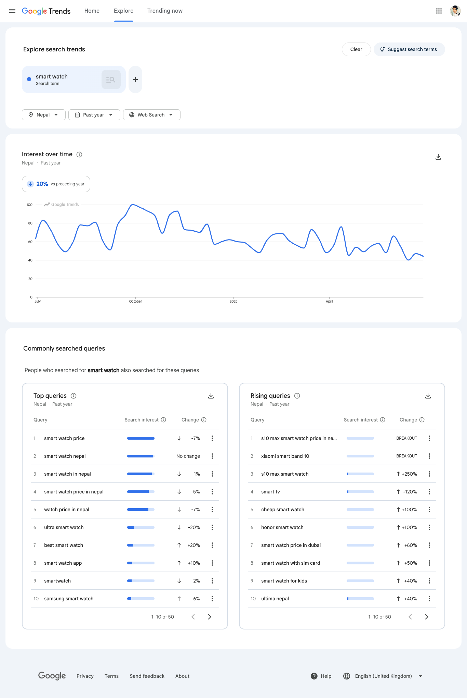
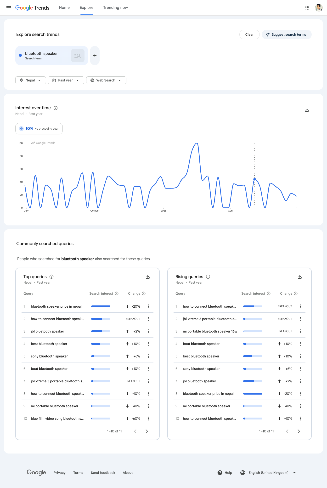
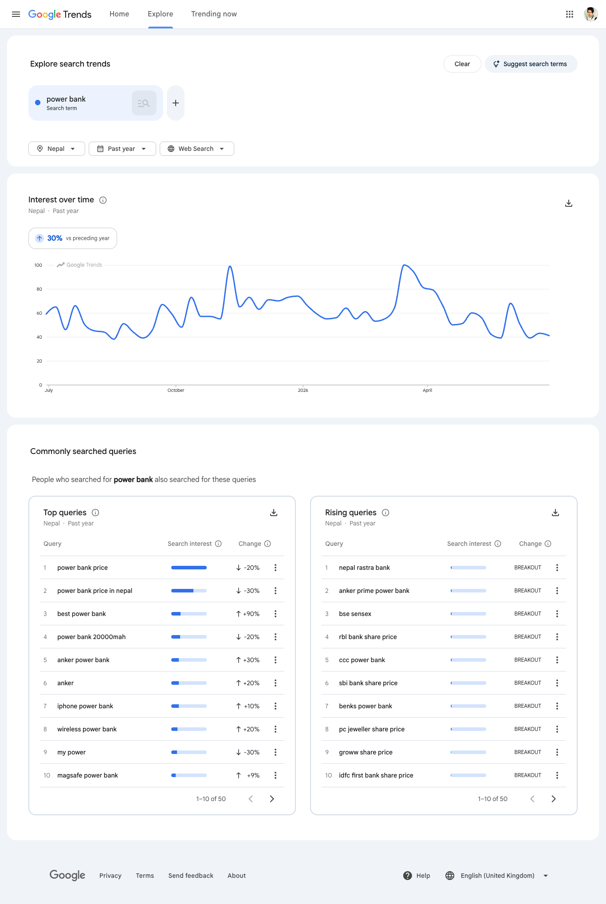
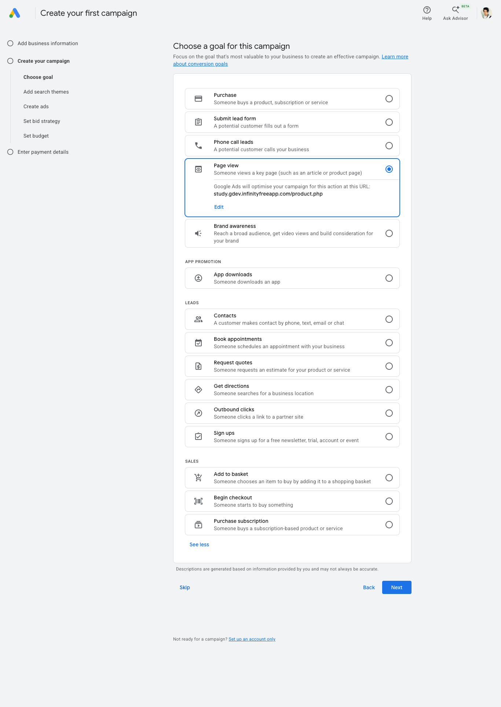
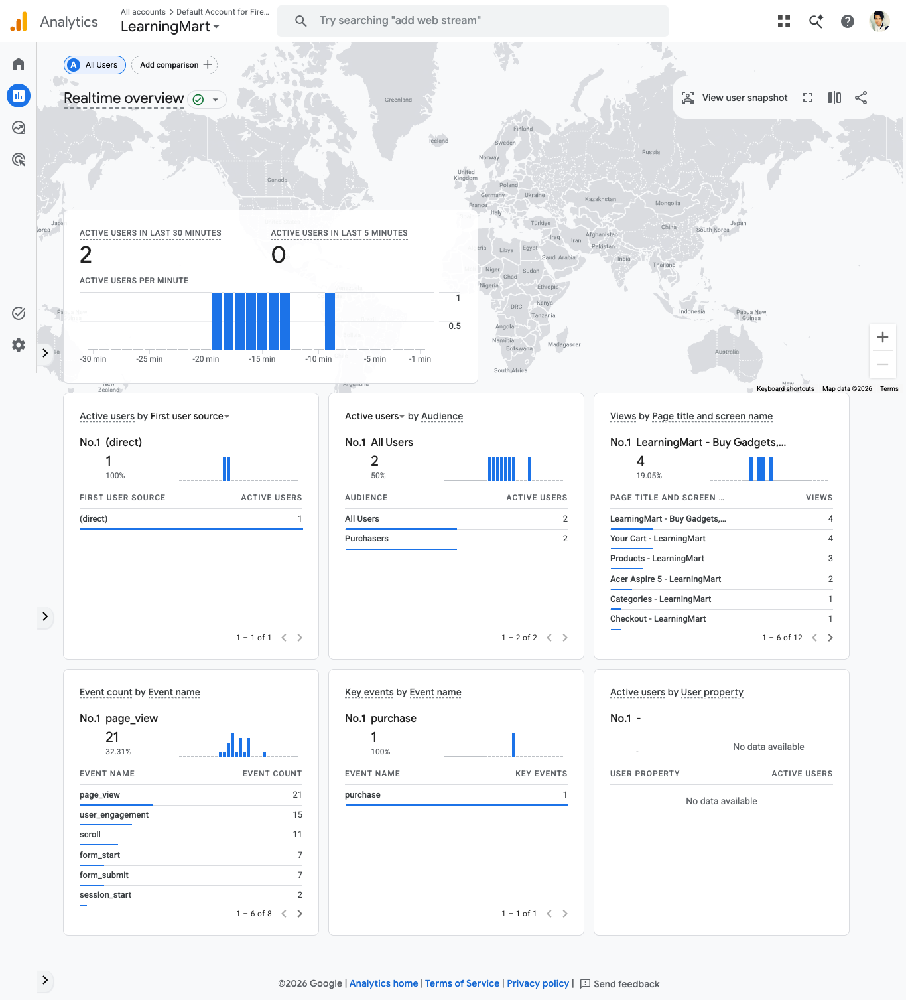

# IT 247 — Marketing Viva: Worked Answers (LearningMart)

> **What this is:** the Phase 2 (Market) viva questions — **Labs 9–11 / Q12–Q16** — answered against our
> **real** store so students have a concrete model to imitate. The generic model answers live in
> `IT247_Lab_Work_and_Viva.md`; the deliverable templates (keyword report, ad plan, social audit) live in
> `MARKETING_SAMPLES.md`. This file shows what a *good, site-specific* answer sounds like in the viva.
>
> **Our store, in facts you can quote:**
> - **Live URL:** `https://study.gdev.infinityfreeapp.com`
> - **What it sells:** tech products — Phones, Laptops, Audio, Wearables, Accessories (5 categories).
> - **Real products** (name · price): Redmi Note 13 · Rs. 32,999 · Wireless Earbuds · Rs. 2,999 ·
>   Bluetooth Speaker · Rs. 3,499 · Smart Watch · Rs. 4,999 · Power Bank 20000mAh · Rs. 2,199.
> - **Category IDs** (used in URLs): Phones = 1, Laptops = 2, **Audio = 3**, Wearables = 4, Accessories = 5.
> - **GA4 Measurement ID:** `G-BLPDF1ZW5K` (set in `config.php` as `$GA4_ID`; the snippet renders
>   site-wide from `layout/header.php`).
>
> **Students:** substitute *your own* URL, GA4 ID and products. Copying these numbers verbatim is the
> exact thing the viva is designed to catch — you must be able to point at the answer in your report and
> explain it.

---

## Lab 9 — SEO: Search Console & Keyword Research (Q12–Q13)

**Q. Why doesn't a new store appear on Google automatically?**
Google's crawler (Googlebot) discovers pages by following links from pages it already knows. Our store,
`study.gdev.infinityfreeapp.com`, is brand-new and nothing links to it, so Googlebot has no path to find
it — it could stay invisible indefinitely. We fix that by registering it in **Google Search Console** and
submitting `sitemap.php`, which hands Google the list of our URLs directly instead of waiting to be found.

**Q. How did you verify the store in Search Console?**
Using the **HTML-file method**: Search Console gives a `google<...>.html` file, we uploaded it to the site
**root** (`htdocs/`), and Google fetched it over our live **HTTPS** URL to confirm we control the domain.
A file at the root only proves ownership if Google can actually reach it — that's why a `localhost` or
non-HTTPS site can't be verified, and why we had to deploy first.

**Q. Where do the keywords come from, and how did you read "demand"?**
From **Google Trends** (`trends.google.com`, region = **Nepal**) — we don't use Keyword Planner because
Google now forces a credit card at Ads signup. We entered our seed terms one at a time (`wireless earbuds`,
`smart watch`, `bluetooth speaker`, `power bank` — the things we actually stock) and read the **Top** and
**Rising** query panels. **"Demand" is the length of the blue Search-interest bar** — relative interest,
not an exact monthly count. Longer bar = more people searching it.

Our actual Google Trends screenshots (region = Nepal, past year) — these are the graded evidence:


*`wireless earbuds` — interest **+1,300%** on the year (spiky = seasonal). Top/Rising surface
`best wireless earbuds` (commercial) and `wireless earbuds price in nepal` (transactional — the one we used).*


*`smart watch` — high, steady demand (long bars) even though it's **−20%** on the year. The whole Top list is
buying-intent: `smart watch price`, `smart watch (price) in nepal`. Rising shows brand/spec terms
(`s10 max smart watch`, `xiaomi smart band 10`).*


*`bluetooth speaker` — **+10%**. `bluetooth speaker price in nepal` tops the list; brand terms
(`jbl`, `sony`, `boat`) show which brands to stock and name in titles.*


*`power bank` — **+30%**, but a teaching point: Rising is full of **noise** — `nepal rastra bank`,
`bse sensex`, `sbi bank share price` — stock-market searches dragged in by the word "bank". We
**discard those** and keep `power bank price in nepal` and `power bank 20000mah`.*

> **How to read these in the viva:** point at a bar and say *"longer bar = more search interest — it's
> relative, not a real count."* Point at the `power bank` Rising panel and explain *why* you dropped the
> "bank" results — that's the judgement the examiner is checking for.

**Q. Transactional vs commercial intent — which do you target first?**
- **Transactional** = ready to buy: `wireless earbuds price in nepal`, `power bank 20000mah`,
  `smart watch price in nepal`. **Target these first** — they convert.
- **Commercial** = still comparing: `best wireless earbuds`, `smart watch review`. Useful later, lower
  priority.
We put transactional keywords into product **titles**; commercial ones into **descriptions**.

**Q. Show where you closed the loop (research → on-page SEO).**
We took the transactional keyword `wireless earbuds price in nepal` and edited our **Wireless Earbuds**
product (Rs. 2,999):
- `<title>Wireless Earbuds — Price in Nepal | Buy Online — LearningMart</title>`
- `<meta name="description" content="Buy wireless earbuds in Nepal at the best price (Rs. 2,999). Clear sound, great for calls, fast delivery.">`

Then reloaded the page → **View Source** → confirmed the keyword now appears in `<title>` and the meta
description. That screenshot is the graded proof.

---

## Lab 10 — Ad Campaign Plan & Analytics / GA4 (Q14–Q15)

**Q. What is CPC?**
**Cost Per Click** — with a Search ad you pay only when someone actually **clicks** the ad, not when it's
merely shown (that's an impression). So budget is spent on visitors, not views.

**Q. How does Google decide whose ad shows and what they pay? (the auction)**
When someone searches a keyword we bid on, Google runs an **instant auction**. Each advertiser has a **max
bid** (most they'll pay per click) and a **Quality Score** (how relevant their ad + landing page are to the
search). Position is set by **Ad Rank = bid × Quality Score**, so a *more relevant* ad can beat a *higher
bidder* — we don't just win by paying more. We pay **per click**, and usually only just enough to beat the
advertiser below us, not our full max bid. This is exactly why our plan pairs the keyword
`wireless earbuds price in nepal` with an earbuds-specific ad and lands on the **Audio** page — high
relevance raises Quality Score, which means a better position at a lower cost.

**Q. Why send the ad to a product/category page, not the homepage?**
The searcher typed `wireless earbuds price in nepal` — they want *that product*. Landing them on the
homepage forces extra clicks to find it, and every extra click loses people. Sending them straight to our
**Audio category** (or the earbuds product) means fewer lost clicks → higher conversion.

**Q. What is your landing URL, and what do the UTM tags do?**
Our Audio ad group points at the Audio category (**cat = 3**) with UTM tags:
```
https://study.gdev.infinityfreeapp.com/product.php?cat=3&utm_source=google&utm_medium=cpc&utm_campaign=audio
```
The **UTM tags** label the visit so **GA4 can attribute** it to `source = google`, `medium = cpc`,
`campaign = audio`. Without them every paid click would look like plain traffic; with them we can prove
*which channel actually brings buyers*.

**Q. Why a written plan instead of a live campaign?**
Google Ads requires a **credit card at signup**, even to only set up an account. A written plan captures
the entire setup — goal (Sales), ad group, 5 keywords, 3 headlines + 2 descriptions, and the UTM landing
URL — with **zero spend**. (Optional live route: build a draft in Meta/Facebook Ads Manager and screenshot
it.) Our plan's ad group is **"Audio — Earbuds & Speakers"** with keywords led by
`wireless earbuds price in nepal` and `bluetooth speaker price in nepal`.


*Proof for the report: Google Ads makes you go through business + **billing** setup even to create an
account, so we stop here and document the campaign as a plan instead of spending.*

**Q. What does GA4 track once installed, and how did you confirm it works?**
Once the `G-BLPDF1ZW5K` snippet is live site-wide (from `layout/header.php`), GA4 tracks **page views,
device, country, and source/medium** for every visitor, plus events like the **`purchase`** conversion on
`order_success.php`. We confirmed it by opening the store and watching **Reports → Realtime** — an active
user appeared within ~30 seconds. (Note: the visitor does **not** need to log in — the tag fires for
anonymous visitors on every page; only the `purchase` event needs a logged-in, paid order.)


*Our real GA4 Realtime screen — one screenshot proves the whole answer: **page views** by page title
(home, Cart, Products, Acer Aspire 5, Checkout), the **first-user source** (`(direct)` here — it'd read
`google / cpc` if opened via the UTM link), live **events** (`page_view`, `scroll`, `form_submit`), and
the **`purchase` key event = 1** from a completed order. This is the graded evidence for Q15.*

**Q. Realtime works but the standard Reports are empty — is it broken?**
No. Standard reports (**Reports → Acquisition → Traffic acquisition**, **Engagement → Pages and screens**)
are *processed*, not live — they lag **24–48 hours**, and a brand-new property shows little on day one.
**Realtime / DebugView** are the only near-instant views; the tables fill in the next day. If your own
visit doesn't show, it's usually an **ad-blocker / tracking protection** on that browser eating the
`collect` request — test in incognito (this is exactly what we saw: desktop with a blocker showed nothing,
mobile showed the active user immediately).

---

## Lab 11 — Social Media Analysis (Q16)

**Q. Difference between reach and impressions?**
**Reach** = the number of **unique people** who saw a post. **Impressions** = the **total views**,
counting the same person multiple times. Impressions ≥ reach always.

**Q. How is engagement rate calculated?**
`(likes + comments) ÷ followers × 100`, averaged over ~5 recent posts. Big pages show a small % because
the follower count in the denominator is huge — that doesn't mean the posts are weak.

**Q. Why does social media matter for a store like LearningMart?**
Three reasons: **direct traffic** (posts link back to `study.gdev.infinityfreeapp.com`), **brand
awareness** (people learn we exist and what we sell), and **remarketing** — showing offers again to people
who already engaged. For a small store, 3–4 quality posts a week with clear product + price, short reels of
products in use (earbuds, smart watch), and a Dashain/Tihar countdown offer beat high-volume plain posts.

---

## Cross-cutting (examiners ask these too)

**Q. Walk me from a Google search to a sale on your store.**
A shopper searches `wireless earbuds price in nepal` → sees our **ad** (or, over time, our indexed page
found via **Search Console** + sitemap) → clicks the **UTM landing URL** to the Audio category → the visit
is tracked in **GA4** (`google / cpc`) → they add earbuds to cart, log in, and pay via Khalti → the
`purchase` event fires on `order_success.php` and shows in GA4 Monetization. Search Console = getting
found; Ads = paying to be found faster; GA4 = measuring what worked.

**Q. Which is free and which costs money here?**
**Search Console, Google Trends, GA4, and the campaign *plan*** are all **free**. Only running a **live**
Google/Meta ad costs money (and needs a card) — which is why this lab documents the ad as a plan.
